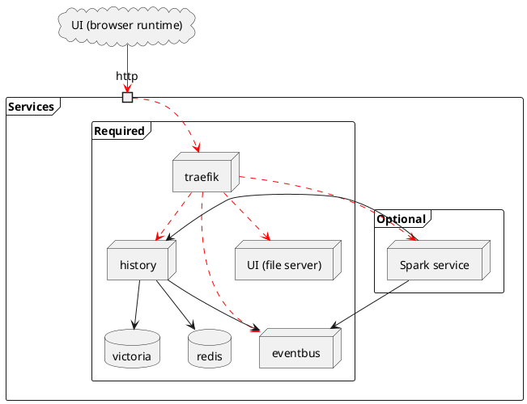

# System Architecture

```plantuml
@startuml Deployment
cloud "UI (browser runtime)" as ui_runtime
frame Services {
  portin http

  frame Required {
    database victoria
    database redis
    node eventbus
    node history
    node "UI (file server)" as ui_nginx
    node traefik
  }
  frame Optional {
    node "Spark service" as spark_service
  }
}

ui_runtime -[#red]-> http
http .[#red].> traefik

traefik .[#red].> ui_nginx
traefik .[#red].> history
traefik .[#red].> spark_service
traefik .[#red].> eventbus

history --> victoria
history --> redis
history --> eventbus

spark_service --> history
spark_service --> eventbus
@enduml
```
