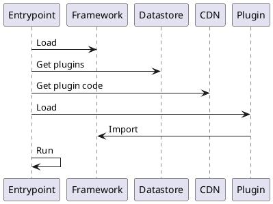
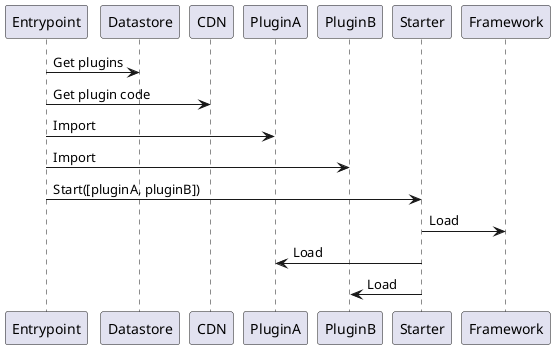
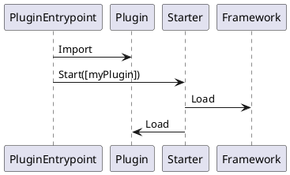

# Dynamically loading UI plugins

Date: 2019/01/01

Brewblox is set up to be dynamic and extensible at runtime through configuration. <br>
While the backend accomplishes this through a microservice architecture, the UI is still a single application.

Making a transpiled single application dynamically extensible is not trivial. 
This document describes the various steps that must be taken to do so.

## Context

The [backend architecture design](./20180206_subprojects) set out to make the system scalable by dividing it into separate applications.

The UI requires a slightly different approach: it should be a single application where end users can monitor and control all backend services.

Any solution will need to take into account that not all plugins are official. 
External contributors are encouraged, and should be supported without them having to submit PRs to the main repository.

## Previous Efforts

In the [UI repository][ui-repo] efforts have been made to separate framework and spark-specific code and components.

All specific code has been placed in [src/plugins][ui-plugin-dir].
Plugins register implementations of generic types (eg. dashboard widgets). <br>
The framework code renders plugin-defined widgets in dashboards, and offers tools to persist configuration.

This separation of framework and plugins makes it easier to move to dynamically loaded plugins.
The remaining issues that must be solved concern deployment, not code architecture.

## Requirements

- Plugin configuration (which plugins to load) are editable in the UI
- Changing the plugin configuration does not require a code rebuild
- Plugin configuration must be persistent
- Plugins can be created without modifying the brewblox-ui code (either upstream, or in a fork)
- Plugins do not require actions or approval by the Brewblox team before they can be loaded
- Plugins can import and use framework code and typings
- Loading plugins does not significantly increase page load times
- Development features such as hot reload are still usable while developing plugins
- brewblox-ui remains a single repository

## Architecture

Two requirements have the most impact on high-level architecture:

- Changing the plugin configuration does not require a code rebuild
- Plugins can import and use framework code and typings

A simple representation of required steps during startup:



Based on these steps, the application entrypoint must be somewhat separated from the framework. The framework must be available for import without triggering the entrypoint.

This can be done by offering a separate `main.js` and `index.js` file. The `main.js` file is called when the UI is started, and `index.js` is used for importing the framework part.

## Importing the framework

[This guide][publish-vue] describes the main steps required to publish and import a Vue library.
In our case we just need to change the behavior slightly: instead of directly registering components when imported, it should export a Brewblox plugin startup function. (eg. [Spark plugin index][spark-plugin-index])

## Loading plugin code



The entrypoint (in brewblox-ui) queries the datastore for the plugin configuration, before importing the desired plugins from a CDN.

This approach imports all relevant code before starting the Vue application. No significant changes to application behavior after Vue is started are required.

The starter code is kept separate from the entrypoint to allow alternative entrypoints.

## Plugin dependencies

When loading plugins from CDN, some care must be taken with dependencies.

Plugins likely have a dependency on `brewblox-ui` - this should of course not be downloaded. All other dependencies should still be fetched.

Whether this is best accomplished through `package.json`, or by requiring plugins to also load from CDN is a technical issue, and best resolved in implementation.

## Development workflow



Plugin developers benefit from the ability to define alternative entry points. Their entrypoint can skip the datastore/CDN round trips for their own plugin, and use a relative import instead.

In production, the plugin entry point is simply ignored when the plugin is loaded from a CDN.

This fulfills the requirement of being able to use development features as hot module reloads, while still having access to the brewblox framework.

## Core plugins

It is a reasonable assumption that the majority of Brewblox end users are using the Spark/History plugins. <br>

To improve load times, and avoid splitting the brewblox-ui repository, these plugins should remain in the `src/plugins` directory.
The Starter module should by default load these core plugins, along with all plugins provided by the entrypoint.

Example function signature:
```typescript
export type Plugin = (args: PluginArguments) => void;

export const start = (plugins: Plugin[], loadCorePlugins: boolean = true) => {
    // do stuff
}
```

## Conclusion

`brewblox-ui` should become both an importable library, and an executable web application. Plugins should be loaded dynamically from a CDN on startup.

Summary of required changes:

- Split `main.ts` in entrypoint and starter modules
- Load configuration from datastore in entrypoint
- Load plugins from CDN in entrypoint
- Create example / boilerplate repository for plugin developers


[ui-repo]: https://github.com/Brewblox/brewblox-ui
[ui-plugin-dir]: https://github.com/Brewblox/brewblox-ui/tree/develop/src/plugins
[publish-vue]: https://medium.com/justfrontendthings/how-to-create-and-publish-your-own-vuejs-component-library-on-npm-using-vue-cli-28e60943eed3
[spark-plugin-index]: https://github.com/Brewblox/brewblox-ui/blob/develop/src/plugins/spark/index.ts
