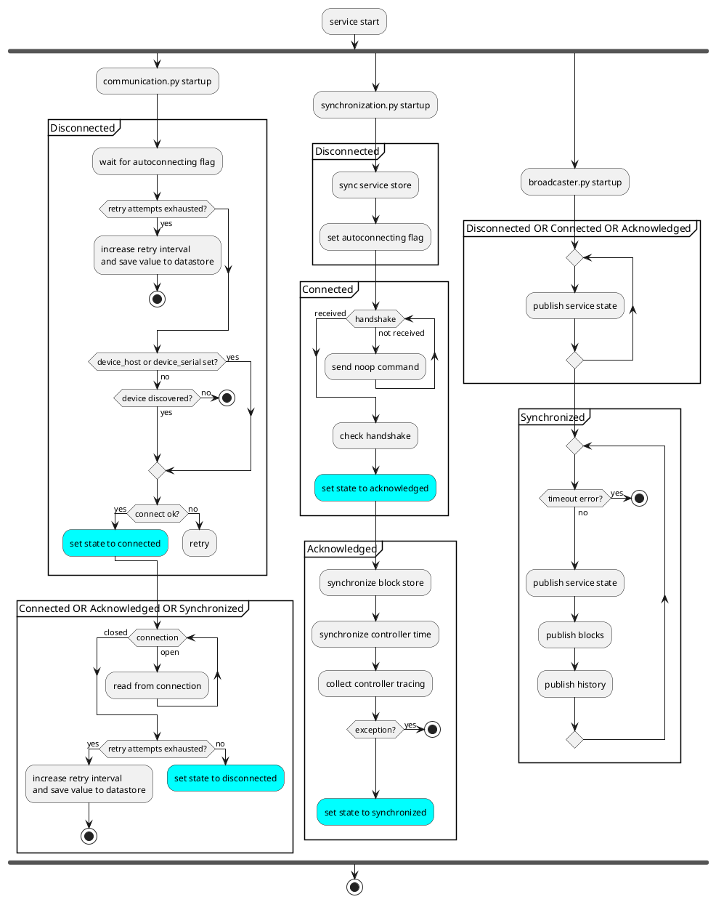
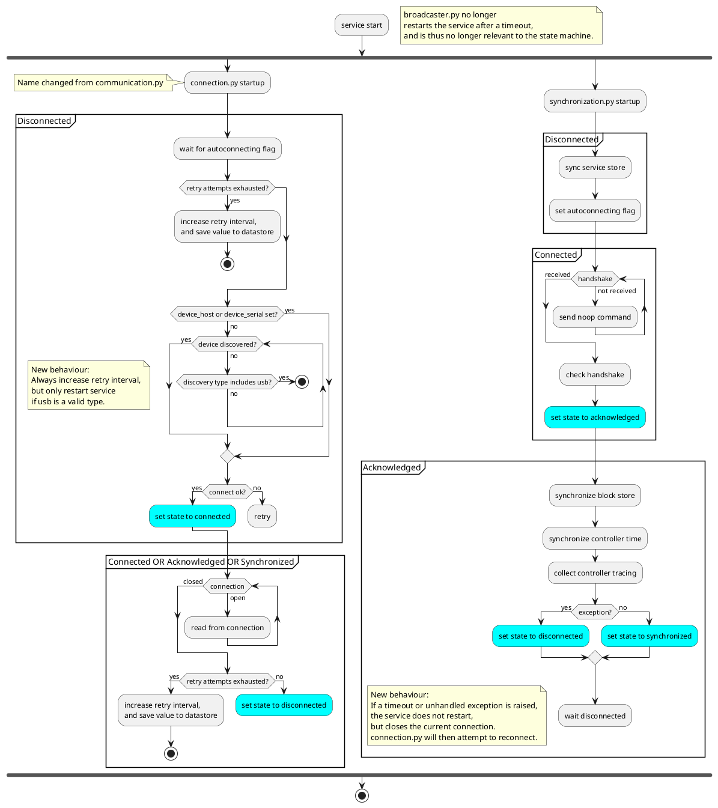

# Analyzing the Spark device/service connection state machine

Date: 2020/10/08

## Context

The process to connect a Spark service to a Spark controller has multiple distinct phases:
- **Disconnected**: the service has not made a connection.
- **Connected**: there is a transport-layer connection between the service and a remote host, possibly the controller.
- **Acknowledged**: the remote host has sent a handshake, and is confirmed to be a Spark controller.
- **Synchronized**: all required actions are completed, and the service and controller are ready for normal operation.

Phase transitions involve actions from multiple features that are running in parallel.
Transport-level connections are handled in *communication.py*,
while handshakes and controller synchronization are handled in
*synchronization.py*.

Phase transitions can move back to Disconnected at all times,
but will only ever advance a single step forward.

## Service reboots

If an error is raised that cannot be handled, the service exits.
It is assumed that the service runs with the `restart: unless-stopped` flag enabled for its Docker container.

Docker itself introduces another constraint: USB devices plugged in after the container starts are not forwarded to the container.
To discover USB devices, the container has to be restarted periodically.

Docker also adds a constraint that discourages frequent service restarts.
Under some circumstances, if one service restarts, all docker containers are reset.
This appears to be caused by IPv6 networking, but the exact cause (and fix) is somewhat unclear.

In combination: we want to reboot periodically while discovering USB devices, but preferably only then.

## Connection processes

Below is an overview of the service features involved with either the state transitions (*communication.py*, *synchronization.py*),
or that act as watchdog (*broadcaster.py*).

All features are started when the service start.
Partitions indicate where a feature executes certain actions in specific phases.

Blocking behavior is implied for transitions between partitions in the diagram. Some behavior is the same during multiple phases, and is expressed in the partition label.

For example, *communication.py* behaves exactly the same throughout the Connected, Acknowledged, and Synchronized phases.

At diagram stop symbols, an `aiohttp.web.GracefulExit()` exception is raised, which will cause the service to shut down.

First *synchronization* is responsible for fetching the service config that includes the `autoconnecting` flag.
This flag is used pause services when the user temporarily disconnects the Spark controller for extended periods.

If the `autoconnecting` flag is fetched and is True,
*communication* discovers and connects to a device.
When this is done, a serial connection is established between the service, and a remote host, and the service transitions to the **Connected** phase.
At this point, the only thing we know about the remote host is that it accepts USB/Wifi connections, and (if discovered) advertises itself as a Spark controller.

From this point onwards, *communication* reads data from the transport, and writes data when its `write()` function is called.
If it detects that the connection was closed, it will transition the service back to the **Disconnected** phase.

*synchronization* has been waiting for the connected event,
and will now try to establish a handshake with the controller.
The controller is expected to send a handshake when it detects a new connection.
As a backup mechanism, it will also send a handshake whenever the `NOOP` command is received.
*synchronization* will send Noop commands until either it receives a handshake, or a timeout expires.

When synchronization receives a handshake, it will transition the service to the **Acknowledged** phase.
The handshake also includes the firmware version the controller is using.
If the firmware is incompatible with the service, *synchronization* will stop here.

Now, the controller has been identified as a Spark controller, and its firmware version has been validated.
Before the service is ready for normal operation, some more actions must be performed:
- the system time on the controller is set.
- the content of the block store is fetched from the datastore.
- system trace calls are read from the controller, and tracing is restarted.

When all this is done, the service transitions to the **Synchronized** phase,
and is ready for normal operations.

During normal operations, *broadcaster* acts as watchdog.
If multiple subsequent commands have failed, the service is restarted.
This was implemented in response to observed behavior of USB connections.
When controllers connected over USB are unplugged, no disconnected event is received by *communication*.
Data can be written, but no new data will be read. Commands will fail when the timeout specified in *commander.py* is exceeded.

## Entities capable of raising GracefulExit()

During startup, there are multiple opportunities for an exit error to be raised. Afterwards, additional scenarios and function calls exist.

These Python modules are capable of raising a GracefulExit error:

- *synchronization.py*
  - If a timeout error is raised while waiting for the controller handshake.
  - If an unexpected error is raised.
- *system_api.py*
  - After updating the controller firmware, the controller restarts. To reconnect, the service is restarted as well.
  - The `/service/reboot` REST endpoint allows for user-triggered reboots.
- *connection.py*
  - When discovery retry attempts are exhausted.
- *communication.py*
  - When connection retry attempts are exhausted, either when connecting, or after multiple disconnects during normal operation.
- *commander.py*
  - A listening mode message is received during normal operations.
- *broadcaster.py*
  - If the service is synchronized, but a timeout was exceeded since the last successful communication attempt with the controller.

## Changes to behavior

*broadcaster.py* doubling as watchdog for USB connections is a code smell, even though it works reliably.

A more elegant solution is to add a connection check when commands fail with a `CommandTimeout` exception.
If the controller still responds to a Noop command, everything is fine.
If the Noop command also fails, the service should close the connection and try to reconnect.

*synchronization.py* and *connection.py* are both overly trigger-happy when it comes to restarting the service.
For *synchronization.py*, a disconnect would suffice when an exception is caught.
*connection.py* only is required to periodically reboot if the discovery settings include usb devices. Reboots are never required when using a `--discovery=wifi` flag.

*connection.py* and *communication.py* are confusingly named.
*connection.py* houses stateless functions used by *communication.py*.

To improve clarity, *connection.py* is renamed to *connect_funcs.py*, and *communication.py* is renamed to *connection.py*.

## Reworked state machine

*broadcaster.py* is now no longer relevant to the connection state machine,
and GracefulExit should be raised significantly less often.
