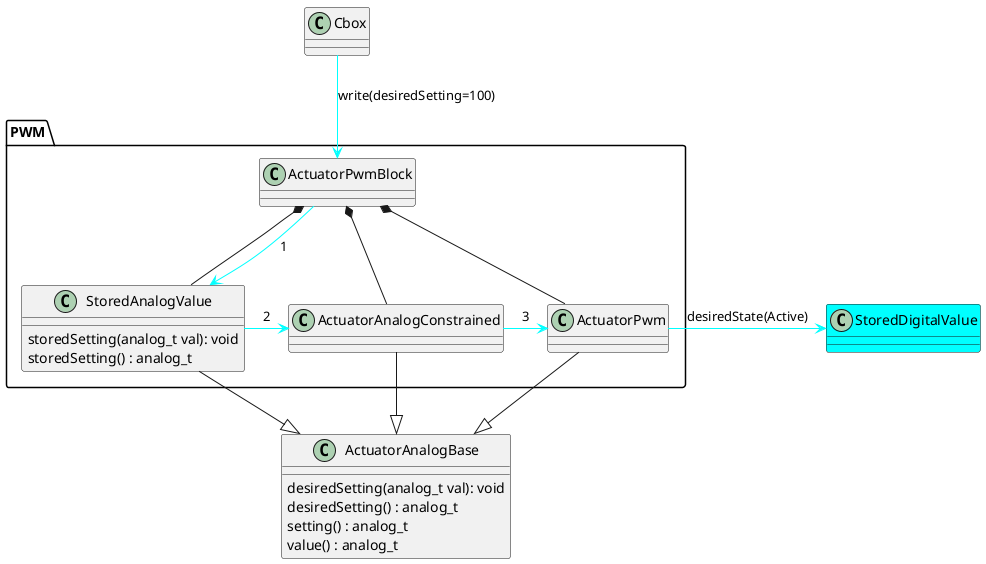
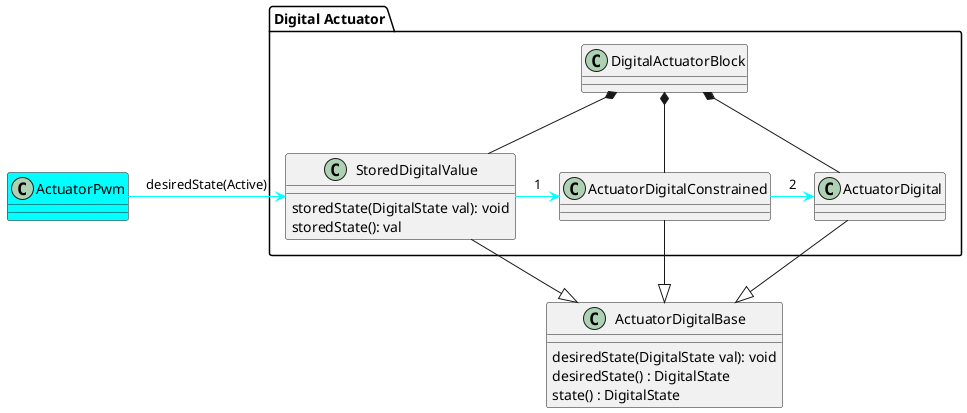
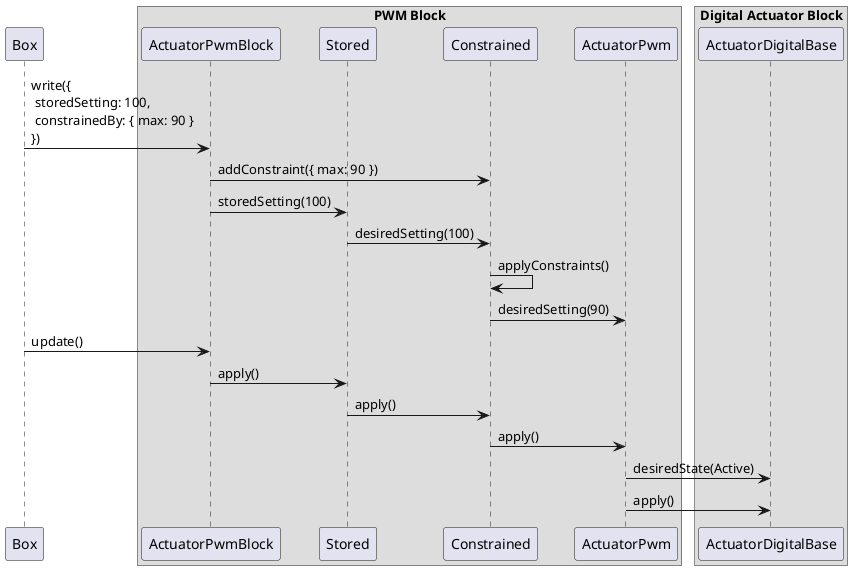

# Stored and desired block settings

Date: 2022/09/22

## Context

The desired setting or state for blocks can have two sources: the user-defined setting, and the output from a claiming block.
The resulting setting is as expected when a block becomes claimed, but not when it becomes unclaimed.

When a block becomes unclaimed, it is undesirable for it to immediately switch to its user-defined setting.
The unclaiming may be due to a bug, or be a temporary state (eg. on startup).
If a block has been claimed for a significant time, it's also likely that the user is not aware of the user-defined setting.
We want to avoid surprising the user with active behavior.

It would be nice, but not required, if the block remembers the user-defined setting.
This allows us to prompt users to reload the previously used setting.

The trivial solution would be to set the user-defined setting to a neutral/null state when the block is claimed.
This is acceptable for analog actuators, where a 0 setting typically equals inactive, but not for Setpoint blocks,
where 0°C is a valid and realistic setting.

Our persistence format (protobuf) does not make any meaningful distinction between 0 and unset for numeric values.
This means we can't use a null value for user-defined setpoint settings, as it will be indistinguisable from 0.

## Requirements

- Blocks MUST revert to an inactive state after being unclaimed.
- The inactive state MUST persist through a reboot or reload from persistent storage.
- Persistent fields MUST NOT be nullable.
- Nice to have: user-defined settings are not overwritten in persistent storage when the block is claimed.

## Implementation

### Fields

Three separate groups of blocks meet the criteria of being both claimable, and having user-defined settings:

- Analog actuators (ActuatorPwm, FastPwm, AnalogActuatorMock, ActuatorOffset)
- Setpoints (SetpointSensorPair)
- Digital actuators (DigitalActuator, MotorValve)

Analog actuators and Setpoints also inherit the ProcessValue interface (used by ActuatorLogic, and ActuatorOffset).

All of these objects have a single setting that is modified in various stages:

- The user-defined stored setting.
- The desired setting. This is either the stored setting, or the output from a claiming block.
- The setting. This is the desired setting after constraints have been applied.
- The value. This is the value as measured by the system.

For digital actuators, the setting and the value can be combined.
The feedback loop between setting (output pin active / inactive) and value (output pin has been set active / inactive)
is too short to justify having both a `setting` and a `value`.

In combination, this means that blocks should include the following fields in their proto message:

Analog actuators / Setpoints:

- storedSetting (writable)
- desiredSetting (readonly, nullable)
- setting (readonly, nullable)
- value (readonly, nullable)

Digital actuators:

- storedState (writable)
- desiredState (readonly, nullable)
- state (readonly, nullable)

### Safety ratchet (SettingMode)

The basic desired behavior can be summarized as "after being unclaimed, the block must be re-activated by user input".
For the reasons described above, nullable settings are not an option. The inactive state must persist through a reboot.
Any and all used settings must survive a protobuf round-trip.

The more straightforward approach is to introduce an explicit setting: the SettingMode enum.
The enum has two values: STORED, and CLAIMED.

The default value is STORED. This provides the smoothest migration path, and the most intuitive default value for newly created blocks.
The mode will be automatically set to CLAIMED when a block is claimed, but will only move back to STORED as a result of user input.

To improve user experience, the mode should also revert to STORED if a block patch is sent that includes `storedSetting`, but does not include `settingMode`.

For the purposes of this behavior, Sequence block instructions are considered "user input".
If a `SET_SETPOINT` instruction is called for an unclaimed Setpoint block with `settingMode=CLAIMED`, the settingMode should revert to STORED.

Examples:

- `writeBlock({ storedSetting: 10, settingMode: 'CLAIMED' })` -> block is inactive unless claimed.
- `writeBlock({ storedSetting: 10 })` -> settingMode is 0 (STORED) -> block will use stored setting.
- `patchBlock({ })` -> no change to settingMode field.
- `patchBlock({ storedSetting: 10, settingMode: 'CLAIMED' })` -> block is inactive unless claimed.
- `patchBlock({ storedSetting: 10 })` -> storedSetting is present -> settingMode is 0 (STORED) -> block will use stored setting.

### Forwarded settings

Previously, constraints were handled by the `ActuatorAnalogConstrained` / `ActuatorDigitalConstrained` classes that took a reference to the actual actuator class.
`constrained.desiredSetting(value)` would be called, and the constrained class would call `actuator.desiredSetting(value)` after modifying the argument value.
This chain can be extended with the `StoredAnalogActuator` / `StoredSetpointValue` / `StoredDigitalValue` classes.

The actuator, constraints, and stored setting classes all implement the `ActuatorAnalogBase` / `SetpointBase` / `ActuatorDigitalBase` interface,
where the `desiredSetting(value)` / `desiredState(value)` functions are defined.
External clients call on the stored setting class, which forwards the value to the constraints class, which then forwards the value to the actuator.

### Applying changes

Changes to runtime block settings may originate from two sources: communication, and periodic updates.
During a block write, multiple relevant values may be set (eg. setting, constraints, and enabled).
All of these should be taken into account, but only once, after all changes have been made.

To make behavior consistent between the various forwarding actuators, a separate `apply()` function is introduced in the virtual base.
When called, an actuator should apply its own changes, and then call `target.apply()` if it targets another actuator.

Functions other than `apply()` can call on the target actuator class, but should not cross the block boundary.
`apply()` itself can call `apply()` across the block boundary.

The cbox container guarantees that an out-of-order `block.update()` call is made after a block write.
`block.write()` should therefore not call `apply()`.

For example, the (simplified) call chain when changing the PWM setting:

