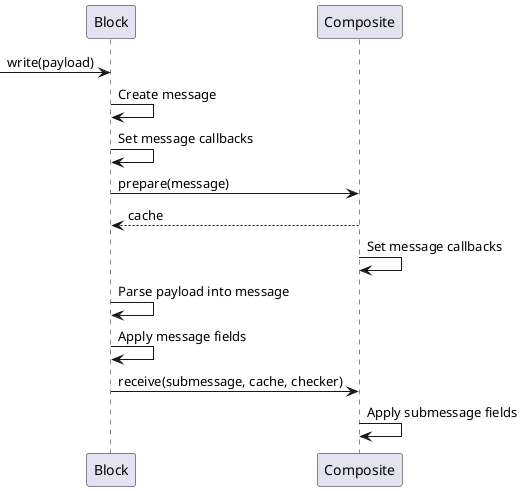

# Deep Block Patching

Date: 2024/01/23

## Context

An impediment to process-level control is the inherent fragility of inter-dependent blocks
that can be edited outside the process-level API.
If the system configuration can be rendered invalid without making process-level calls,
the process has to perform extensive checks to ensure validity before making any change.

As a solution, we can offer specialized **macro blocks** that encapsulate functionality.
Instead of a control chain, you now have a single block that exposes all public settings of the entire chain, and hides all private configuration.
For example, in a `Fridge` block, you can't edit the `Cool PID` target. It is hardcoded to always control the `Cool PWM`.

To avoid extensive duplication of existing fields, we can split existing blocks into multiple composited submessages.
Macro blocks will offer a different set of the available submessages.
To keep with the previous example, a Fridge macro block will include PID kp/td/ti settings, but not the `Cool PID` target link.
If we place kp/td/ti in one composition part, and the target link in another, we can assemble a wide variety of macro blocks with a minimum of field duplication.

A problem with this approach is that the current patch functionality is top-level only.
If you want to update a submessage in a patch call, you need to provide the entire submessage.
This is acceptable now, while most blocks are a flat collection of fields,
but not if blocks become collections of submessages.

## Old implementation

Due to protobuf limitations around default values and field presence,
patching is implemented using metadata in payloads.

```proto
enum MaskMode {
  NO_MASK = 0;
  INCLUSIVE = 1;
  EXCLUSIVE = 2;
}

message Payload {
  uint32 blockId = 1 [ (nanopb).int_size = IS_16 ];
  brewblox.BlockType blockType = 2;
  uint32 subtype = 3 [ (nanopb).int_size = IS_16 ];
  string content = 4; // Block message: proto encoded, then base64 encoded
  repeated uint32 mask = 5 [ (nanopb).int_size = IS_16 ];
  MaskMode maskMode = 6;
}
```

`mask` is a list of field tags. `maskMode` defines whether the payload content is limited to only the fields listed in the mask (`INCLUSIVE`)
or to only the fields **not** listed in the mask (`EXCLUSIVE`).

When parsing incoming messages in firmware, this mask is checked before copying field values from the message to the class object.

Example pseudo code:

```py
def write(self, payload):
    parser = PayloadParser(payload)
    message = parser.parse_message()

    if parser.has_field(field_a_tag):
        self.field_a = message.field_a

    if parser.has_field(field_b_tag):
        self.field_b = message.field_b
```

This implementation works well, but only supports top-level fields.
`mask` can't express the tag equivalent of `a.b.c`.

## Masking vs addressing

If we assume a new message structure that makes extensive use of composited flat submessages,
we have two avenues to implement deep patching: nested masks, and nested addresses.

Nested masks are an extension of the current approach, but instead of `mask` being a list of tags, it is a list of lists of tags (`int[][]`).

Nested addresses keep using the existing masks, but now send a message to a specific submessage, and not the entire block.
For example, a patch will now address `fridgeBlock.coolPidSettings`.

Both approaches have their disadvantages.

**Masking**

- Protobuf does not support `int[][]`. It must be implemented as `{ tags: int[] }[]`.
- An inclusive patch struggles to define an intuitive diff for a repeated field.
- An inclusive patch must support an explicit value for setting a default value in a submessage.
- An `int[][]` data format carries extra overhead for all patch calls, regardless of whether the target block has nested fields.
- Submessage parsers must now be aware of the top-level field tag to check submessage masks.
- Deep masks will introduce new behavior when patching submessages, as undefined fields are now kept as-is instead of set to default:
  - existing data: `{ submessage: { fieldA: True, fieldB: False } }`
  - patch: `{ submessage: { fieldB: True } }`
  - old result: `{ submessage: { fieldA: False, fieldB: True } }`
  - new result: `{ submessage: { fieldA: True, fieldB: True } }`

**Addressing**

- If multiple submessages are patched in the same call, this must be split in multiple payloads.
- Submessage type must be inferred client-side before encoding and sending a submessage patch.
- Nested addressing introduces a separate new mechanism for deep patches: addressing and (flat) masking will be used together.
- Submessages must also be flat. Nested fields in submessages cannot be patched.

## Masking vs addressing: conclusion

When compared, masking is preferable to addressing, as it introduces fewer new moving parts.
Masking introduces more overhead in requests, addressing introduces the need to have multiple payloads for the same request. \
Extra overhead is preferable to extra overhead *and* complexity.

## Implementation

### List values

Patching of repeated submessages is not supported.
Lists must always be sent all at once. \
For repeated submessages that have a strictly defined limit, such as the `DisplaySettings` slots,
we should consider replacing the repeated field with a named field for each slot.

Implementation of such changes is outside the scope of this decision.

### Matching

To prevent the need for callbacks when parsing protobuf messages, the max depth for masks is set to 4.
This is an arbitrary value, and can be increased when required.

When comparing masks to field tags, 0 is considered a wildcard.

- The mask (0,0,0,0) matches fields (1), (2,1), (2,2), (3,1,3).
- The mask (1,2,0,0) matches fields (1), (1,2), (1,2,3), but not (2), (1,3).

### Receiving submessages

An existing example of a submessage with dedicated read/write handlers are constraints.
`blocks/ConstraintsProto.hpp` offers functions for converting between nanopb constraints and `control`-level class objects.
We'll use this as an example.

Write handlers can't independently check whether a field is masked.
The top-level tag for the `constraints` field can be different for each block.
We can resolve this by splitting the `PayloadParser` class into the top-level parser, and a recursive mask checker. \
The mask checker can encapsulate the actual parent tag(s), and provide a public function that checks whether a tag at the current level is masked.
Specialized checkers are created in the same place where specialized handler functions are called.

Example pseudo code:

```py
def write(self, payload):
    top_level_checker = make_checker(payload)
    ...
    if top_level_checker.has_field(constraints_tag):
        specialized_checker = top_level_checker.make_specialized(constraints_tag)
        write_constraints(message.constraints, self.constraints, specialized_checker)
    ...
```

```py
def write_constraints(proto_constraints, class_constraints, specialized_checker):
    if specialized_checker.has_field(constraints_min_tag):
        class_constraints.min = proto_constraints.min
    if specialized_checker.has_field(constraints_max_tag):
        class_constraints.max = proto_constraints.max
```

In this case, `specialized_checker` matches the payload mask against `[constraints_tag, constraints_min_tag]` or `[constraints_tag, constraints_max_tag]`.
If a block submessage has constraints, it can specialize the checker twice before calling `write_constraints()`.

### Repeated values in submessages

Callbacks for repeated fields must be registered before parsing, but should load parsed values into a cache.
To handle repeated fields in composite classes, the following steps are required:



The submessage cache is created in `Composite::prepare()`, but used in `Composite::receive()`.
The `Composite::receive()` function is only called if the submessage field is not excluded,
and can't be relied on to dispose of the cache.
Consequently, we need to transfer cache ownership up to `Block::write()`, where it can be disposed of at function scope end.

Both `Block::write()` and `Composite::receive()` check masking. The cache will be applied only if the nested mask is valid.
