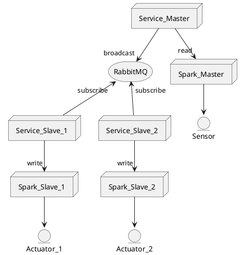

# Block Synchronization
Date: 2018/11/02

Note: this document assumes familiarity with RabbitMQ protocols and syntax. <br>
A generic tutorial can be found [here][rabbitmq-tutorial]. An example implementation of the brewblox-service eventbus API is available [here][boilerplate-main].

## Context

Spark controllers currently have no way of interacting with their peers. <br>
This limits scaling, and is problematic in scenarios where it is physically unfeasible to connect all interdependent hardware to the same spark.

## Solution

As the service is already responsible for (local) network communication, the logical step is to implement object synchronization here.

In order to support both Spark < - > Spark, and Spark < - > Other Controller communication, the protocol is kept generic. <br>
To keep network communication asynchronous, synchronization is done using the existing eventbus.

`Master` blocks periodically broadcast their state on the designated RabbitMQ exchange, using a unique routing key.
`Slave` blocks subscribe to a given routing key, and write received data to a controller object.



This approach decouples services, and allows for easy implementation of a one-to-many relation of master/slave objects.

## API

The brewblox-devcon-spark service offers two endpoints for block synchronization: `/remote/master`, and `/remote/slave`.

Requirements:
- A Brewblox environment with:
    - A RabbitMQ eventbus
    - A Spark service called `spark-master`, connected to a Spark
    - A Spark service called `spark-slave`, connected to a Spark
- A sensor block on `spark-master` called `master-sensor`
- A dummy sensor block on `spark-slave` called `dummy-sensor`


To get started, first call the `/remote/master` endpoint.

```bash
curl \
    -X POST \
    --header 'Content-Type: application/json' \
    --header 'Accept: application/json' \
    -d '{ \ 
            "id": "master-sensor", \ 
            "interval": 5 \ 
        }' \
    'http://localhost:5000/spark-master/remote/master'
```

Response: 
```
{
  "key": "spark-master.master-sensor"
}
```

The exact key does not matter, the import thing is that it's unique.

Now create a slave by calling the `/remove/slave` endpoint.

```bash
curl \
    -X POST \
    --header 'Content-Type: application/json' \
    --header 'Accept: application/json' \
    -d '{ \ 
            "id": "dummy-sensor", \ 
            "key": "spark-master.master-sensor", \ 
            "translations": {} \ 
        }' \
    'http://localhost:5000/spark-slave/remote/slave'
```

Every time `spark-master` broadcasts the state for `master-sensor`, `spark-slave` receives the message, and writes the received data to `dummy-sensor`

## Translations

In the first example, we left the `translations` key empty when calling `/remote/slave`. This means that all fields are copied from the master block to the slave block.

In situations where the slave block has a different data model than the master, or only requires a subset of data to be written, the translation table can come in handy.

`/` characters indicate nested data. Specified keys are merged into the target data.

Example:
```python
# translation table
"translations": {
"value": "targetvalue",
"nested/value": "nested/target/value"
}

# master data
{
    "value": 123,
    "other_value": 567,
    "nested": {
        "value": 456,
        "other_value": 890
    }
}

# slave data (before write)
{
    "targetvalue": 0,
    "value": 0,
    "nested": {
        "target": {
            "thing": 0
        },
        "thang": 0
    }
}

# slave data (after write)
{
    "targetvalue": 123,
    "value": 0,
    "nested": {
        "target": {
            "value": 456,
            "thing": 0
        },
        "thang": 0
    }
}
```

## DIY

When implementing synchronization between a Spark and a different type of controller, the new service must implement the underlying data protocol.

### Routing

The default value for the RabbitMQ exchange is `syncast`. This value can be configured in the Spark service. This exchange is configured as a topic.

The routing key is arbitrary, but should be unique for synchronization master + slave pairs. <br>
When calling `/remote/master`, a routing key is generated. `/remote/slave` takes a routing key as argument.

### Data

The body of the message should be a JSON string containing object data. Object ID, profiles and type are not included.

### Default behavior

- The master service reads the specified block.
- The master service broadcasts `block[data]` to the specified exchange and routing key.
- The slave service receives a callback for the RabbitMQ message.
- The slave service reads the specified block.
- IF translation table: The slave service merges the translated keys into the read block.
- ELSE: The slave service replaces the read data with the incoming message.
- The slave service writes the block with updated data to the controller.


[rabbitmq-tutorial]: https://www.rabbitmq.com/tutorials/tutorial-three-python.html
[boilerplate-main]: https://github.com/Brewblox/brewblox-boilerplate/blob/develop/YOUR_PACKAGE/__main__.py
