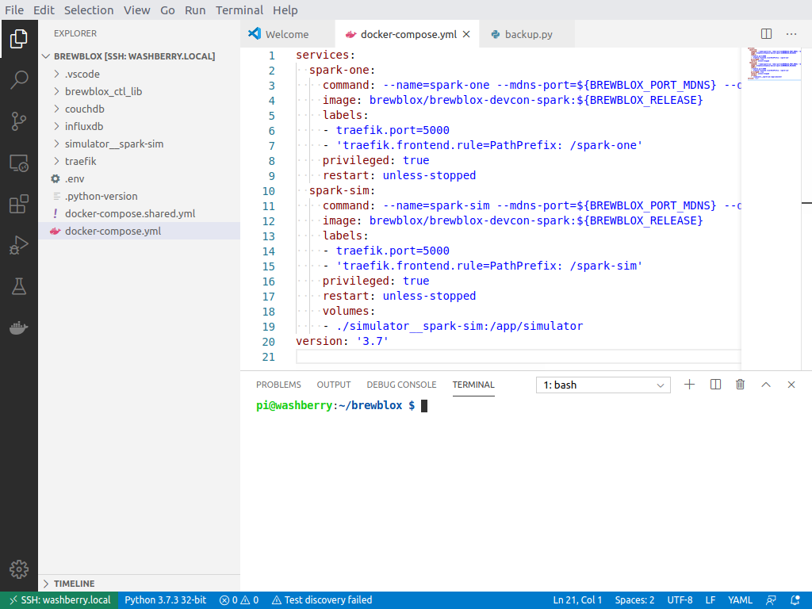

# Deploying Scripts

The [Development Platforms](./dev_platform.md) doc lists the options for writing new services and scripts.

At some point, you'll want to copy files to or from the machine you're using to run Brewblox.
Below we outline some solutions for easily doing this. We'll stick with free solutions.

## FileZilla

If you prefer a GUI-based application, we recommend using [FileZilla](https://filezilla-project.org/).

The host field should be `sftp://IP_ADDRESS`. Username / password are the same as when logging in over SSH.

## Git Bash (Windows)

While Mac and Linux have a built-in SSH client, Windows is lagging behind.
[Git For Windows](https://git-scm.com/download/win) comes with Git Bash and an SSH client.

Install Git For Windows, run Git Bash, and you will have access to the `ssh` and `scp` commands.
To get started, you can follow [this guide](https://www.garron.me/en/articles/scp.html).

## Visual Studio Code Remote Development

For directly editing and running files on your Pi, you can also use [Visual Studio Code with the SSH Remote plugin](../user/config_editor.md).

It must be noted that this approach is best used for editing text files and running terminal commands. If you need to copy other files (eg. backups), you'll still need to use `scp` or FileZilla.

::: warning
The Pi is not a powerful platform - performance of any compilation or build step will be terrible.

For writing services, take a look at the options listed by the [development platform doc](./dev_platform.md).
:::

