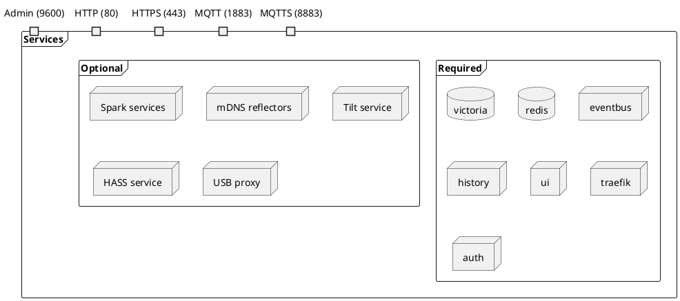
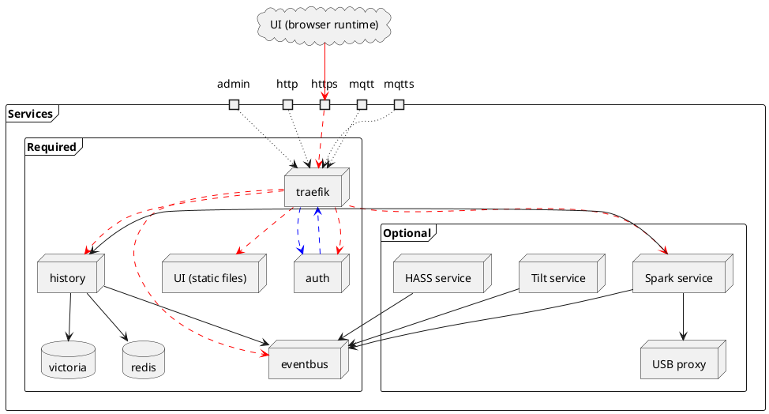
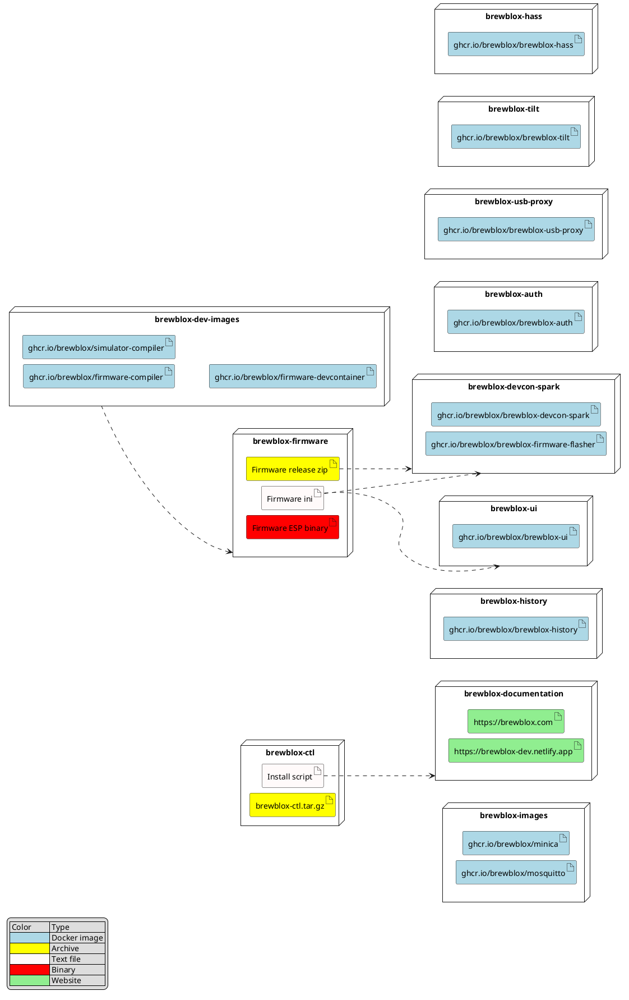

# System Architecture

Any Brewblox installation is set up as a combination of services.
Docker and Docker Compose are used for containerization and network configuration.

This document serves as a reference for what services exist, and with whom they communicate.
The actual implementation of this configuration is mostly done by `brewblox-ctl`,
with support for user-defined changes.

## Deployment

Services are split in two categories: required, and optional.\
As the name suggests, required services are expected to be always present.
The system is not expected to be functional when one of these are missing.\
Optional services are added explicitly or implicitly by the end user.

Barring custom configuration, any Brewblox network exposes five ports.
Listed port numbers are default values, and can be changed in configuration.

- Admin (9600/tcp, HTTP, accessible from the host itself only)
- HTTP (80/tcp)
- HTTPS (443/tcp)
- MQTT (1883/tcp)
- MQTTS (8883/tcp)

All traffic on these external ports is routed through the traefik proxy.

## Communication

Communication is split in two categories: internal and external.

Internal communication is between services within the same Docker network.
Plain HTTP (or MQTT) is used, and the target service is addressed by name (eg. `history` or `eventbus`).
In the diagram below, black arrows are used for internal communication.

External communication crosses the Docker network boundary at one of the exposed ports,
and is then proxied by traefik before reaching the target service.
Not all services are open to external communication.

In the diagram below, the UI runtime in the browser is used as an example of an external client.
The browser sends a request to the external port, where it is received and forwarded by traefik.
Red arrows are used for external communication. Proxied requests have a dashed line.

When authentication is enabled, all requests must carry a valid `Authentication` cookie.
All external requests to other services are first sent to the `auth` service by traefik.
If the auth service responds with a 200 status code, the request is sent to the actual recipient.
In the diagram below, this path is shown in dashed blue lines.

Authentication cookies are requested directly from the `auth` service.
These requests are not first checked by the auth service,
and do not have to carry a valid authentication cookie.

### Eventbus communication

The MQTT eventbus is used for asynchronous communication between entities.
Entities can be internal (services) or external (the UI runtime or third-party clients).

Here, sender and receiver are not connected directly.
Both connect to the eventbus (either direct or through the traefik proxy),
and publish or subscribe to messages.\
For a more in-depth explanation of used protocols and formats, see the [events](./events.md) documentation.

### Host interaction

The USB proxy and mDNS reflection services serve to isolate host dependencies
on USB and mDNS, respectively.

The USB proxy service has elevated privileges to allow for USB access on the host.
This is abstracted into a separate service because the Spark 4 and up no longer support
USB communication. By default, the Brewblox system won't access host USB from inside a container.

mDNS discovery is done by broadcasting UDP packets to all interfaces connected to a local network.
Individual services are not connected to the host network interfaces,
but to a bridge network created by Docker Compose.
The bridge network is not connected to the LAN, but to the host network adapter.
If a Spark controller (connected to the LAN) broadcasts mDNS packets,
these will not reach the Docker bridge network.\
The mDNS reflection services use `--network-mode=host`,
and reflect mDNS packets between the LAN network interface(s) and the Docker bridge network.

## Build Artifacts

The various repositories generate build artifacts that are used either by other repositories,
or during system runtime.

**brewblox-dev-images** contains the Dockerfiles for the images used in the firmware CI build,
and local development. As they are relatively static, and not linked to any release track, they are built manually.

**brewblox-firmware** generates firmware binaries that are then uploaded to Azure Storage.
A `firmware.ini` file is uploaded separately. This file is manually downloaded and committed into the brewblox-devcon-spark and brewblox-ui repositories.

The firmware binary file for the ESP-based Spark 4 is uploaded separately.
The OTA update for the Spark 4 consists of sending the Spark the Azure Storage URL where it can download its new binary.

**brewblox-devcon-spark** downloads and redistributes the firmware artifacts.
For user-facing releases, the firmware shipped with `brewblox-devcon-spark` artifacts
is considered the "released" firmware. During builds, `brewblox-devcon-spark` will always fetch
the firmware release zip associated with the `firmware.ini` committed in the `brewblox-devcon-spark` repository.

**brewblox-ctl** has two associated artifacts: the `brewblox-ctl.tar.gz` Python package dist,
and the Bash install script.\
`brewblox-ctl.tar.gz` is uploaded to Azure Storage, but the install script is not actively deployed.
Instead, <https://www.brewblox.com/install> redirects to the direct link for the install script on Github.

The install script, and later `brewblox-ctl` itself fetch `brewblox-ctl.tar.gz` from Azure Storage.

**brewblox-images** manages build configuration for Docker images where we wrap existing applications
or Docker images without contributing a meaningful amount of code.

