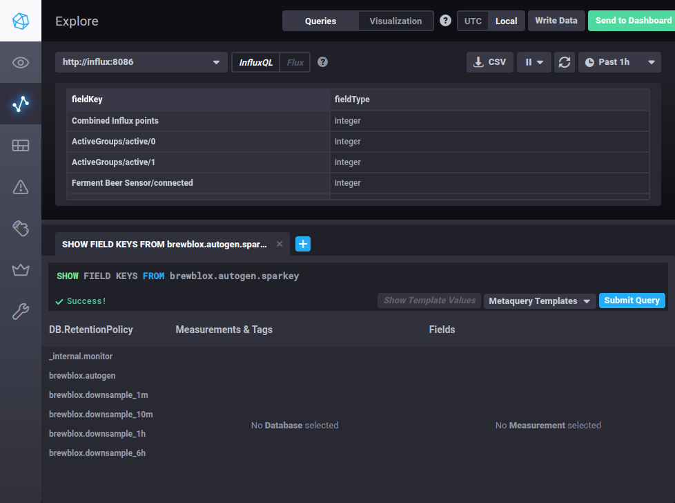

# Viewing raw history data with Chronograf

UI graphs and CSV exports are built to provide a convenient and straightforward way to view history data.
No advanced data analysis tools or access to Influx functionality is provided.

If the UI graphs are not sufficient, you can choose to directly access and query the database itself.

This is made easier by the existence of [Chronograf](https://www.influxdata.com/time-series-platform/chronograf/), a client for querying InfluxDB with its own web-based GUI.

To set up Chronograf on port 8888 of your Pi, add the following service to your `docker-compose.yml`
```
  chronograf:
    image: chronograf:1.8
    command: --influxdb-url=http://influx:8086
    ports:
      - "8888:8888"
```

Start your services (`brewblox-ctl up`), and you can now query the raw history data as published by your services.
For more information on Brewblox naming and storage conventions, see the [storage and downsampling reference doc](../reference/influx_downsampling).


