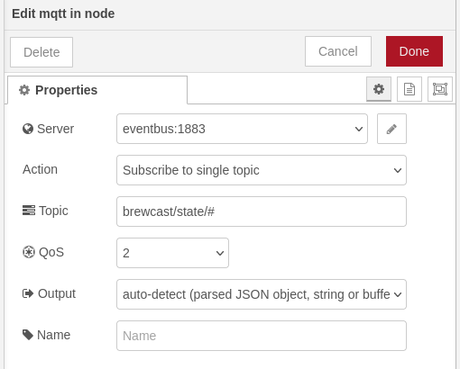
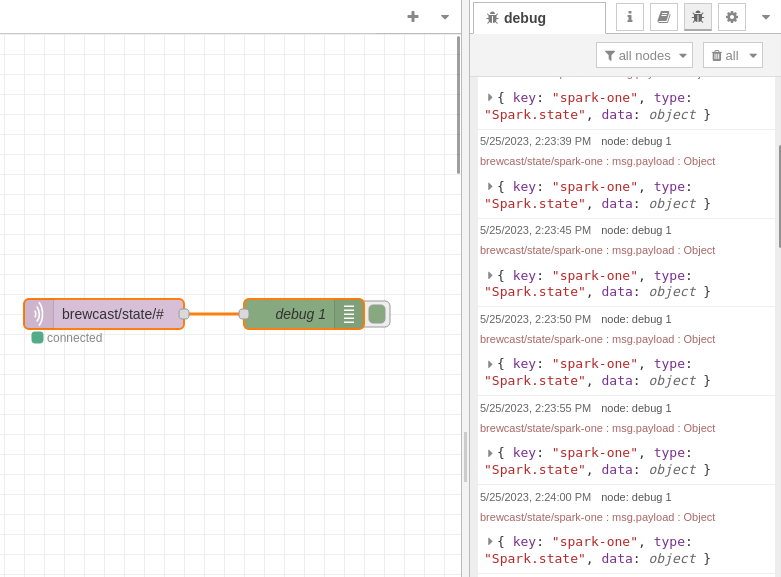
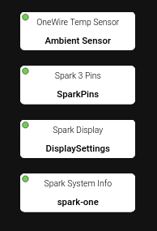
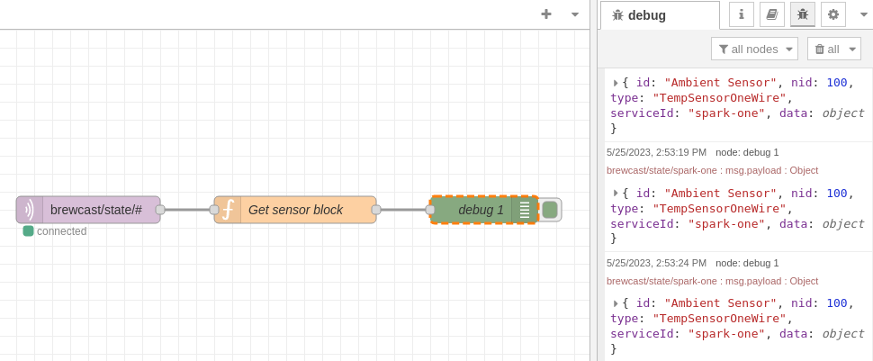
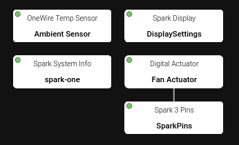
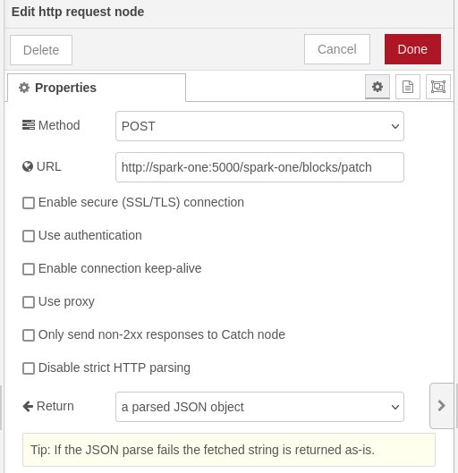
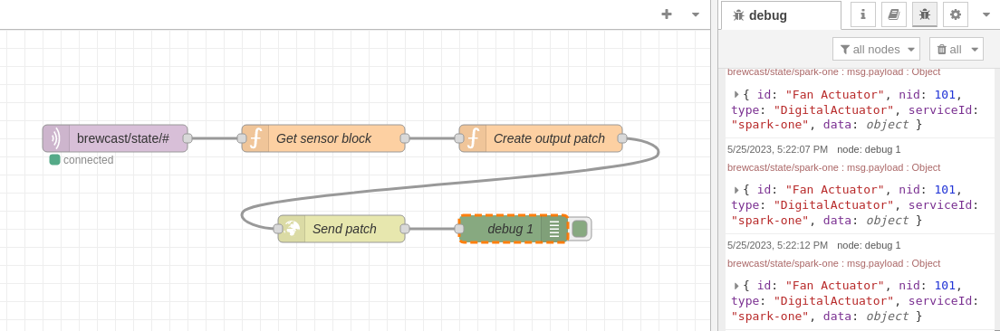

# Node-RED

## Introduction

- use Node-RED
- MQTT setup
- listen to block events
- send patch commands to Spark
- listen to disconnected events
- assume basic familiarity with Node-RED

## Installation

For this tutorial, we'll assume you have Brewblox already installed, with at least one Spark service.
If you don't have a Spark at hand, you can add a Spark simulation service.

Here, we'll call the Spark service `spark-one`. Adjust as needed in your own environment.

To add the Node-RED service, run:

```sh
brewblox-ctl add-node-red
```

When this is done, you can access the Node-RED interface at `{PI_ADDRESS}/node-red`

## Listening to the Brewblox eventbus

The first thing we want to do, is to connect to the Brewblox MQTT eventbus.
Because the `node-red` service runs inside the Brewblox network, we can connect to it directly.
For a more in-depth explanation, see the [routing guide](../../reference/routing.md).

- Create a *mqtt in* node.
- Double click the node to edit settings.
- Add a new *mqtt-broker config* node, with the following properties:
  - Server: `eventbus`
  - Port: `1883`
  - Do not use TLS
- Subscribe to the `brewcast/state/#` topic.
- Create a *debug* node.
- Attach the *debug* node to the *mqtt in* node.
- Deploy the flow.



If we switch to the **debug** tab in the right side bar, we'll now see Spark status updates appear every few seconds.



## Listening to a Spark block

The Spark state messages we are now logging are documented in the [Spark service state page](../../reference/spark_state.md).

We're mostly interested in the `data.blocks` field. This contains a list of [blocks](../../reference/block_types.md).

For this tutorial, we attached a OneWire sensor to the Spark, and called it **Ambient Sensor**.
If you're using a simulation service, you can add a *Temp Sensor (Mock)* block, and use that instead.



To get the block data from the Spark state event, we need to add a *function* node, with some javascript code:

```js
if(msg.payload.type !== 'Spark.state') {
    // Not a Spark state event
    // Stop the flow
    return null;
}

if(!msg.payload.data) {
    // Spark service is not connected
    // Stop the flow
    return null;
}

const block = msg
    .payload
    .data
    .blocks
    .find((block) => block.id === 'Ambient Sensor');

if(!block) {
    // Sensor block not found
    // Stop the flow
    return null;
}

// We have a block
// Let's send it to the next node
msg.payload = block;

return msg;
```

Connect the debug node to the function node, and you will see the block appear in the debug sidebar.



## Triggering an action

If the sensor value is above 25°C, we want to turn on a desk fan. If the sensor value falls below 25°C, we want to turn it off again.
To do this, we need to check the sensor, and depending on its value, update the setting of an actuator.

Create a *Digital Actuator* block on the Spark service, and link it to an IO channel.



To read and update the data, we need to check the documentation for the relevant blocks:

- [Temp Sensor (OneWire)](../../reference/block_types.md#tempsensoronewire)
- [Digital Actuator](../../reference/block_types.md#digitalactuator)

We need to read the sensor **value** field, and write to the actuator **storedState** field.

Create a new *function* node:

```javascript
// The numerical value is in Celsius or Fahrenheit
// Depending on your system-wide settings
const sensorValue = msg.payload.data.value.value;

// Create a block patch
// The 'data' field only includes the fields we want to change
const actuatorPatch = {
    id: 'Fan Actuator',
    type: 'DigitalActuator',
    serviceId: 'spark-one',
    data: {
        storedState: 'STATE_INACTIVE',
    },
};

if(sensorValue > 25) {
    actuatorPatch.data.storedState = 'STATE_ACTIVE';
}

msg.payload = actuatorPatch;
return msg;
```

To send the patch, we can use the [Spark service REST API](../../reference/blocks_api.md).
Remember: we can send it to the Spark service directly.

For the `spark-one` service, the URL will always be:

```txt
http://spark-one:5000/spark-one/blocks/patch
```

Create a *http request* node to send a POST request to this URL.
The response will always be a JSON object.



Connect the previous *function* node to the *http request* node, and attach our debug node to the output of the *http request* node.
Deploy the nodes, and the debug messages will show the full state of the Digital Actuator.


