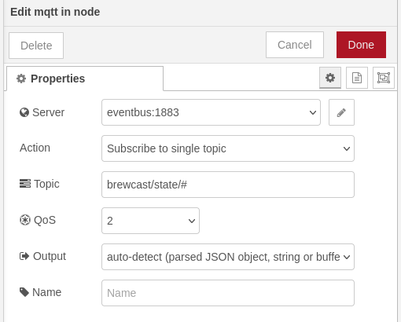
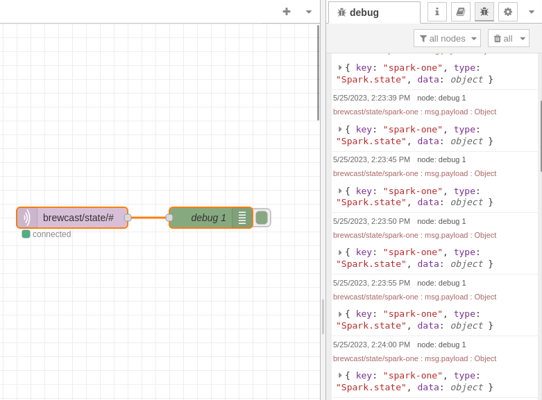
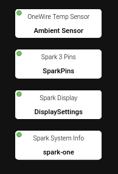
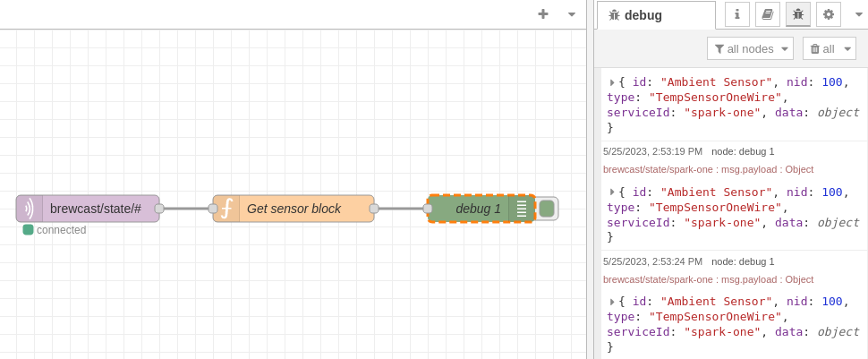
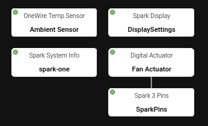
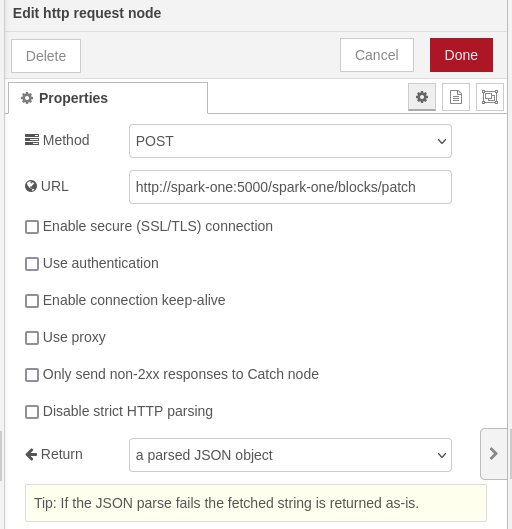
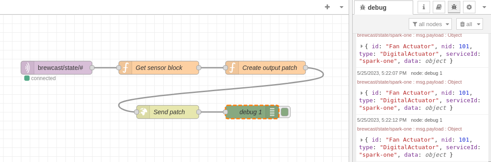

# Node-RED: Use Blocks

## Introduction

Node-RED is an low-code platform for writing automation tasks.
It can communicate with Brewblox APIs using MQTT and REST.

This tutorial shows how to listen for measured values from a sensor block
and change actuator on/off state in response.

We'll assume a basic familiarity with Node-RED, MQTT, and Brewblox blocks.
For introductions on these topics, see:

- [Node-RED](https://nodered.org/docs/tutorials/) (See below for an easy way to install Node-RED)
- [MQTT](http://www.steves-internet-guide.com/mqtt-works/)
- [Blocks](../../../user/blocks_architecture.md)

## Installation

We need to have at least one active Spark service.
If you don't have a Spark at hand, you can add a [simulation service](../../../user/services/spark_sim.md).

In this tutorial, we'll call the service **spark-one**.
Adjust as needed in the configuration and code blocks if your service has a different name.

To add the Node-RED service, run:

```sh
brewblox-ctl add-node-red
```

When this is done, you can access the Node-RED interface at `{BREWBLOX_ADDRESS}/node-red`

## Listening to the Brewblox eventbus

The MQTT eventbus is central to communication in Brewblox.
History data and service state is published here, and any client can subscribe to these messages.
For the Spark service, service state includes all blocks.
We can use this to create a Node-RED flow that responds to changes in block data.

Because the `node-red` service runs inside the Brewblox network, we can connect to the eventbus directly.
For a more in-depth explanation, see the [routing guide](../../reference/routing.md).

::: tip
If you're running Node-RED externally, the eventbus address is `{BREWBLOX_ADDRESS}:1883`
:::

Steps:

- Create a *mqtt in* node.
- Double click the node to edit settings.
- Add a new *mqtt-broker config* node, with the following properties:
  - Server: `eventbus`
  - Port: `1883`
- Subscribe to the `brewcast/state/#` topic.
- Create a *debug* node.
- Attach the *debug* node to the *mqtt in* node.
- Deploy the flow.



If we switch to the **debug** tab in the right side bar, we'll now see Spark status updates appear every few seconds.



## Finding the sensor block

The Spark state messages we are now logging are documented in the [Spark service state page](../../reference/spark_state.md).

We're interested in the `data.blocks` field. This contains a list of [blocks](../../reference/block_types.md).

For this tutorial, we attached a OneWire sensor to the Spark, and called it **Ambient Sensor**.
If you're using a simulation service, you can use a *Temp Sensor (Mock)* block.



To get the block data from the Spark state event, we need to add a *function* node, with some javascript code:

```js
if(msg.payload.type !== 'Spark.state') {
    // Not a Spark state event
    // Stop the flow
    return null;
}

if(!msg.payload.data) {
    // Spark service is not connected
    // Stop the flow
    return null;
}

const block = msg
    .payload
    .data
    .blocks
    .find((block) => block.id === 'Ambient Sensor');

if(!block) {
    // Sensor block not found
    // Stop the flow
    return null;
}

// We have a block
// Let's send it to the next node
msg.payload = block;

return msg;
```

Connect the debug node to the function node, and you will see the block appear in the debug sidebar.



## Changing the actuator block

If the sensor value is above 26°C, we want to turn on a desk fan. If the sensor value falls below 24°C, we want to turn it off again.
Between 24°C and 26°C is the dead band, where we don't change the actuator either way.
To do this, we need to check the sensor, and depending on its value, update the setting of an actuator.

Create a *Digital Actuator* block called **Fan Actuator** on the Spark service, and link it to an IO channel.



To read and update the data, we need to check the documentation for the relevant blocks:

- [Temp Sensor (OneWire)](../../reference/block_types.md#tempsensoronewire)
- [Digital Actuator](../../reference/block_types.md#digitalactuator)

We need to read the sensor **value** field, and write to the actuator **storedState** field.

Create a new *function* node:

```javascript
// The numerical value is in Celsius or Fahrenheit
// This depends on your system-wide settings
const sensorBlock = msg.payload;
const sensorValue = sensorBlock.data.value.value;

// Create a block patch
// The 'data' field only includes the fields we want to change
const actuatorPatch = {
    id: 'Fan Actuator',
    type: 'DigitalActuator',
    serviceId: 'spark-one',
    data: {},
};

if (sensorValue < 24) {
    actuatorPatch.data.storedState = 'STATE_INACTIVE';
}
else if (sensorValue > 26) {
    actuatorPatch.data.storedState = 'STATE_ACTIVE';
}
else {
    return null;
}

msg.payload = actuatorPatch;
return msg;
```

To send the patch, we can use the [Spark service REST API](../../reference/blocks_api.md).
Just as with the eventbus, we can connect to the service directly at `spark-one:5000`, and don't need to use the public IP address.

For the `spark-one` service, the URL will be:

```txt
http://spark-one:5000/spark-one/blocks/patch
```

::: tip
If you're running Node-RED externally, the URL will be `http://{BREWBLOX_ADDRESS}/spark-one/blocks/patch`.
:::

Create a *http request* node to send a POST request to this URL.
The response will always be a JSON object.



Connect the previous *function* node to the *http request* node, and attach our debug node to the output of the *http request* node.
Deploy the nodes, and the debug messages will show the response from the HTTP request.
The `blocks/patch` response is the new state of the changed block.



## Source

```json
[{"id":"9992de42fa5ebbce","type":"tab","label":"Using blocks","disabled":false,"info":"","env":[]},{"id":"01302c4161e4ff52","type":"mqtt in","z":"9992de42fa5ebbce","name":"","topic":"brewcast/state/#","qos":"2","datatype":"auto-detect","broker":"5523a8995d4ae51d","nl":false,"rap":true,"rh":0,"inputs":0,"x":760,"y":120,"wires":[["5625c086cba505df"]]},{"id":"b139372f833daf59","type":"debug","z":"9992de42fa5ebbce","name":"debug 1","active":true,"tosidebar":true,"console":false,"tostatus":false,"complete":"payload","targetType":"msg","statusVal":"","statusType":"auto","x":1200,"y":220,"wires":[]},{"id":"5625c086cba505df","type":"function","z":"9992de42fa5ebbce","name":"Get sensor block","func":"if(msg.payload.type !== 'Spark.state') {\n    // Not a Spark state event\n    return null;\n}\n\nif(!msg.payload.data) {\n    // Spark service is not connected\n    return null;\n}\n\nconst block = msg\n    .payload\n    .data\n    .blocks\n    .find((block) => block.id === 'Ambient Sensor');\n\nif(!block) {\n    // Sensor block not found\n    return null;\n}\n\n// We have a block\n// Let's send it to the next node\nmsg.payload = block;\n\nreturn msg;","outputs":1,"noerr":0,"initialize":"","finalize":"","libs":[],"x":990,"y":120,"wires":[["1c3621bde205eab0"]]},{"id":"1c3621bde205eab0","type":"function","z":"9992de42fa5ebbce","name":"Create output patch","func":"// The numerical value is in Celsius or Fahrenheit\n// This depends on your system-wide settings\nconst sensorBlock = msg.payload;\nconst sensorValue = sensorBlock.data.value.value;\n\n// Create a block patch\n// The 'data' field only includes the fields we want to change\nconst actuatorPatch = {\n    id: 'Fan Actuator',\n    type: 'DigitalActuator',\n    serviceId: 'spark-one',\n    data: {},\n};\n\nif (sensorValue < 24) {\n    actuatorPatch.data.storedState = 'STATE_INACTIVE';\n}\nelse if (sensorValue > 26) {\n    actuatorPatch.data.storedState = 'STATE_ACTIVE';\n}\nelse {\n    return null;\n}\n\nmsg.payload = actuatorPatch;\nreturn msg;\n","outputs":1,"noerr":0,"initialize":"","finalize":"","libs":[],"x":1230,"y":120,"wires":[["5ef8f86ee768a4c0"]]},{"id":"5ef8f86ee768a4c0","type":"http request","z":"9992de42fa5ebbce","name":"Send patch","method":"POST","ret":"obj","paytoqs":"ignore","url":"http://spark-one:5000/spark-one/blocks/patch","tls":"","persist":false,"proxy":"","insecureHTTPParser":false,"authType":"","senderr":false,"headers":[],"x":1010,"y":220,"wires":[["b139372f833daf59"]]},{"id":"5523a8995d4ae51d","type":"mqtt-broker","name":"","broker":"eventbus","port":"1883","clientid":"","autoConnect":true,"usetls":false,"protocolVersion":"4","keepalive":"60","cleansession":true,"birthTopic":"","birthQos":"0","birthPayload":"","birthMsg":{},"closeTopic":"","closeQos":"0","closePayload":"","closeMsg":{},"willTopic":"","willQos":"0","willPayload":"","willMsg":{},"userProps":"","sessionExpiry":""}]
```
