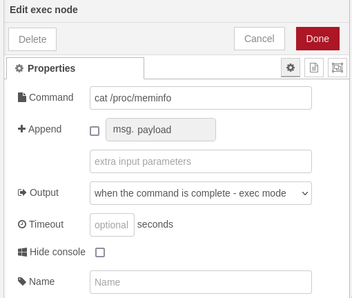
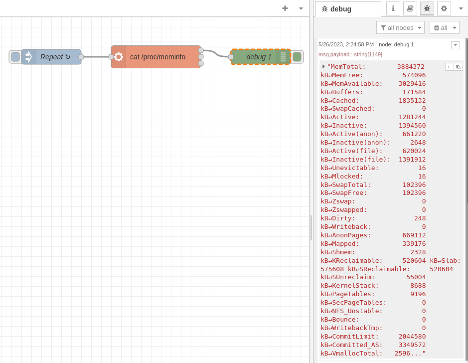
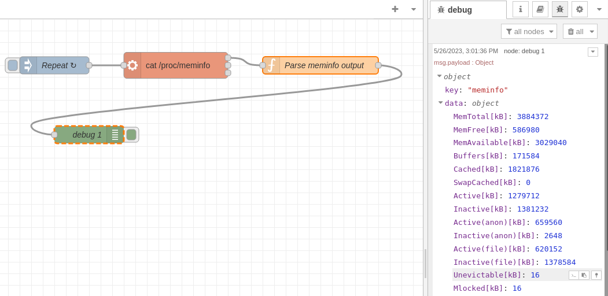
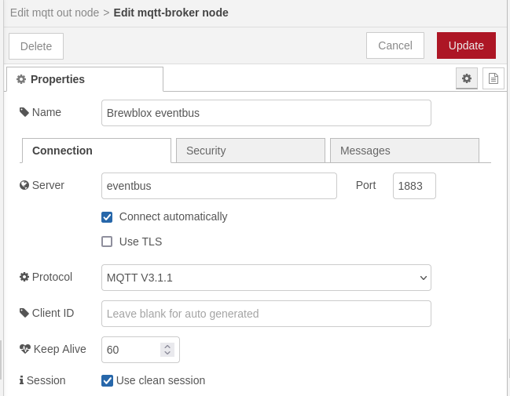
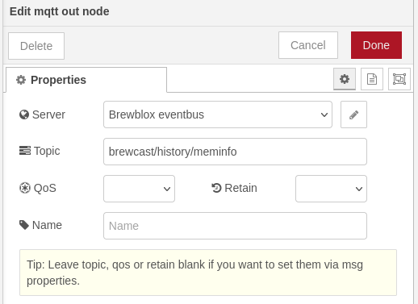
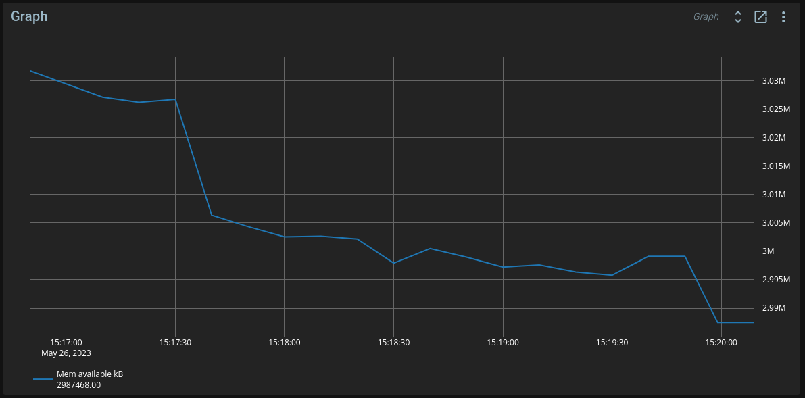

# Publishing data in Node-RED

## Introduction

Node-RED is an low-code platform for writing automation tasks.
It can communicate with Brewblox APIs using MQTT and REST.

This tutorial shows how to publish Brewblox history data that can then be viewed in graphs.

We'll assume a basic familiarity with Node-RED, MQTT, and Brewblox history data.
For introductions on these topics, see:

- [Node-RED](https://nodered.org/docs/tutorials/) (See below for an easy way to install Node-RED)
- [MQTT](http://www.steves-internet-guide.com/mqtt-works/)
- [History](../../reference/history_events.md)

## Installation

To add the Node-RED service, run:

```sh
brewblox-ctl add-node-red
```

## Flow

For this tutorail, we'll query the system memory diagnostics,
and publish the result to the Brewblox history database.

To do this, we need to:

- Periodically trigger the Node-RED flow.
- Call the system diagnostics tool.
- Convert the raw output of the system diagnostics tool into something we can publish.
- Send the formatted data to the Brewblox eventbus.

## Getting raw data

In this flow, we're not responding to external inputs, but periodically fetching data.

To get this process started, first create an *inject* node, and set it to repeat every 10 seconds.


To get the actual data, create an *exec* node, with the command `cat /proc/meminfo`.



Add a *debug* node to see the `stdout` output from the exec node, and deploy the nodes.

Now, when you open the debug tab in the right side bar, you'll see the raw output from the `cat /proc/meminfo` command.



## Formatting data

The raw data is incompatible with the [Brewblox history format](../../reference/history_events.md), and would be ignored if published.
We need to convert it to a JSON object with the correct fields.

To do this, create a *function* node, with this javascript code:

```js
const key = 'meminfo';
const data = {};

for (const line of msg.payload.split('\n')) {
    // example line: 'MemTotal:        3884372 kB'
    const words = line
        .replace(':', '')
        .split(' ')
        .filter((s) => s !== '');

    // Example:
    // data['MemTotal[kB]'] = 3884372;
    data[words[0] + '[kB]'] = parseInt(words[1]);
}

msg.payload = { key, data };

return msg;
```

Attach the *function* node to the *exec* stdout, and move the debug node to the *function* output.
Deploy the nodes, and the debug output changes to the formatted data.



## Publishing to MQTT

Because the `node-red` service runs inside the Brewblox network, we can connect to the eventbus directly at `eventbus:1883`.
For a more in-depth explanation, see the [routing guide](../../reference/routing.md).

::: tip
If you're running Node-RED externally, the eventbus address is `{BREWBLOX_ADDRESS}:1883`
:::

To publish, we need a *mqtt out* node.
Add it, and double click to edit settings.

If you already have a "Brewblox eventbus" broker from the [Using blocks in Node-RED](../node_red_listening/README.md) tutorial, you can re-use this.
Otherwise, add a new *mqtt-broker config* node. The **Server** should be `eventbus`.



In the *mqtt out* node, set the **Topic** to `brewcast/history/meminfo`.



Connect the output of the *function* node to the *mqtt out* node, and deploy the nodes.


To see the results, create a new Graph in Brewblox, and select the new fields under `meminfo`.



## Source

```json
[{"id":"f3401d5ed8270c60","type":"tab","label":"Publish history","disabled":false,"info":""},{"id":"9b695b94.32347","type":"mqtt-broker","name":"Brewblox eventbus","broker":"eventbus","port":"1883","clientid":"","autoConnect":true,"usetls":false,"compatmode":false,"protocolVersion":"4","keepalive":"60","cleansession":true,"birthTopic":"","birthQos":"0","birthPayload":"","birthMsg":{},"closeTopic":"","closeQos":"0","closePayload":"","closeMsg":{},"willTopic":"","willQos":"0","willPayload":"","willMsg":{},"userProps":"","sessionExpiry":""},{"id":"e178443b43d89a8f","type":"inject","z":"f3401d5ed8270c60","name":"Repeat","props":[{"p":"payload"},{"p":"topic","vt":"str"}],"repeat":"10","crontab":"","once":false,"onceDelay":0.1,"topic":"","payload":"","payloadType":"date","x":780,"y":80,"wires":[["cea435bb258ba023"]]},{"id":"cea435bb258ba023","type":"exec","z":"f3401d5ed8270c60","command":"cat /proc/meminfo","addpay":"","append":"","useSpawn":"false","timer":"","winHide":false,"oldrc":false,"name":"","x":990,"y":80,"wires":[["f43208cf69d6829c"],[],[]]},{"id":"f43208cf69d6829c","type":"function","z":"f3401d5ed8270c60","name":"Parse meminfo output","func":"const key = 'meminfo';\nconst data = {};\n\nfor (const line of msg.payload.split('\\n')) {\n    // example line: 'MemTotal:        3884372 kB'\n    const words = line\n        .replace(':', '')\n        .split(' ')\n        .filter((s) => s !== '');\n    \n    // Example:\n    // data['MemTotal[kB]'] = 3884372;\n    data[words[0] + '[kB]'] = parseInt(words[1]);\n}\n\nmsg.payload = { key, data };\n\nreturn msg;","outputs":1,"noerr":0,"initialize":"","finalize":"","libs":[],"x":1240,"y":80,"wires":[["4e98ebbf6f0de136"]]},{"id":"4e98ebbf6f0de136","type":"mqtt out","z":"f3401d5ed8270c60","name":"","topic":"brewcast/history/meminfo","qos":"","retain":"","respTopic":"","contentType":"","userProps":"","correl":"","expiry":"","broker":"9b695b94.32347","x":1090,"y":180,"wires":[]}]
```
