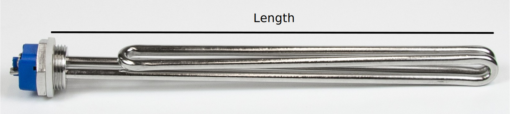

# Heating elements

Brewing involves heating a lot of water. To reduce waiting time on your brewing day you are best advised to select the highest power heating element your mains outlet can power. Obviously, the element should fit your kettle so these two characteristics are the main criteria for element selection.

In this document we talk you through the basic theory of heating water, the pros and cons of different heating elements, how to install and connect them, and the different tools you need.

::: danger Note
Always consult an electrician for advice and help with wiring your elements. Under no circumstances should they be used without proper wiring, ground fault circuit protection and overcurrent circuit protection.
:::

## Heating water

Water is a high heat capacity fluid, therefore it takes a lot of energy (power and time) to heat. For example: in The Netherlands a typical residential mains outlet is rated at a maximum power of 3680W. With a heating element of 3500W it would take 45 minutes to heat a kettle with 50L of water to 65C for mashing ($\Delta T$ = 45C), or 80 minutes to boil ($\Delta T$ = 80C).

Heating water with this setup already adds more than two hours (45 + 80 = 125 minutes) of waiting time to your brewing day. Select a higher power heating element when your mains outlet allows for it. You can calculate the expected heating time in your situation with the calculator below. The calculator works with SI derived units of litres (L) and degrees celsius (C) by default, but takes US gallon (US Gal) and degree Fahrenheit (F) as well.

TODO: Bob vragen interactieve heating time calculator te maken in vuepress.

<!-- ### calculator

### Formula:

$$\Delta t = \frac{c_p \cdot M \cdot \Delta T}{P \cdot 60} = \text{XX min}$$

| Variable   | Description                                          | Unit(s) / Value(s)                                           | Interactive use                                      |
|:----------:|------------------------------------------------------|--------------------------------------------------------------|------------------------------------------------------|
| $\Delta t$ | heating time (time difference)                       | min (round to int sufficient)                                | result                                               |
| $c_{p}$    | Specific heat capacity (isobaric mass heat capacity) | 4.18 kJ / (kg * K) for water (l)                             | constant                                             |
| $M$        | Mash (water) mass                                    | kg, calculate from L / Gal (US Gal), 1L = 1kg, 1Gal = 3.79kg | interactive value + unit - default: 40 L             |
| $\Delta T$ | Mash temperature difference                          | C / F, 1C = 5/9F                                             | interactive value + unit - default: (65 - 20) = 45 C |
| $P$        | Power heating element                                | W                                                            | interactive value - default: 3600W                   |

Default example: It takes 45 (44.8) mins to heat 50L of water 45C (20 to 65C) with a 3500W heating element. -->

## Mains electricity

To power your heating element it has to be connected to your local mains. Characteristics of mains electricity differ from country to country, see [Wikipedia](https://en.wikipedia.org/wiki/Mains_electricity_by_country) for a list or consult your local electrician for details. BrewPi heating elements can be operated at 230 or 240V and can be used all over the world. In this section we talk you through the three main connection configurations with examples from Europe (NL) and North-America (US). In the last part of this section we will discuss how to determine the maximum power (current) of the heating element you still can connect safely.

### Single phase

Most residential mains outlets outside of North- and Central-America are single phase outlets operating at 230V. How to connect your heating element is shown in the figure below. The heating element (rectangle) is connected between the live (L) and neutral (N) wire. The live wire is held at a voltage of 230V while the neutral is at zero. The voltage powering the element is 230 - 0 = 230V.

TODO: Elco, ground aangeven in plaatje?

### Split phase

In the US and related countries mains electricity operates at 120V. For high-power electrical appliances (like heating elements, stoves, etc.) houses in the US are equipped with split phase outlets like [NEMA 14](https://en.wikipedia.org/wiki/NEMA_connector#NEMA_14). In split phase outlets two live wires (L1 and L2) at 120V are combined in a special configuration to supply 120 + 120 = 240V to the heating element (rectangle). See the figure below.

TODO: Elco, ground aangeven in plaatje?

### Three phase

Three phase mains connections are the high-power electrical connections outside North- and Central-America and generally operate at 230V. These connections can be found in many commercial and some residential buildings around the world. A three phase connection consists of three phases (three live wires) and in general can provide about 3 times the power of a single phase connection. To make full use of a three phase connection requires an heating element with 3 resistors. Each resistor is connected between a live wire (L1 - L3) and neutral (N) in a star (or Y) configuration, see the figure below. Since BrewPi 3-phase heating elements contain equal power resistors, the neutral can be omitted and the line is dashed in the figure.

TODO: Elco, ground aangeven in plaatje?

### Maximum current

To protect the electric circuit in your building from an overload or short circuit (fire hazard) it is protected by a circuit breaker (fuse) on the distribution board. The circuit breaker limits the current that can be drawn from a mains outlet and determines the maximum power of the heating element your can safely connect.

To reduce waiting time at your brewing day, we at BrewPi, would advise you to buy the highest power heating element your mains outlet can power. Therefore you should find the maximum current ($I_{max}$) of the circuit breaker behind the outlet on your brewing location. Ask your electrician when you are unsure about the details of your electrical installation.

You can select your heating element based on the maximum current or maximum power ($P_{max}$) of the outlet you plan to use. The maximum power is determined by multiplying the voltage of your mains ($U$) by the maximum current; $P_{max} = U \times I_{max}$.

**Examples:**
- **Single phase:** typical residential mains outlets in the Netherlands are protected by a circuit breaker with a maximum current of 16A. Operating at 230V, outlets have a maximum power of 3680W.
- **Split phase:** typical split phase outlets in the US are protected by a circuit breaker with a maximum current of 25A. Operating at 240V these outlets have a maximum power of 6000W.
- **Three phase:** residential three phase connections in the Netherlands come in two flavors; 3x16 and 3x25A rated current. At 230V these connections have a maximum power of 11040 or 17250W respectively.

The examples are listed in the table below for an overview.

| Type         | Voltage (V) | Max. Current (A) | Max. power (W) | Location |
|--------------|------------:|-----------------:|---------------:|---------:|
| Single phase |         230 |               16 |           3680 |        NL|
| Split phase  |       2x120 |               25 |           6000 |        US|
| Three phase  |         230 |     3x16 3x25 | 11040 17250 |        NL|

**Note:** most probably the circuit breaker on your distribution board serves as an overcurrent protection for a number of outlets near your brewing location. When selecting your element, leave some room (for example ~0.5A or ~100W) for other small electrical appliances like a lamp or a radio for a nice time during your brewing day. If you plan on upgrading your mains outlet to a higher rated power, you might want to select your element accordingly.

## Elements

At BrewPi we sell low watt density (4-13 W/cm2) heating elements. The low watt density prevents scorching your elements with mash sugars, and ensures they are easy to clean after brewing. At the same time it prevents scorching your brew and the possible production of burnt off-flavors that might ruin your beer. All elements are made from stainless steel for durability and hygiene reasons.

BrewPi heating elements come in two geometries; straight and round. Straight elements are the cheaper option in general. Round elements heat your mash / wort more homogeneous, are minimally blocking your flow when whirlpooling and have a even lower watt density. Technical details of the different elements can be found in the sections below.

### Straight

Straight BrewPi heating elements come in two types; foldback and tri-clamp. Foldback elements are the most simple elements you can find, and are the best option on a budget. Tri-clamp elements are fixed in your kettle with a tri-clamp fitting. These fittings consist of two flanges, an O-ring, and a clamp band (hence *tri*-clamp) and are the best option if you want to be able to easily remove the element from the kettle. This comes in handy when you want to change your element frequently, or want to clean it thoroughly outside the kettle.

#### Foldback

Details about our foldback heating elements are listed in the interactive table below. In the table you can toggle the length unit (cm / inch), and the mains voltage (230V / 240V) by clicking on the respective property. The element length (see figure for a definition) determines the minimum kettle size (Min. kettle ⌀) required for mounting. Both foldback elements have a low watt density of $\leq$ 12 W/cm2, even at a mains voltage of 240V. Both elements consist of 1 resistor, and come with a 1" BSP thread. Note: our foldback elements come without a locknut or mounting kit. For proper installation either of these needs to be bought separately. The mounting kit is custom designed and adds ground fault protection to the element while -at the same time- serving as a safety cover for the electrical wiring.

TODO: Plaatje nog aanpassen - Is dit het origineel Elco?

<TableFoldback/>

TODO: XX BrewPi part. no. nog aanpassen

#### Tri-clamp

Details of our tri-clamp heating elements are listed in the table below. The table length unit (cm / inch) and mains voltage (230V / 240V) can be toggled on click. The tri-clamp fitting is approved for food-grade hygiene standards and useful when frequent removal of the element from the kettle is required. It does require a 2" tri-clamp ferrule (64mm OD) mounted on your kettle. The element length (see figure for a definition) determines the minimum kettle diameter (Min. kettle ⌀) required for mounting. The elements are available in a big power range (2800 - 11000W), and have low watt density ($\leq$ 13 W/cm2). The element current (Current) is written in the format: (no. resistors)x(current per resistor). The maximum current is dependent on how it is connected to the outlet. More information about how to connect your element and how to determine the maximum current can be found in the section [Connecting](#connecting) below.

TODO: Plaatje nog aanpassen - Is dit het origineel Elco?

<TableTriclamp/>

### Round

At BrewPi we sell custom designed round heating elements. Technical details of the heating elements can be found in the interactive table below. You can toggle the table length unit (cm / inch) and mains voltage (230V / 240V) on click. The element Diameter and Length (see figure for a definition) determine the minimum required kettle diameter (Min. kettle ⌀). The element round shape is least obstructive to the flow when whirlpooling in a kettle with the design diameter (Design kettle ⌀). The elements come in two types; 1-phase elements with one resistor per flange, and 3-phase elements with 3. Especially the 3-phase elements have an extremely low watt density, which makes scorching your element practically impossible. All elements come with a mounting kit, and have a 1.5" BSP thread. The element current (Current) is written in the format: (no. resistors)x(current per resistor). The maximum current is dependent on how it is connected to the outlet. More information about how to connect your element and how to determine the maximum current can be found in the section [Connecting](#connecting) below.

TODO: Plaatje nog aanpassen - Is dit het origineel Elco?

<TableRound/>

TODO write connecting, installation?, operation, etc. + remove comments.

## Connecting

Now you have selected your element(s)

::: danger Note
Always consult an electrician for advice and help with wiring your elements. Under no circumstances should these be used without proper wiring, ground fault circuit protection and overcurrent circuit protection.
:::

### 1-Phase system

- example flange like in store?
- example flange 2/3-phase elements?

### 2-Phase system

- example flange like in store?

### 3-Phase system

- example flange like in store?

## Installation

TODO: vraag - hoort er bij?

- Buy kettle
- Buy hole punch
- Make hole in kettle with hole punch
- Install
- Dry fire protection - float sensor (hier of bij connecting)

- staat al in pdf?
  - link pdf foldback
  - link pdf tri-clamp?
  - link pdf round?

## Operation

- Switching element with SSR's
- Operating element for temperature control, connecting to Spark, etc.
- Operating multiple elements on one mains outlet
