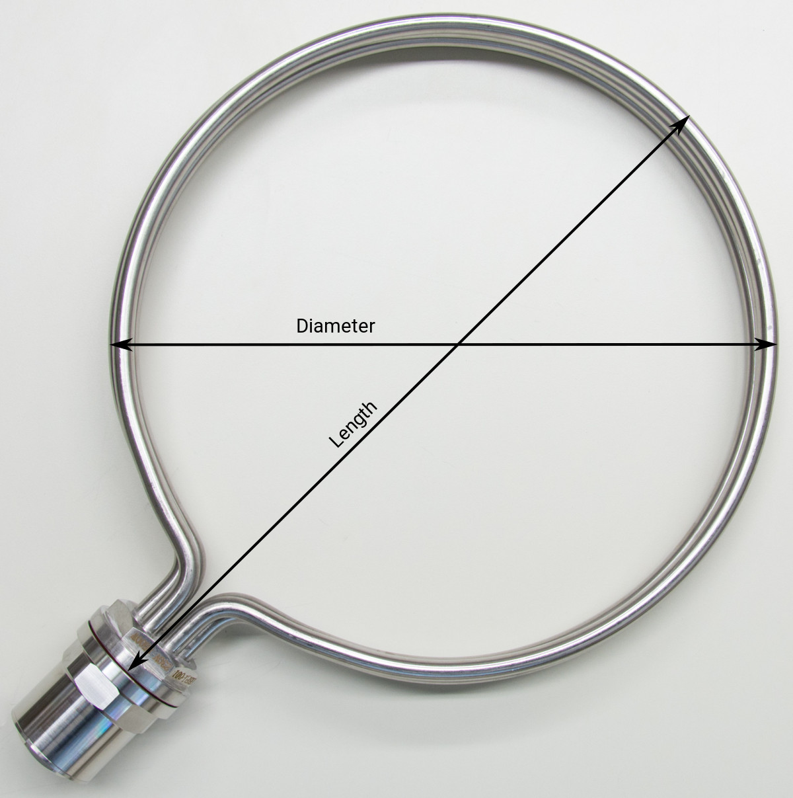

# Heating elements

Brewing involves heating *a ton* of water. To reduce waiting time on your brewing day you are best advised to select the highest power heating element your mains outlet can power. Obviously, the element should fit your kettle so these two characteristics are the main criteria for element selection.

In this document we talk you through the basic theory of heating water, the pros and cons of different heating elements, how to install and connect them, and the different tools you need.

::: danger Note
Always consult an electrician for advice and help with wiring your elements. Under no circumstances should these be used without proper wiring, ground fault circuit protection and overcurrent circuit protection.
:::

## Mains power

Voltage, rated power and number of phases of mains outles differ all over the world. In terms of mains voltage we can divide the world in two main voltage blocks; the European 230V based system, and the US 120V system. See [Wikipedia](https://en.wikipedia.org/wiki/Mains_electricity_by_country) for a world map. BrewPi heating elements are designed for an operating voltage of 230 / 240V and can be connected in both systems. The rated power of your mains outlet is important as it is the maximum power your outlet can sustain contiuously, and thus the maximum power of the heating element you can connect safely. In this section we talk you through how to calculate the rated power of an outlet and give you an example of a 1, 2, and 3-phase system. You can calculate the rated power of your mains with the formula:

$$\text{Rated power} = \text{Nominal voltage} \times \text{Rated current}$$
$$P_N = V \times I_N$$

The nominal voltage is the voltage of your mains, the rated current is the rated current of the fuse the outlet is connected to in your fuse box. Consult your local electrician for advice when you are unsure about the technical details of your local mains.

**Examples:**
- **1-Phase:** Typical residential mains outlets in The Netherlands (Europe) are single phase outlets at 230V and are protected by a fuse with a rated current of 16A. These outlets have a rated power of 3680W. In the US, single phase outlets operate at 120V and in general cannot provide enough power for a heating element suitable for brewing.
- **2-Phase:** To power high-power electrical appliances, houses in the US are equipped with 2-phase (split phase) outlets like for example [NEMA 14](https://en.wikipedia.org/wiki/NEMA_connector#NEMA_14). With these outlets you can add two 120V single phases to a voltage of 2x120 = 240V. With a typical rated current of 25A these outlets have a rated power of 6000W.
- **3-Phase** In general, residential and commercial buildings in Europe can apply for a 3-phase connection to the electricity grid. These connections have three phases supplying the current, and therefore in general 3x the power of a single phase connection. In The Netherlands these connections come in two flavours; 3x16 and 3x25A rated current. These connections can power 11040 and 17250W heating elements respectively.

The examples are listed in the table below for an overview.

| Type    | Voltage (V) | Rated current (A) | Rated power (W) |
|---------|------------:|------------------:|----------------:|
| 1-Phase |         230 |                16 |            3680 |
| 2-Phase |       2x120 |                25 |            6000 |
| 3-Phase |         230 |      3x16 3x25 |  11040 17250 |

Most probably the fuse in your fuse box serves as an overcurrent protection for a number of outlets near your brewing location. When selecting your element, leave some room for other small electrical applicances like a lamp or a radio for a nice time during your brewing day. If you plan on upgrading your mains outlet to a higher rated power, you might want to select your element accordingly. 

\*Vraag Elco: hoe sluit je een hoog vermogen element aan op een aansluiting die dat vermogen niet kan leveren? Voltage omlaag, trafo ervoor?

## Heating water

Water is a high heat capacity fluid. It takes 4180J to heat 1kg of water by 1C (2320J per kg F). Neglecting losses we can calculate the time it takes a heating element to heat water to the desired temperature with the formula:

$$\text{Heating time} = \frac{\text{Specific heat capacity} \times \text{Mass} \times \text{Temperature difference}}{\text{Power heating element}}$$ 

$$\Delta t = \frac{c_p \times M \times \Delta T}{P}$$

**Example:** In The Netherlands a typical residential mains outlet is rated at a maximum power of 3680W. With a heating element of 3500W it would take 45 minutes to heat a kettle with 50L of water to 65C for mashing ($\Delta T$ = 45C), or 80 minutes to boil ($\Delta T$ = 80C).

45 + 80 minutes adds more than two hours of waiting time to your brewing day. Select a higher power heating element when your mains outlet allows for it. You can calculate the heating time in your situation with the calculator below. The calculator works with SI derived units of litres (L) and degrees celcius (C) by default, but takes US gallon (US Gal) and degree Fahrenheit (F) as well.

### calculator

Bob vragen interactieve heating time calculator te maken in vuepress.

### Formula:

$$\Delta t = \frac{c_p \cdot M \cdot \Delta T}{P \cdot 60} = \text{XX min}$$

| Variable   | Description                                          | Unit(s) / Value(s)                                           | Interactive use                                      |
|:----------:|------------------------------------------------------|--------------------------------------------------------------|------------------------------------------------------|
| $\Delta t$ | heating time (time difference)                       | min (round to int sufficient)                                | result                                               |
| $c_{p}$    | Specific heat capacity (isobaric mass heat capacity) | 4.18 kJ / (kg * K) for water (l)                             | constant                                             |
| $M$        | Mash (water) mass                                    | kg, calculate from L / Gal (US Gal), 1L = 1kg, 1Gal = 3.79kg | interactive value + unit - default: 40 L             |
| $\Delta T$ | Mash temperature difference                          | C / F, 1C = 5/9F                                             | interactive value + unit - default: (65 - 20) = 45 C |
| $P$        | Power heating element                                | W                                                            | interactive value - default: 3600W                   |

Default example: It takes 45 (44.8) mins to heat 50L of water 45C (20 to 65C) with a 3500W heating element.

## Elements

At BrewPi we sell low watt density ($\leq$ 12 W/cm2) heating elements to prevent scorching your mash / wort. At the same time this prevents encrusting your elements and makes them really easy to clean after brewing. All elements are made from stainless steel for durability and hygenic reasons.

BrewPi heating elements come in two geometries; straight and round. Straight elements are the cheaper option in general. Round elements heat your mash / wort more homogeneous, are minimally blocking your flow when whirpooling and have a even lower watt density. Technical details of the different elements can be found in the sections below.

### Straight

Straight BrewPi heating elements come in two types; foldback and tri-clamp. Foldback elements are the most simple elements you can find, and are the best option on a budget. Tri-clamp elements are fixed in your kettle with a tri-clamp fitting. These fittings consist of two flanges, an O-ring, and a clamp band (hence *tri*-clamp) and are the best option if you want to be able to easily remove the element from the kettle. This comes in handy when you want to change your element frequently, or want to clean it thourougly outside the kettle. 

#### Foldback

Details about our foldback heating elements are listed in the table below. The element length (see figure for a definition) determines the minimum kettle size (Min. ⌀) required for mounting. The element power is defined at a nominal voltage of 230V. Both foldback elements have a low watt density of 11 W/cm2 and consist of 1 resistor. These elements can be connected to 1 and 2-phase outlets, and come with a 1" BSP thread. Note: do not forget to buy your element mounting kit to add grounding protection and a safety cover for the electrical wiring.

Plaatje nog aanpassen - Is dit het origineel Elco?

|  # | Length (cm) | Min. ⌀ (cm) | Power (W) | No. Resistors | Watt density (W/cm2) |
|:--:|------------:|------------:|----------:|--------------:|--------------------------------:|
| X* |          27 |          30 |      2800 |             1 |                            11.0 |
| X* |          32 |          35 |      3200 |             1 |                            11.0 |

X* BrewPi part. no. nog aanpassen

#### Tri-clamp

Details of our tri-clamp heating elements are listed below. The tri-clamp fitting is hygenic and useful when frequent removal of the element from the kettle is required. They do require a 2" tri-clamp ferrule (64mm OD) mounted on your kettle. The element length (see figure for a definition) determines the minimum kettle diameter (Min. ⌀) required for mounting. The elements are available in a big power range (2800 - 10000W), and have low watt density ($\leq$ 12 W/cm2). 2 resistor elements can be connected in a 1 and 2-phase parallel configuration, 3 resistor elements can be connected in a 1 phase parallel, and 3-phase star configuration.

Plaatje nog aanpassen - Is dit het origineel Elco?

|  # | Length (cm) | Min. ⌀ (cm) | Power (W) | No. Resistors | Watt density (W/cm2) |
|:--:|------------:|------------:|----------:|--------------:|--------------------------------:|
| 11 |          32 |          32 |      5500 |             3 |                            10.6 |
| 12 |          42 |          42 |      8500 |             3 |                            11.7 |
| 13 |          52 |          52 |     10000 |             3 |                            10.7 |
| 14 |          30 |          30 |      2800 |             2 |                             8.8 |
| 15 |          35 |          35 |      3200 |             2 |                             8.3 |
| 16 |          42 |          42 |      5000 |             2 |                            10.3 |

Element power is defined at a nominal voltage of 230V.

### Round

At BrewPi we sell custom designed round heating elements. The element Diameter and Length (see figure for a definition) determine the minimum required kettle diameter (Min. ⌀). The element round shape is least obstructive to the flow when whirlpooling in a kettle with the design diameter (Design ⌀). The heating elements come in two types; 1-phase elements with one resistor per flange, and 3-phase elements with 3 resistors. Especially the 3-phase elements have an extremely low watt density, which makes scorching your mash / wort practically impossible. All elements come with a mounting kit, and have a 1.5" BSP thread. Technical details of the heating elements  can be found in the tables below.

Plaatje nog aanpassen - Is dit het origineel Elco?

#### 1-phase

|  # | Diameter (cm) | Length (cm) | Min. ⌀ (cm) | Design ⌀ (cm) | Power (W) | Watt density (W/cm2) |
|:--:|--------------:|------------:|------------:|--------------:|----------:|--------------------------------:|
|  6 |            30 |          35 |          36 |            40 |      3500 |                            10.7 |
|  7 |            35 |          40 |          41 |            45 |      3500 |                             9.2 |
| 11 |          25.5 |        30.5 |          32 |            35 |     *2800 |                            10.3 |

Element power is defined at a nominal voltage of 230V.

*Nog aanpassen als nieuwe order op 3200W is gedimensioneerd.

#### 3-phase

|  # | Diameter (cm) | Length (cm) | Min. ⌀ (cm) | Design ⌀ (cm) | Power (W) | Watt density (W/cm2) |
|:--:|--------------:|------------:|------------:|--------------:|----------:|--------------------------------:|
|  1 |            35 |          40 |          41 |            45 |      8500 |                             7.5 |
|  2 |            40 |          45 |          46 |            50 |      8500 |                             6.5 |
|  3 |            50 |        56.5 |        57.5 |            63 |     10000 |                             6.1 |
|  4 |            60 |          66 |          67 |            72 |     10000 |                             5.1 |
|  5 |            80 |        86.5 |        87.5 |            93 |     15000 |                             5.8 |
|  8 |            25 |          30 |          31 |            35 |      5500 |                             6.8 |
|  9 |            30 |          35 |          36 |            40 |      5500 |                             5.6 |
| 10 |            35 |          40 |          41 |            45 |      5500 |                             4.8 |

Element power is defined at a nominal voltage of 230V.

## Connecting

Mains power is distributed to your local wall outlet in different systems characterized by the number of phases to distribute the power.
Mains voltage, frequency, and number of phases to distribute electrical power differ all over the world, see [Wikipedia](https://en.wikipedia.org/wiki/Mains_electricity_by_country) for an example. 

### 1-Phase system

### 2-Phase system

### 3-Phase system

NL 1-phase 230V / 16A max. 3680W
NL 3-phase 230V (400V L-L) / 16A = 11040W proxy mainland Western-Europe 
USA by outlet
 - 1-phase 120V 15A = 1800W not enough power (NEMA 1-15 / 5-15)
 - split-phase 240V 30 / 50A = 7200 / 12000W (NEMA 14-30 / 14-50)

## Element Type

- shape
  - foldback
  - round
  - triclamp
- mounting options
- dimensions
- materials
- power density

## Connecting
## Operation

