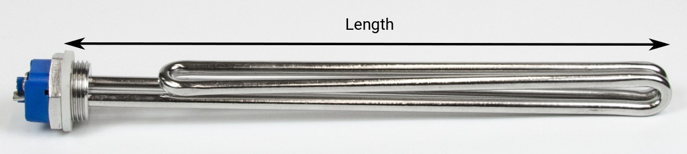

# Heating elements

Brewing involves heating a lot of water. To reduce waiting time on your brewing day you are best advised to select the highest power heating element your mains outlet can power. Obviously, the element should fit your kettle so these two characteristics are the main criteria for element selection.

In this document we talk you through the pros and cons of different heating elements, how to install them in your kettle and connect them to your mains and control equipment.

::: danger Note
Always consult an electrician for advice and help with wiring your elements. Under no circumstances should they be used without proper wiring, ground fault circuit protection and overcurrent circuit protection.
:::

## Heating water

Heating water takes a lot of energy. For example: with a heating element of 3500W it would take 18 minutes to heat 20L of water to 65C for mashing (20 - 65C), or 32 minutes to boil (20 - 100C). Heating water with this setup adds 50 minutes of waiting time to your brewing day. However, if you were to switch to 50L batches, the waiting time already adds up to more than two hours. Select a higher power heating element when your mains outlet allows. You can calculate the expected heating time in your situation with the calculator below.

TODO: Elco vragen stuk schrijven over waarom hoog-vermogen elementen, ramp-up tijden, etc.
TODO: Bob vragen interactieve heating time calculator te maken in vuepress.

<!-- ### calculator

### Formula:

$$\Delta t = \frac{c_p \cdot M \cdot \Delta T}{P \cdot 60} = \text{XX min}$$

|  Variable  | Description                                          | Unit(s) / Value(s)                                           | Interactive use                                      |
| :--------: | ---------------------------------------------------- | ------------------------------------------------------------ | ---------------------------------------------------- |
| $\Delta t$ | heating time (time difference)                       | min (round to int sufficient)                                | result                                               |
|  $c_{p}$   | Specific heat capacity (isobaric mass heat capacity) | 4.18 kJ / (kg * K) for water (l)                             | constant                                             |
|    $M$     | Mash (water) mass                                    | kg, calculate from L / Gal (US Gal), 1L = 1kg, 1Gal = 3.79kg | interactive value + unit - default: 40 L             |
| $\Delta T$ | Mash temperature difference                          | C / F, 1C = 5/9F                                             | interactive value + unit - default: (65 - 20) = 45 C |
|    $P$     | Power heating element                                | W                                                            | interactive value - default: 3600W                   |

Default example: It takes 45 (44.8) mins to heat 50L of water 45C (20 to 65C) with a 3500W heating element. -->

## Mains electricity

Our heating elements work at 230 / 240 V AC. How the elements are connected to your mains depends on where you live. In this section we talk you through the three main configurations and show you how to determine the maximum current and power of the heating element you can connect safely. When unsure about the details of your mains, consult a local electrician.

### Single phase

With the exception of North- and Central-America most residential mains outlets worldwide are single phase outlets operating at 230V AC. With single phase outlets, the heating element is connected between the phase (L) and neutral (N) wire.

In most places, 230V single phase outlets are protected by 16A circuit breakers.

### Split phase

In the US, Canada and some other countries mains electricity operates at 120V AC. For high-power electrical appliances (like heating elements, stoves, etc.) houses in the US are equipped with split phase outlets. In split phase outlets two phases (L1 and L2) at 120V are combined to 240V AC. The heating element is connected between phase L1 and L2, see figure.

In the US, split phase outlets are typically protected by a 25A circuit breaker.

### Three phase

Three phase mains connections are the high-power electrical connections outside North- and Central-America. They consist of three phases (L1 - L3) and a neutral (N) wire. To fully utilize the available power of a three phase outlet requires a three phase heating element. Essentially a three phase heating element consists of three single phase elements combined in a single flange. Three phase elements should be connected **in star configuration**.

**Star configuration:** in a three phase star configuration the individual elements are connected between the phase (L1 - L3) and neutral (N). The voltage over each element is 230V AC. In some countries the neutral (N) wire is omitted from the outlet. If so, you can get away with not connecting the neutral wire as our heating elements are balanced in power. In star configuration currents from the three individual elements cancel in the center, and the neutral wire can be omitted.

The second connection option is the delta configuration. With the exception of Norway, our heating elements should **never** be connected in delta configuration as it will fry your element.

**Delta configuration:** in a three phase delta configuration the individual heating elements are connected between two adjacent phases. For example: element 1 is connected between L1 and L2, element two between L2 and L3, etc. The voltage over each element is 400V AC. Our heating elements are dimensioned to operate at 230 - 240 V AC, operation at 400V AC draws too much current (power) and is unsafe (fire hazard). Our heating elements cannot be used in three phase delta configuration. **Exception:** in some parts of Norway electrical power is distributed over three phase connections with a voltage of 230V AC phase to phase (instead of 400V AC). In this case connecting your element in delta configuration is safe.

In the Netherlands three phase connections operate at 230V AC and are protected by 3x16 or 3x25A circuit breakers.

TODO: Elco, V AC alleen in deze sectie genoemd, uitzonderingen in plaatjes daargelaten. Ok? Of helemaal doorvoeren?

### Protective Earth

When working with electrical equipment, anything you can touch should be grounded for safety. This is especially true in a potentially wet brewing environment and is to ensure you never get in contact with the AC voltage from your mains. When the AC voltage does touch the equipment exterior, it will run to ground and trip your Ground-Fault Circuit Breaker (GFCB). Our heating elements are equipped with a Protective Earth (PE) terminal to ground the exterior of your heating element and kettle.

### Maximum current

To protect the electric circuit in your building from an overload or short circuit (fire hazard) it is protected by a circuit breaker or a fuse. The circuit breaker limits the current that can be drawn from a mains outlet and determines the maximum power of the heating element you can safely connect.

We advise you to buy the highest power heating element your mains outlet can power for two reasons:
- reduced waiting time on your brewing day
- maximum brew receipt flexibility
For instance, some brew receipts require you to quickly ramp up the temperature while mashing. It would be a shame to find out you cannot brew this beer while you could have easily fitted a higher power element. Temperature control requires reducing the effective power of the element anyway, so having an overpowered element is not an issue. How to reduce the effective power of an heating element is discussed [later](#pulse-width-modulation) this guide.

Find the maximum current ($I_{max}$) of the circuit breaker behind the outlet on your brewing location. Ask your electrician when you are unsure about the details of your electrical installation. You can select your heating element based on the maximum current ($I_{max}$) or maximum power ($P_{max}$) of the outlet you plan to use. The maximum power is determined by multiplying the voltage of your mains ($U$) by the maximum current of the circuit breaker; $P_{max} = U \times I_{max}$.

**Examples:**
- **Single phase:** typical residential mains outlets in the Netherlands are protected by a circuit breaker with a maximum current of 16A. Operating at 230V AC, outlets have a maximum power of 3680W.
- **Split phase:** typical split phase outlets in the US are protected by a circuit breaker with a maximum current of 25A. Operating at 240V AC these outlets have a maximum power of 6000W.
- **Three phase:** residential three phase connections in the Netherlands come in two flavors; 3x16 and 3x25A rated current. At 230V AC these connections have a maximum power of 11040 or 17250W respectively.

The examples are listed in the table below for an overview.

| Type         | Voltage (V) | Max. current (A) | Max. power (W) | Location |
| ------------ | ----------: | ---------------: | -------------: | -------: |
| Single phase |         230 |               16 |           3680 |       NL |
| Split phase  |       2x120 |               25 |           6000 |       US |
| Three phase  |         230 |     3x16 3x25 | 11040 17250 |       NL |

**Note:** typically a circuit breaker protects a group of outlets in a building. Our heating elements are intentionally dimensioned a few hundred watts below the maximum power of most common circuit breakers to allow connecting some other small electrical appliances like a pump, light, or radio to the same group without problems.

## Elements

The heating elements we sell have a low watt density (4 - 13 W/cm2). This means the heat is produced over a large surface area, and the risk of caramelizing and burning mash sugars is greatly reduced. Caramelizing and burning mash sugars can create unintended flavors in your beer. Moreover, the caramel deposits on the element and is hard to clean. Our heating elements come in three types, round, foldback and tri-clamp. All elements are made from stainless steel for durability and food safety.

### Round

Our round heating elements are a custom design. Round elements heat your mash / wort more homogeneous, are minimally blocking the flow when whirlpooling and have the lowest watt density of all the elements we sell. When mounted in a kettle with the design diameter there is a 5cm (2in) gap between the element and the kettle wall, see photo. The elements come in two types; 1-phase elements with one resistor per flange, and 3-phase elements with 3. Especially the 3-phase elements have an extremely low watt density, which makes scorching your element practically impossible. All elements have a protective earth terminal, and come with a mounting kit to protect the electrical wiring from liquids.

TODO: Elco, foto rond element in ketel nog maken.

<TableRound/>

TODO: Elco, 0.5cm vernoemen?

### Foldback

Foldback heating elements are straight elements fold back, hence the name. The fold increases the element surface area, thereby lowering the watt density and risk of scorching.

<TableFoldback/>

TODO: XX BrewPi part. no. nog aanpassen

#### Mounting kit

The basic design of these foldback elements does not provide a protective earth terminal, nor a cover for the wiring. To overcome these deficiencies we have designed a custom mounting kit, see photos below. The mounting kit is sold separately, and can be found in the [store](https://store.brewpi.com/mashing/stainless-steel-heating-elements/heating-element-mounting-kit). With the mounting kit installed your element and kettle are grounded, and the wiring is safe from liquids.

#### Tri-clamp

Tri-clamp elements are fixed in your kettle with a tri-clamp fitting. These fittings consist of two flanges, an O-ring, and a clamp band (hence *tri*-clamp) and are the best option if you want to be able to easily remove the element from the kettle. This comes in handy when you want to change your element frequently, or want to clean it thoroughly outside the kettle. Our tri-clamp heating elements come with a mounting kit, and require a 2" tri-clamp ferrule with a large 43mm inner diameter installed on your kettle.

TODO - Elco: Guillaume plaatje triclamp poort vragen - de huidige is van torontobreweries.ca

<TableTriclamp/>

## Connecting

Now you have selected your element(s) we can discuss how to connect them to your mains.

::: danger Note
Always consult an electrician for advice and help with wiring your elements. Under no circumstances should these be used without proper wiring, ground fault circuit protection and overcurrent circuit protection.
:::

### Single phase outlet

To connect an heating element to a single phase outlet requires connecting three wires; phase (L), neutral (N) and protective earth (PE). All our heating elements can be connected to a single phase outlet. The 2 and 3 resistor elements come with metal strips to connect the resistors in parallel. How to connect your element is shown schematically in the figure below, with photos showing the configuration of the metal strips. How to determine the current the element draws is described in the examples. Make sure your wiring and circuit breaker can handle the amount of current drawn by the element.

TODO: Elco mening over PE-terminal bolletje? Locatie feitelijk niet helemaal correct...

**Examples:**
- Round heating element [#7](#round) has one resistor and draws a current of 15.2A when connected to a 230V outlet.
- Tri-clamp element [#14](#tri-clamp) has two resistors and draws a current of 6.1A per resistor at 230V. When connected in parallel to a 230V single phase outlet the element will draw a current of 2 x 6.1 = 12.2A.
- Round heating element [#2](#round) has three resistors and draws a current of 12.3A per resistor at 230V. When connected in parallel to a 230V single phase outlet the element will draw a current of 3 x 12.3 = 36.9A.

The wires connected to your element should be of sufficient gauge (diameter) to transport the current, and the current should not exceed the maximum current of your circuit breaker. More about wire gauge [here](#wire-gauge).

TODO: Elco, welk woord gebruiken? Gauge / diameter?

### Split phase outlet

In connecting your element to a 240V split phase outlet you have the same options and procedure as when connecting it to the single phase outlet discussed previously. Just replace phase (L) with phase 1 (L1), and neutral (N) with phase 2 (L2) in the wiring, as shown in the scheme below. In determining the total current drawn by the element you base it on the current per resistor values at 240V from the tables in the [elements](#elements) section.

### Three phase outlet

Connecting a 3 resistor element to a three phase outlet requires connecting 5 wires; phase 1-3 (L1 - L3), neutral (N) and protective earth (PE). How to connect your element is shown in the figure below, with a photo showing how to configure the metal strips. How to determine the current drawn by the element is described in the example. As discussed in the [Mains](#three-phase) section, always connect your 3-phase heating elements in the star configuration shown here. The 400V AC of the delta configuration will draw too much current and fry your element (fire hazard). When your 3 phase outlet comes without a neutral (N), it can be omitted as discussed [before](#three-phase).

**Example:**
- Round heating element [#4](#round) has three resistors and draws a current of 14.5A per phase when connected to a 230V three phase outlet.

The wires connected to your element should be of sufficient gauge (diameter) to transport the current, and the current should not exceed the maximum current of your circuit breaker. More about wire gauge in the next section.

### Wire gauge

The wires connected to your element should be of sufficient diameter (gauge) to transport the current drawn by your element. In the US and Canada diameters of electrical wires are standardized in the American Wire Gauge (AWG) standard. Bigger diameter wires get a lower number. Typical 14-gauge wires and cables can carry 15A of current, 12-gauge can carry 20A. In Europe and most of the rest of the world, electrical wires are specified by their cross-sectional area measured in square millimeters (mm2). For instance, the 3 and 5 wire cables we sell in the [store](https://store.brewpi.com/temperature-control/cables) consist of 2.5mm2 wires and can carry 16A of current. When unsure, ask your local hardware store or electrician about the required cable diameter for your element.s

## Installation

To install the heating element in your kettle requires creating a 32.5 or 47mm hole in the kettle wall. Drill bits are not available at these diameters, and so we recommend you get a sheet metal hole punch for a nice, clean hole in your kettle without any burrs.

We sell hole punches in the [store](https://store.brewpi.com/mashing/tools), which one you should get is listed in the table below. The hole punches can be used for a wall thickness up to 1.6mm in stainless steel, 2.0mm in softer metals. For tri-clamp elements we assume you have a kettle with a tri-clamp ferrule preinstalled, or know what you are doing when welding one on there.

| Element type |   Thread |         Hole punch |
| ------------ | -------: | -----------------: |
| Round        | 1.5" BSP |     [47mm][HP47mm] |
| Foldback     |   1" BSP | [32.5mm][HP32-5mm] |

The hole punches require a 12mm pilot hole for the M12 bolt that pulls the cutter through the wall. The bolt itself requires a 10mm hex key to tighten. When drilling in stainless steel we advise you to get a cobalt head drill bit, and a low-speed, high-torque drill. We advise you to cool your drill bit with running oil / water while drilling.

#### Element position

The flange of the heating element is flat, and your kettle wall is round. Hence the kettle wall will flatten when tightening the heat element locknut during installation. For a proper seal, the kettle wall should be able to flex a little. The bend where the side wall transitions into the kettle bottom is very rigid. Install the heating element with the center point about 10cm (4in) above the kettle bottom to allow for a proper flex of the kettle wall.

TODO: Elco foto maken vervlakte ketelwand.

[HP47mm]: https://store.brewpi.com/mashing/tools/q-max-sheet-metal-hole-punch-47mm
[HP32-5mm]: https://store.brewpi.com/mashing/tools/q-max-sheet-metal-hole-punch-32-5mm

## Operation

In your brewing setup, the heating element will be used to ramp up the temperature of the mash / wort and keep it there for some time dependent on your receipt. For instance during mashing you typically want your mash temperature somewhere in the region of 65C (150F) for some 10s of minutes. To keep the mash at a steady temperature we will switch the element on for short periods of time to reduce its effective power. This technique is called Pulse Width Modulation (PWM). In this section we will show you what hardware you need, and how to connect it to your element and mains. The remainder of the control loop requires a controller and a temperature sensor. For the controller you can use the [BrewPi Spark](https://store.brewpi.com/temperature-control/brewpi-spark-3), temperature sensors can be found in the [store](https://store.brewpi.com/temperature-control/temperature-sensors).

TODO - Elco: redigeren.

### Pulse Width Modulation

Pulse Width Modulation (PWM) is a technique to reduce the effective power of your heating element. You pulse the power to the element, thereby reducing the 

### Solid State Relays

To switch the AC voltages and currents that power your heating element you need an electric device called a relay. Traditional relays are mechanical switches with (for example) an electromagnet and a spring. A small DC voltage activates the electromagnet, and closes the switch. The spring opens the switch when the DC voltage is absent. In this way you can control the electric power to your element. In the [store](https://store.brewpi.com/temperature-control/solid-state-relays-ssr) we sell Solid-State Relays (SSRs) which are based on semiconductor technology. Compared to mechanic relays, SSRs have a longer operational lifetime and the added benefit that they can switch at the zero-crossing of the AC voltage. Switching at the zero-crossing prevents the possibility of high inrush currents, which are bad for your electrical equipment.

An example of a single phase SSR (left), and a three phase SSR (right) is shown in the photo below. Single phase SSRs can be used to switch heating elements connected to split phase outlets as well. SSRs have a maximum current rating. Make sure the maximum current of your SSR exceeds the current drawn by your element.

#### Heat sink

When in use, SSRs will get hot from the electrical current and require a heat sink for continuous operation. An example of an SSR with a high-profile heat sink is shown in the photo below (left). We sell low-profile heat sinks too. All heat sinks can be found in the [store](https://store.brewpi.com/temperature-control/solid-state-relays-ssr).

#### Dry fire protection

 Our heating elements are designed to heat water and will overheat and scorch when fired in air. You want to install a water level float switch (float switch) in your kettle to add dry fire protection to your heating element. An example of a float switch we sell in the [store](https://store.brewpi.com/temperature-control/solid-state-relays-ssr/water-level-float-switch-dry-fire-protection-for-heating-element) is shown in the photo above (right). The switch is open with the floater in the 'low' position, as shown in the photo. The switch is closed when the floater hits the 'high' position. These switches are perfect to interrupt the low-voltage DC control signal of the SSR, and make sure your heating element does not fire without water. Make sure the switch switches after the heating element is fully submerged. How to include the float switch in your control loop will be discussed in the next section.

TODO: Elco, werking float switch correct?

### Connecting your SSR

The SSR is used to switch the AC voltage to your heating element and thus needs to be installed in the cable in between the element and your mains. Connection schemes for heating elements connected to single, split, and three phase outlets are discussed below.

#### Single phase

Cables connecting heating elements to single phase outlets have three wires; phase (L), neutral (N) and protective earth (PE). To switch the AC voltage to the heating element you interrupt the phase (L) wire with the AC terminals of the single phase SSR. The neutral and protective earth wires go to your element directly. The DC terminals of the SSR are connected to the respective terminals of the controller. To add dry fire protection to your setup you interrupt the + wire of the DC voltage coming from the controller with the float switch. Do not forget to add a circuit breaker to your control panel when required at your location.

For many mains outlet types around the world the difference between the phase (L) and neutral (N) wire is not specified. Just interrupt either of the two wires with the SSR, as it will block the flow of current to your element either way.

TODO: Elco, max. - min. AC / DC voltages SSRs noemen?

#### Split phase

The scheme for connecting your SSR in the case of a split phase outlet is shown below. The scheme is the same as for single phase configuration discussed previously, only the naming of the wires is different. Just interrupt either phase 1 (L1) or phase 2 (L2) with the AC terminals of the SSR. The +/- wires coming from the controller are connected to the SSR DC terminals. Interrupt the + wire with a float switch to add dry fire protection. Do not forget to add a circuit breaker to your control panel when required at your location.

#### Three phase

The cable connecting your three phase heating element to a three phase outlet has 5 wires; phase 1-3 (L1 - L3), neutral (N) and protective earth (PE). To install your three phase SSR you interrupt the three phases with the AC terminals of the SSR. Interrupt wire L1 with SSR terminals A1 and A2, L2 with B1 and B2, etc. The neutral and protective earth wire are directly connected to your element, uninterrupted. To control your SSR you connect the + and - wire of the controller to the DC terminals of the SSR. You interrupt the + wire with the float switch to add dry fire protection to your setup. Do not forget to add a circuit breaker to your control panel when required at your location.

### Two elements, one outlet

TODO: Elco schrijven.

TODO: plaatje (schema) van 2 elementen, 2 SSR's, etc. maken?
