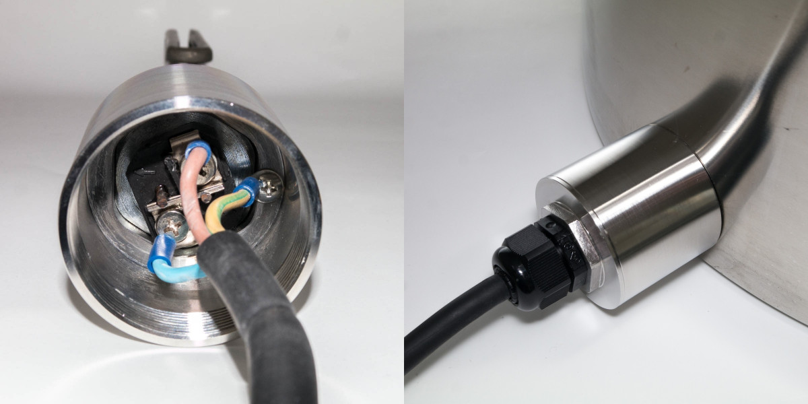

# Heating elements

Brewing involves heating a lot of water. To reduce waiting time on your brewing day you are best advised to select the highest power heating element your mains outlet can power. Obviously, the element should fit your kettle so these two characteristics are the main criteria for element selection.

In this document we talk you through the basic theory of heating water, the pros and cons of different heating elements, how to install and connect them, and the different tools you need.

::: danger Note
Always consult an electrician for advice and help with wiring your elements. Under no circumstances should they be used without proper wiring, ground fault circuit protection and overcurrent circuit protection.
:::

## Heating water

Water is a high heat capacity fluid, therefore it takes a lot of energy (power and time) to heat. For example: in The Netherlands a typical residential mains outlet operates at 230V AC and is rated at a maximum current of 16A. Such an outlet has a maximum power of 3680W ($P = U \times I). With a heating element of 3500W it would take 18 minutes to heat 20L of water to 65C for mashing (20 - 65C), or 32 minutes to boil (20 - 100C).

Heating water with this setup adds 50 minutes of waiting time to your brewing day. 50 minutes is a reasonable time, and there is not much to be gained by selecting a higher power heating element. However, if you were to switch to 50L batches, the waiting time already adds up to more than two hours. Select a higher power heating element when your mains outlet allows. You can calculate the expected heating time in your situation with the calculator below.

TODO: Bob vragen interactieve heating time calculator te maken in vuepress.

<!-- ### calculator

### Formula:

$$\Delta t = \frac{c_p \cdot M \cdot \Delta T}{P \cdot 60} = \text{XX min}$$

| Variable   | Description                                          | Unit(s) / Value(s)                                           | Interactive use                                      |
|:----------:|------------------------------------------------------|--------------------------------------------------------------|------------------------------------------------------|
| $\Delta t$ | heating time (time difference)                       | min (round to int sufficient)                                | result                                               |
| $c_{p}$    | Specific heat capacity (isobaric mass heat capacity) | 4.18 kJ / (kg * K) for water (l)                             | constant                                             |
| $M$        | Mash (water) mass                                    | kg, calculate from L / Gal (US Gal), 1L = 1kg, 1Gal = 3.79kg | interactive value + unit - default: 40 L             |
| $\Delta T$ | Mash temperature difference                          | C / F, 1C = 5/9F                                             | interactive value + unit - default: (65 - 20) = 45 C |
| $P$        | Power heating element                                | W                                                            | interactive value - default: 3600W                   |

Default example: It takes 45 (44.8) mins to heat 50L of water 45C (20 to 65C) with a 3500W heating element. -->

## Mains electricity

BrewPi heating elements work at 230 / 240 V AC. How the elements are connected to your mains depends on where you live. In this section we talk you through the three main configurations and tell you how to determine the maximum power of the heating element you can connect safely. When unsure about the details and regulations of your electricity provider, consult a local electrician.

### Single phase

With the exception of North- and Central-America most residential mains outlets worldwide are single phase outlets operating at 230V AC. The heating element (rectangle) is connected between the phase (L) and neutral (N) wire, see figure.

In most places, 230V single phase outlets are protected by 16A circuit breakers.

### Split phase

In the US, Canada and some other countries mains electricity operates at 120V AC. For high-power electrical appliances (like heating elements, stoves, etc.) houses in the US are equipped with split phase outlets. In split phase outlets two phases (L1 and L2) at 120V are combined to 240V AC. The heating element is connected between phase L1 and L2, see figure.

In the US, split phase outlets are typically protected by a 25A circuit breaker.

### Three phase

Three phase mains connections are the high-power electrical connections outside North- and Central-America. They consist of three phases (L1 - L3) and a neutral (N) wire. To fully utilize the available power of a three phase outlet requires a three phase heating element. Essentially a three phase heating element consists of three single phase elements combined in a single flange. Three phase heating elements can be connected to three phase outlets in two configurations; Star and Delta.

**Star:** in a three phase star configuration the individual elements are connected between a phase (L1 - L3) and neutral (N). The voltage over each element is 230V AC. In some countries the neutral (N) wire is omitted from the outlet. If so, you can get away with not connecting the neutral wire as BrewPi heating elements are balanced in power. In star configuration currents from the three individual elements cancel in the center, and the neutral wire can be omitted.

**Delta:** in a three phase delta configuration the individual heating elements are connected between two adjacent phases. For example: element 1 is connected between L1 and L2, element two between L2 and L3, etc. The voltage over each element is 400V AC. BrewPi heating elements are dimensioned to operate at 230 - 240 V AC. Operation at 400V AC draws too much current (power) and is unsafe (fire hazard). BrewPi three phase heating elements cannot be used in three phase delta configuration.

In the Netherlands three phase connections operate at 230V AC and are protected by 3x16 or 3x25A circuit breakers.

### Protective Earth

For a safe working environment on your brewing day all electrical equipment should be grounded. To ground your kettle BrewPi heating elements are equipped with a protective earth (PE) connection. When connected, you are protected from 230 / 240V in case of a defect in the wiring, connections or equipment. Current drawn from the outlet will run to ground and trip your ground-fault circuit protector instead of hurting you.

### Maximum current

To protect the electric circuit in your building from an overload or short circuit (fire hazard) it is protected by a circuit breaker (fuse) on the distribution board. The circuit breaker limits the current that can be drawn from a mains outlet and determines the maximum power of the heating element your can safely connect.

To reduce waiting time at your brewing day we would advise you to buy the highest power heating element your mains outlet can power. Therefore you should find the maximum current ($I_{max}$) of the circuit breaker behind the outlet on your brewing location. Ask your electrician when you are unsure about the details of your electrical installation.

You can select your heating element based on the maximum current or maximum power ($P_{max}$) of the outlet you plan to use. The maximum power is determined by multiplying the voltage of your mains ($U$) by the maximum current of the circuit breaker; $P_{max} = U \times I_{max}$.

**Examples:**
- **Single phase:** typical residential mains outlets in the Netherlands are protected by a circuit breaker with a maximum current of 16A. Operating at 230V AC, outlets have a maximum power of 3680W.
- **Split phase:** typical split phase outlets in the US are protected by a circuit breaker with a maximum current of 25A. Operating at 240V AC these outlets have a maximum power of 6000W.
- **Three phase:** residential three phase connections in the Netherlands come in two flavors; 3x16 and 3x25A rated current. At 230V AC these connections have a maximum power of 11040 or 17250W respectively.

The examples are listed in the table below for an overview.

| Type         | Voltage (V) | Max. current (A) | Max. power (W) | Location |
|--------------|------------:|-----------------:|---------------:|---------:|
| Single phase |         230 |               16 |           3680 |        NL|
| Split phase  |       2x120 |               25 |           6000 |        US|
| Three phase  |         230 |     3x16 3x25 | 11040 17250 |        NL|

**Note:** most probably the circuit breaker on your distribution board serves as an overcurrent protection for a number of outlets near your brewing location. When selecting your element, leave some room (for example ~0.5A or ~100W) for other small electrical appliances like a lamp or a radio for a nice time during your brewing day. If you plan on upgrading your mains outlet to a higher rated power, you might want to select your element accordingly.

## Elements

At BrewPi we sell low watt density (4 - 13 W/cm2) heating elements. Heating elements produce heat, and heat production is measured in watts. A low watt density heating element produces a low amount of heat per element surface area. This prevents scorching your elements with mash sugars, and ensures they are easy to clean after brewing. At the same time it prevents scorching your brew and the possible production of burnt off-flavors that might ruin your beer. BrewPi heating elements come in three types, round, foldback and tri-clamp. All elements are made from stainless steel for durability and hygiene reasons.

### Round

At BrewPi we sell custom designed round heating elements. Round elements heat your mash / wort more homogeneous, are minimally blocking the flow when whirlpooling and have the lowest watt density of all the elements we sell. Technical details of the heating elements can be found in the interactive table below. You can toggle the table length unit (cm / inch) and mains voltage (230V / 240V) on click. When mounted in a kettle with the design diameter there is a 5cm (2in) gap between the element and the kettle wall, see photo. TODO: foto nog toevoegen. The elements come in two types; 1-phase elements with one resistor per flange, and 3-phase elements with 3. Especially the 3-phase elements have an extremely low watt density, which makes scorching your element practically impossible. All elements come with a mounting kit and have a 1.5" BSP thread. The element current is listed in the format: (current per resistor)x(no. resistors) as the total current drawn by the element depends on the connection to your mains. More about connecting your element in the [next](#connecting) section.

<TableRound/>

### Foldback

Foldback heating elements are straight elements fold back, hence the name. The fold increases the element surface area, thereby lowering the watt density and risk of scorching. Details about our foldback elements are listed in the interactive table below. In the table you can toggle the length unit (cm / inch), and the mains voltage (230V / 240V) by clicking on the respective property. Both foldback elements have a low watt density of $\leq$ 12 W/cm2, even at a mains voltage of 240V. The elements consist of 1 resistor, and come with a 1" BSP thread.

<TableFoldback/>

TODO: XX BrewPi part. no. nog aanpassen

#### Mounting kit

The basic design of these foldback elements does not provide a protective earth connection, nor a cover for the wiring. To overcome these deficiencies we have designed a custom mounting kit, see photos below. The mounting kit is sold separately, and can be found in the BrewPi store. With the mounting kit installed your electrical wiring is safe from liquids, and your kettle is grounded.

#### Tri-clamp

Tri-clamp elements are fixed in your kettle with a tri-clamp fitting. These fittings consist of two flanges, an O-ring, and a clamp band (hence *tri*-clamp) and are the best option if you want to be able to easily remove the element from the kettle. This comes in handy when you want to change your element frequently, or want to clean it thoroughly outside the kettle.

Details of our tri-clamp heating elements are listed in the table below. The table length unit (cm / inch) and mains voltage (230V / 240V) can be toggled on click. The tri-clamp fitting is approved for food-grade hygiene standards and useful when frequent removal of the element from the kettle is required. It does require a 2" tri-clamp ferrule (64mm OD, 43mm ID) mounted on your kettle. The elements are available in a big power range (2800 - 11000W), and have low watt density ($\leq$ 13 W/cm2). The element current is written in the format: (current per resistor)x(no. resistors) as the total current drawn by the element is dependent on the connection to your mains. More about how to connect your element in the [next](#connecting) section.

<TableTriclamp/>

## Connecting

Now you have selected your element(s) we can discuss how to connect them to your mains. The connection to your mains determines the current in the electrical cables and circuit breaker and their minimum dimensions. All will be discussed in this section.

::: danger Note
Always consult an electrician for advice and help with wiring your elements. Under no circumstances should these be used without proper wiring, ground fault circuit protection and overcurrent circuit protection.
:::

### Single phase outlet

To connect an heating element to a single phase outlet requires connecting three wires; phase (L), neutral (N) and protective earth (PE). BrewPi heating elements have 1, 2 or 3 resistors per element, all of which can be connected to a single phase outlet. The 2 and 3 resistor elements come with metal strips to connect the resistors in parallel. Connecting multiple resistors in parallel to an outlet comes at the cost of increasing the current in your wires and circuit breaker. These should be dimensioned accordingly. How to connect your element is shown schematically in the figure below, with photos showing the configuration of the metal strips. How to determine the current the element draws is described in the examples.

**Examples:**
- Round BrewPi heating element #7 has one resistor and draws a current of 15.2A when connected to a 230V outlet.
- Tri-clamp element #14 has two resistors and draws a current of 6.1A per resistor at 230V. When connected in parallel to a 230V single phase outlet the element will draw a current of 2 x 6.1 = 12.2A.
- Round heating element #2 has three resistors and draws a current of 12.3A per resistor at 230V. When connected in parallel to a 230V single phase outlet the element will draw a current of 3 x 12.3 = 36.9A.

The wires connected to your element should be of sufficient gauge (diameter) to transport the current, and the current should not exceed the maximum current of your circuit breaker. More about wire gauge can be found [here](#wire-gauge).

### Split phase outlet

In connecting your element to a 240V split phase outlet you have the same options and procedure as when connecting it to the single phase outlet discussed previously. Just replace phase (L) with phase 1 (L1), and neutral (N) with phase 2 (L2) in the wiring. In determining the total current drawn by the element you base it on the current per resistor values at 240V from the tables in the [Elements](Elements) section.

### Three phase outlet

Connecting a 3 resistor element to a three phase outlet requires connecting 5 wires; phase 1-3 (L1 - L3), neutral (N) and protective earth (PE). How to connect your element is shown in the figure below, with a photo showing how to configure the metal strips. How to determine the current drawn by the element is described in the example. As discussed in the [Mains](#three-phase) section, always connect your BrewPi 3-phase heating elements in the star configuration shown here. The 400V AC of the delta configuration will draw too much current and fry your element (fire hazard). When your 3 phase outlet comes without a neutral (N), it can be omitted as discussed [before](#three-phase).

**Example:**
- Round BrewPi heating element #4 has three resistors and draws a current of 14.5A when connected to a 230V three phase outlet.

The wires connected to your element should be of sufficient gauge (diameter) to transport the current, and the current should not exceed the maximum current of your circuit breaker. More about wire gauge [here](#wire-gauge).

1 and 2 resistor elements can be connected to a 3 phase outlet by simply only connecting the resistors you have. In this situation, connecting the neutral (N) wire is mandatory however.

### Wire gauge

Wires carrying electrical current will get warm due to their low, but finite resistivity. A bigger diameter (lower gauge) wire has a lower resistivity and can carry more current before the enclosing plastic will melt. You don't want your electrical wires to short-circuit (fire hazard) hence wires and cables have a maximum current they can carry safely before getting too hot. This maximum current is called: *rated amperage*. Make sure the rated amperage of the cable connecting the heating elements to your mains exceeds the current drawn by the element. Ask your local electrician or hardware store when unsure.

In the US and Canada diameters of electrical wires are standardized in the American Wire Gauge (AWG). Bigger diameter wires get a lower number. Typical 14-gauge wires and cables can carry 15A of current, 12-gauge can carry 20A. In Europe and most of the rest of the world, electrical wires are specified by their cross-sectional area measured in square millimeters (mm2). For instance, the 3 and 5 wire cables we sell at BrewPi consist of 2.5mm2 wires and have a rated amperage of 16A.

TODO: rated amperage staat niet in de store, hoe mee om gaan?
TODO write installation?, operation, etc. + remove comments.

## Installation

- Buy kettle
  - stainless steel or aluminium kettle, iron enamel kettle will rust, produce off-flavors for beer and finally leak.
- Buy hole punch
  - round: 1.5" BSP - 47mm hole punch, tri-clamp: requires welding tri-clamp ferrule (64mm OD, 43mm ID), foldback: 1" BSP - 32.5mm hole punch
  - install heating element, follow guide. Verhaal over heating element height?

**Note:** the procedure shown in the install guide above is for foldback elements. Round elements have their locknut on the outside of the kettle wall.

#### Water level float switch

 Our heating elements are designed to heat water and will overheat and scorch when fired in air. Hence you want to install a water level float switch (float switch) in your kettle to add dry fire protection to your heating element. Make sure the switch switches only *after* the heating element is fully submerged. How to include the float switch in your control loop will be discussed in the [next](#operation) section. For automated brewing setups you might want a to add float switch at the top of your kettle too, to prevent it from overflowing.

 

## Operation

- Switching element with SSR's
- Operating element for temperature control, connecting to Spark, etc.
- Operating multiple elements on one mains outlet

