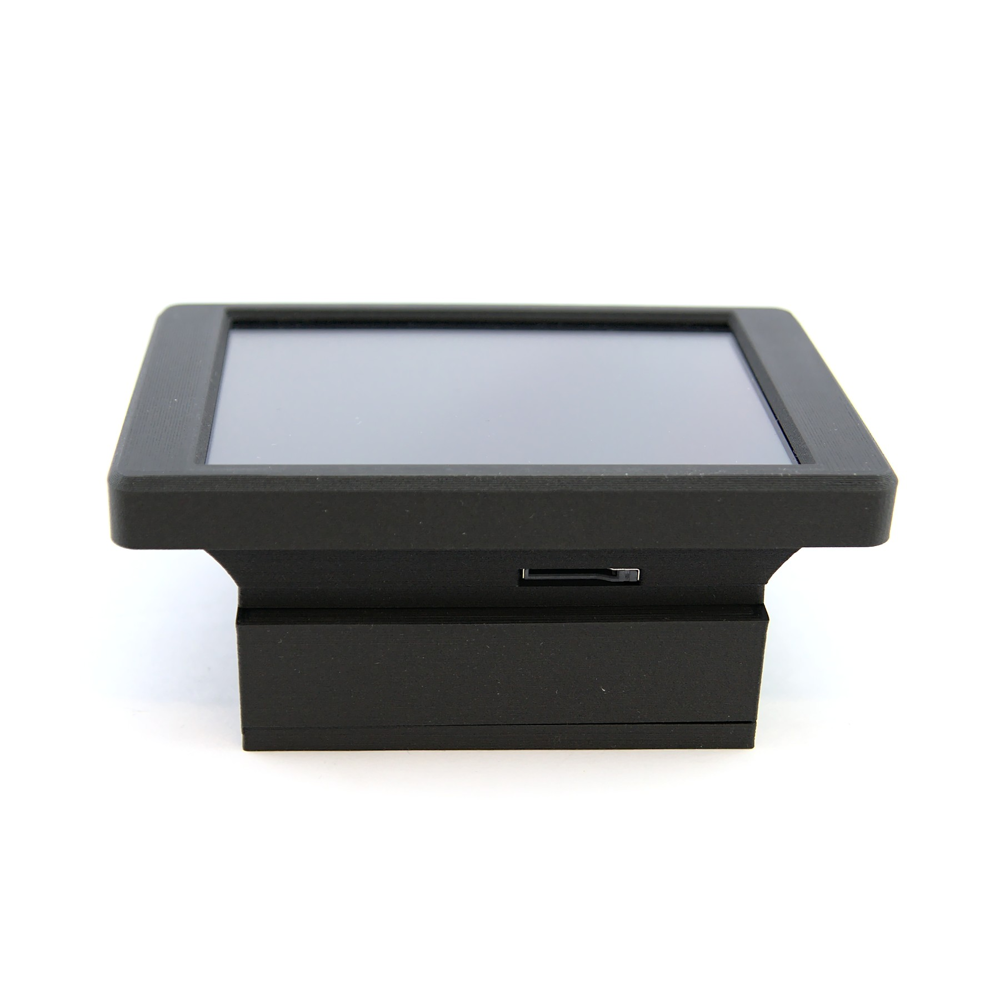
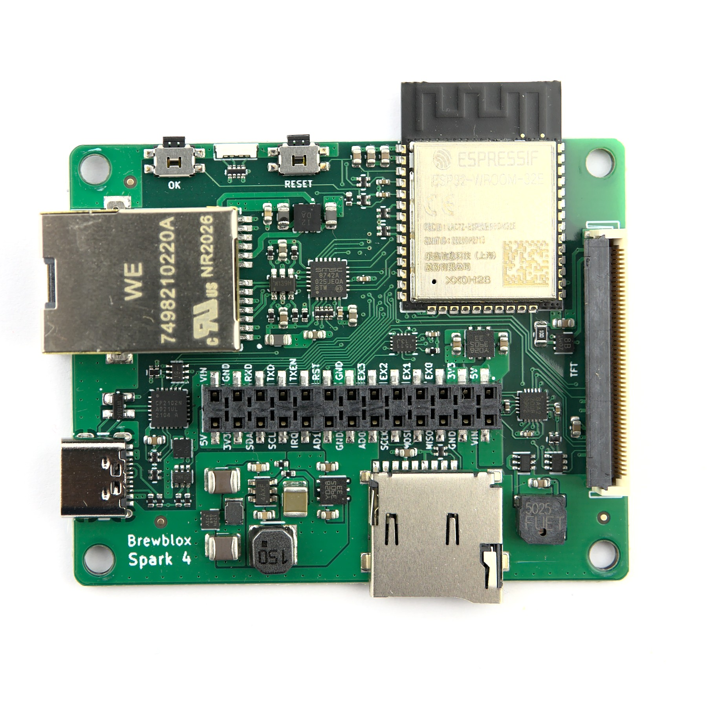
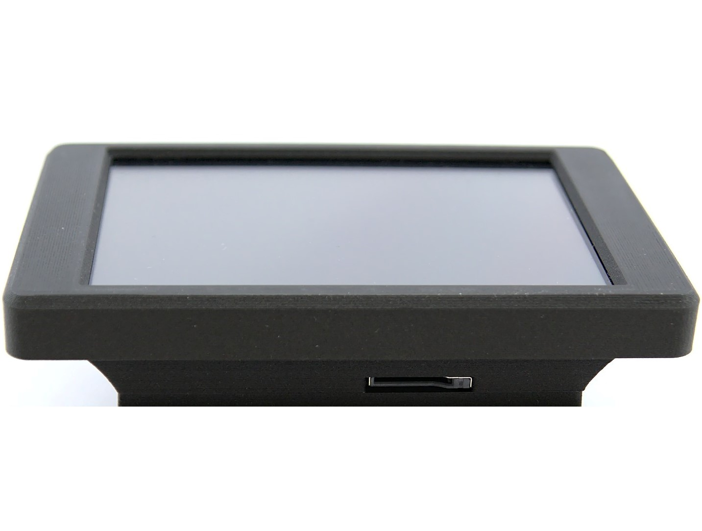
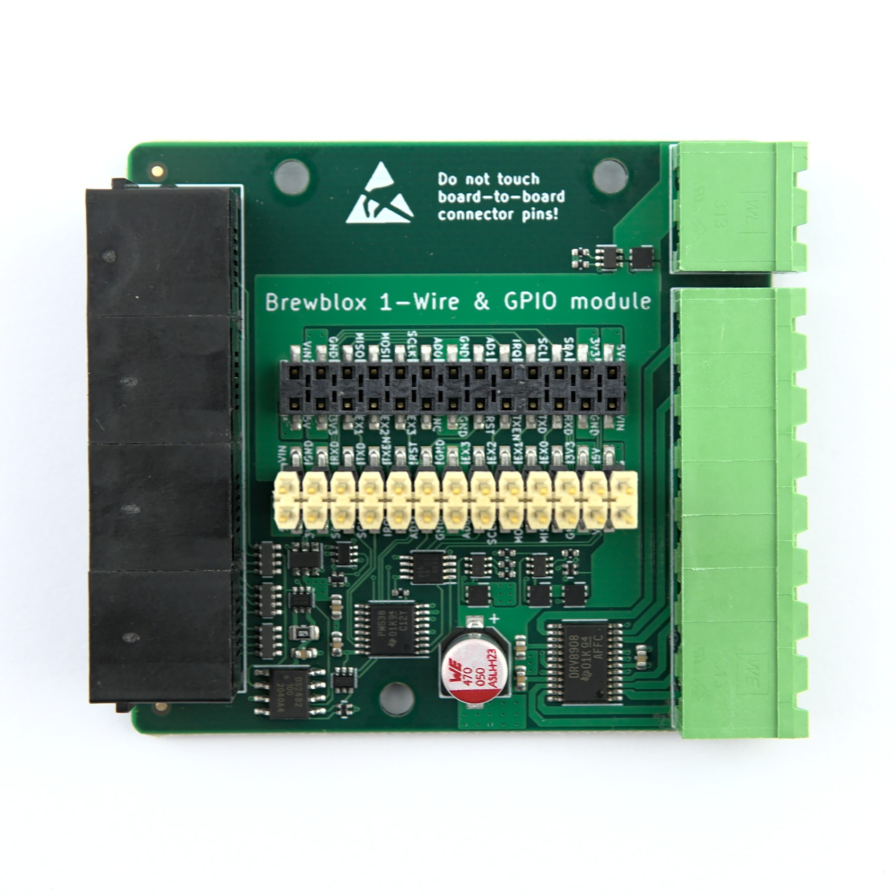
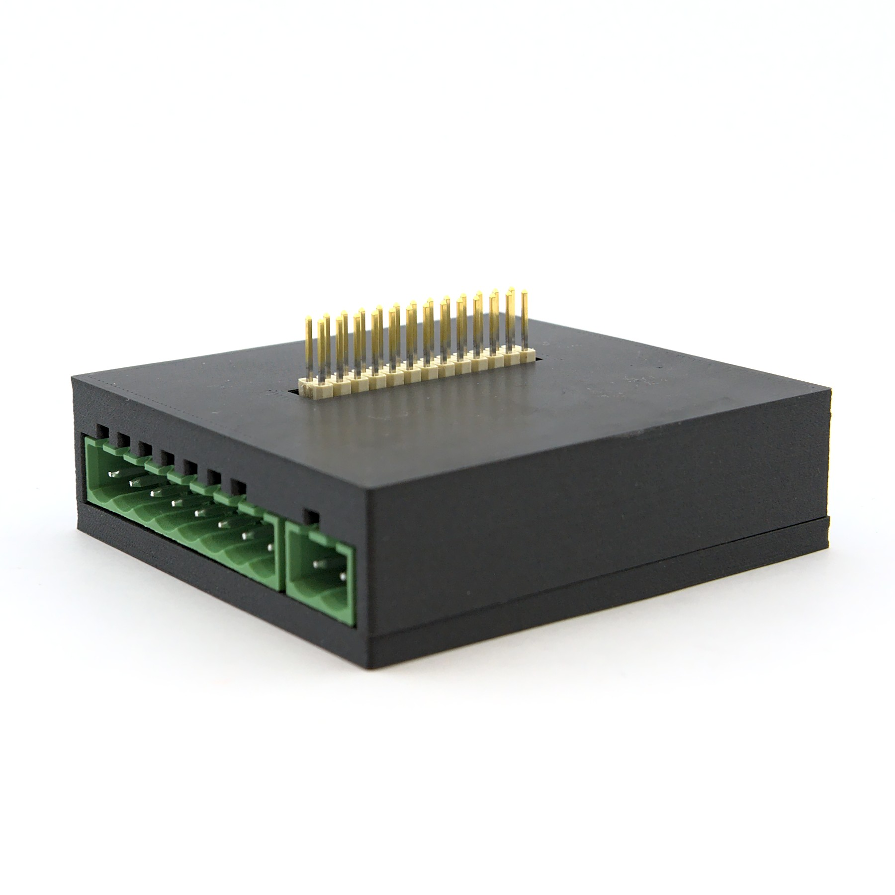
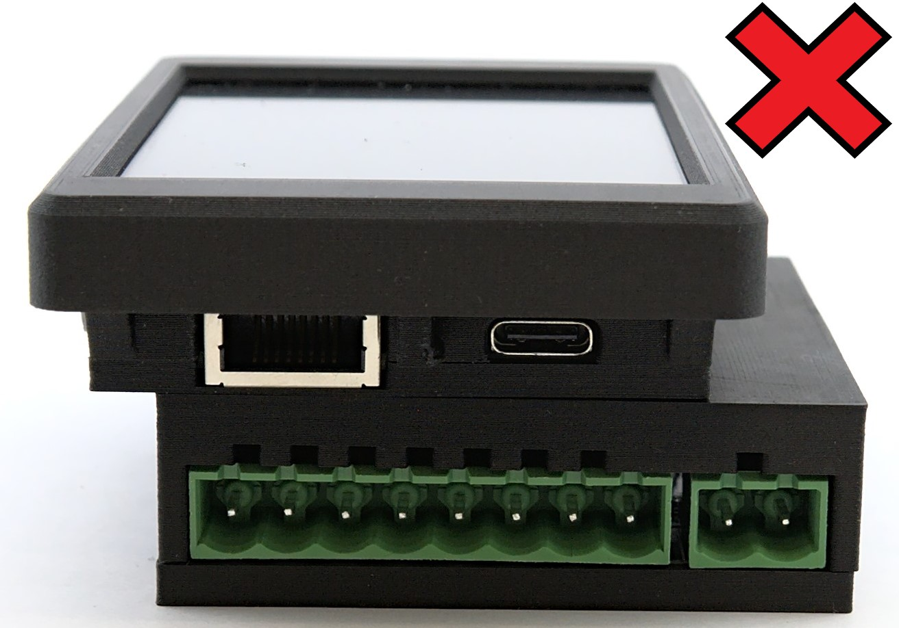
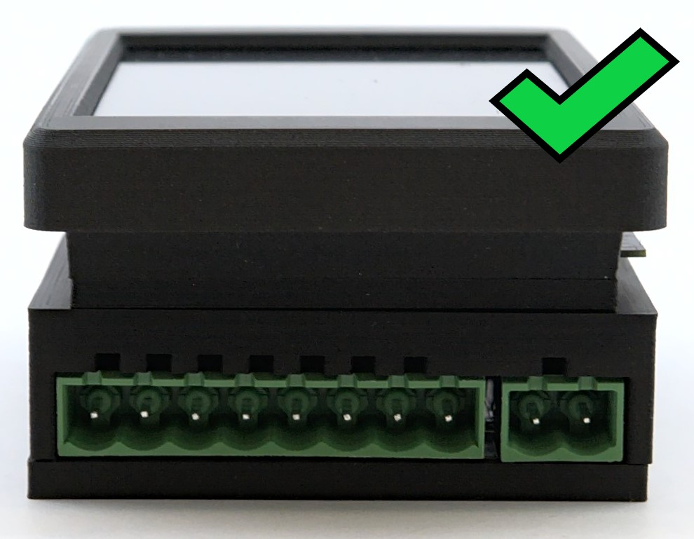
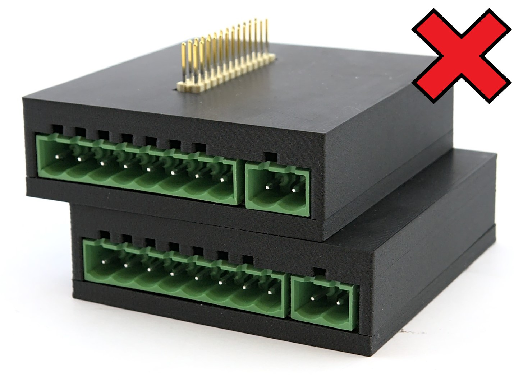
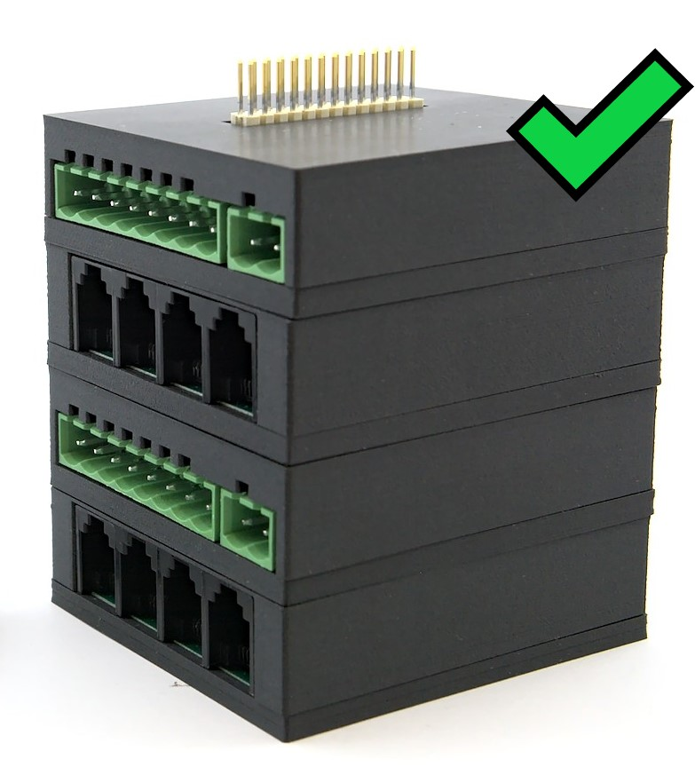

# Brewblox Spark 4 and 1-Wire GPIO module user guide

## Getting started

### General description 
Welcome to the Brewblox Spark 4 and 1-Wire general-purpose I/O (GPIO) module user guide. Thank you for your purchase! 
With the Brewblox Spark 4, our I/O modules and the Brewblox software you are ready to take (home) brewing to the next level.
**TODO** Nog wat meer inleiding over de Spark 4?

This guide will provide you with a quick overview of the hardware installation process of the Spark 4 and 1-Wire GPIO module. 

Happy brewing!

**TODO Geke, Bob, Felix and Elco, of Team Brewblox, of Elco Jacobs? wat zou je hier willen?**

### What’s in the box
Your Spark 4 will come shipped with the following components. 

1x Spark 4

1x DIN rail bracket (optional)

1x 3,5 inch 320x420 pixels TFT LCD Color Display enclosure (optional)

Your 1-Wire GPIO module will come shipped with the following components.

1x 1-Wire GPIO module

1x 1-Wire GPIO module enclosure (optional)

5x Actuator connectors

1x DIN rail bracket (optional)
![1-Wire-GPIO-module-DIN-rail-adapter]

When you unpack please ensure you check everything is there, and if any parts are missing please contact us immediately.

### Assembly
When ordering a Spark 4 with one I/O module, the product comes pre-assembled. But if you order more than one I/O module or if you ever remove/add an I/O module you need to connect them yourself. 
To do this you can follow the next steps: 

1. Make sure your Spark 4 and I/O module(s) are disconnected from the power supply.
2. Remove the protection cap from the I/O module(s) Board-to-Board connector pins. **DO NOT** touch the Board-to-Board connector pins!
3. Plug the I/O module into the Spark 4, by gently pushing the pins on the I/O module into the Board-to-Board connection on the bottom of the Spark 4.
4. If you have more than one I/O module, you can stack them by gently pushing the pins into the Board-to-Board connection on the bottom of the previous I/O module. To stack them in a neat way, make sure you turn the I/O modules 180 degrees (see photo's below). You can stack up to four I/O modules onto a Spark 4.

## How to use the product

### Connecting with the Brewblox software
Your Brewblox Spark 4 is ready to be added to the Brewblox software now.

If you want more information about how to add a Spark 4 to the Brewblox software you can use our [guide](https://www.brewblox.com/user/startup.html#step-5-flash-the-firmware) 

If you want to use more than one Spark 4, you can find a guide [here](https://www.brewblox.com/user/adding_spark.html)

We also have a guide available about how to install the Brewblox software on your server. You can find the guide [here](https://www.brewblox.com/user/startup.html) 

### Plug in the power supply
- *USB-C:* Connect the USB-C cable to the USB port on the Spark 4, and plug the other side of the cable into a suitable adapter or the server. 
- *Passive PoE:* Plug in the ethernet cable. Make sure the switch on the other end of the ethernet cable supports Passive PoE, or use a Passive PoE injector. **WARNING** With Passive PoE the power is always on! Do not plug the ethernet cable in an other device than the Spark 4 when using Passive PoE. This may cause damage to the other device!
- *I/O connector for power supply:* Connect the actuator plug with the power supply cable, then plug the actuator plug in the separated 2-pin GPIO block. **TODO** meer uitleg geven hoe dit in zijn werk gaat.

### Turning on the Spark 4
When the Spark 4 has power it turns itself on. The OK and R buttons should start blinking in cyan and blue, and you should hear a ‘beep’.

### Turning off the Spark 4
To turn the Spark 4 off, you have to cut the power supply.

### Rebooting the Spark 4
Press the R button to reboot the Spark 4. When successful you should hear a ‘beep’.

### Connection with your network
You can use either Wi-Fi or a LAN (Ethernet) cable to connect your Spark 4 to your network.

#### Ethernet
Plug in the LAN (Ethernet) cable to connect your Spark 4 to the ethernet network. Make sure that the other end of your Ethernet cable is connected to a functioning switch. To remove the LAN (Ethernet) cable you have to use the lever on the enclosure of the Spark 4. 

#### Wi-Fi
1. Install the ESP BLE Provisioning app for [Android](https://play.google.com/store/apps/details?id=com.espressif.provble) or ESP SoftAP Provisioning app for [iOS](https://apps.apple.com/in/app/esp-softap-provisioning/id1474040630) on your mobile phone.  
2. Open the app on your mobile phone.
3. Scan the QR code shown on the display of your Spark 4, or provided with your Spark 4.
4. Follow the instructions in the app. The app will ask for Wi-Fi credentials and send them to the ESP32 over BLE.
5. If succeeded, you can see your IP adress in the upper left corner of the display.
   
### Inserting your Micro-SD card
Insert your Micro-SD card in the Micro-SD slot. The Micro-SD card is inserted label side up. The Micro-SD slot is located on the lower side of the Spark 4.

## Compatibility
The 1-Wire GPIO module lets you plug in 4 of **our** temperature sensors, using DS18B20. We **cannot** guarantee other 1-Wire sensors will work, because 1-Wire is not a standardized protocol.
The 1-Wire GPIO module also has two green terminal blocks, a block of 8 pins and a block of 2 pins. The 2-pin block can be used for external power at 12V or 24V. 
The 8-pin terminal block is for GPIO. For each 1-Wire GPIO module, you can configure whether I/O should be at 5V or the external input voltage (12V or 24V).

Each of the 8 GPIO pins is a configurable half H-bridge with fault detection. Which means that each pin can be one of the following:
- Positive supply voltage (5V or external input voltage)
- Negative supply voltage (GND, 0V)
- A low-side switch
- A high-side switch
- A push-pull bidirectional pin
- A digital input

Some examples of what you can connect are:
- A solid-state relay (SSR) or a mechanical relay: 1 high side switch and a GND pin.
- A fan: a GND pin and a high-side switch.
- A bidirectional motor or valve: 2 push-pull pins.
- A switch: a digital input and a GND pin.

If you have valves that automatically close when they lose power, you can even use all pins as a high-side switch to connect eight valves to the board and connect GND to them externally. Each pin can source or sink up to 1A, but multiple pins can be combined if you need more current. All pins also support individual PWM for speed/intensity control.

The 1-Wire GPIO module is **not** compatible with thermocouples and RTDs like a PT-100 or PT-1000.

**TODO** aanvullen waar wel/niet mee compatible bv. boards, sensoren, valves etc.

## Maintenance

### Spark 4 and I/O module(s)
When dirty, you can clean the enclosure of the Spark 4 and I/O module(s) with a dry or damp cloth.
The Spark and I/O module(s) and enclosures are not waterproof, so do not use a wet cloth or immerse them in water. 

When you use the Spark or I/O module(s) without enclosure we advise you to use compressed air. 

### Touchscreen
It is best to first attempt to clean with a dry microfiber cloth. Wipe the screen using a circular motion with slight pressure. There should not be a need to press hard on the display.
If the touchscreen still has dirt, dampen a microfiber cloth with a cleaning solution specifically designed for touchscreens and gently rub the spots away. Always moisten the cloth rather than spraying cleaner directly onto the touchscreen to prevent water damage. 
Never use bleach, ammonia or other abrasive cleaners to clean the touchscreen. Always give the touchscreen a moment to completely dry before using.

## Repair
In case your Spark 4 might break or stops working properly we strongly recommend contacting us. For more information about our warranty, see below.
The only part you can replace yourself, is the touchscreen. 

### Replacing the screen
To replace the touchscreen you can follow the next instructions.

1. Disconnect the Spark 4 and I/O module(s) from the power supply.
2. Remove the I/O module(s) from the Spark 4.
3. Remove the screen placement enclosure from the Spark 4, by gently pulling the right side of the screen placement enclosure outside and forwards.
4. Unlock the cable that connects the screen to the board by clicking the lever that holds the cable upwards.
5. Now you can remove the screen.
6. Place the new screen and follow the previous steps backwards to install the screen and enclosure again.

## How to dispose of the product

### Disposal of electronic components
Please protect our environment by properly disposing of the Brewblox Spark 4 and/or the I/O module(s). Electronic devices should not be disposed of as household refuse. For EU customers, Brewblox offers a product take-back service. When your product(s) reach the end of their life, simply send them back to us at your expense, we will dispose of them according to the relevant legislation. If you live outside the European Union and wish to discard this product please contact your local authorities and ask for the correct method of disposal.

### Disposal of packaging waste
Packaging materials of the product are manufactured from recyclable materials. Dispose of them properly and sort them in accordance with recycled waste instructions. Do not dispose of them with normal domestic waste.

## Troubleshooting
We are happy to help with any problems or questions that arise when using the Brewblox Spark 4, I/O module(s) or our Brewblox software. The most common problems are answered below.
For more information, other problems or questions we advise you to check our website first. If that doesn’t solve your problem or question you can reach us on our forum. 

### What happens when connecting more than four I/O modules?
The Spark 4 supports up to four I/O modules. When you connect more than four modules, the fifth module will overwrite the board address from the first module. The sixth module will overwrite the address from the second module, etc. This can result in conflicts between the boards, and the Spark 4 might stop working properly.

### Wi-Fi not working: is the Spark connected to Wi-Fi?
If the Spark LCD does not show an IP address, you can try to reset the Wi-Fi first. 

#### Reset Wi-Fi
1. Push the reset button on the Spark 4.
2. When restarting push the OK button on the Spark 4 for 5 seconds.

### Wi-Fi not working: is the Spark accessible from your computer and the server?
Can you visit the Spark IP in your browser? It should show a short placeholder message.
If you run `brewblox-ctl http get <SPARK_IP>`, do you see the html for the placeholder message?

If the answer to either is no, your Spark and server are likely using different subnets in your home network. Check your router configuration to allow them to communicate.

If the answer to both questions is yes, but the service still can't find your Spark, it may be a problem with mDNS. By default, we use [multicast DNS](https://en.wikipedia.org/wiki/Multicast_DNS) to discover Sparks that are not connected over USB. In most - but not all - routers, mDNS is enabled by default. Check your router configuration for settings related to multicast DNS.

If you can't solve the problem in your router settings, it may be preferable to skip discovery, and add `--device-host=SPARK_IP` to your docker-compose.yml file. You can find the syntax in the [connection settings guide](../user/connect_settings).
When doing so, it is advised to assign a fixed IP address to the Spark in your router settings. (Also called "static DHCP lease").

### How do I display the temperature in Fahrenheit?
This can be set separately for the Spark service.
1. Go to the Spark service page
2. In the top right corner, click on the Actions button (three vertical dots).
3. Click on `Configure used units`, and set desired values for the UI and the Spark display.

## Safety instructions
- Read all instructions before using the Brewblox Spark 4 and I/O module(s).
- Do not touch the Board-to-Board connector pins on the I/O module(s).
- To protect against fire, electric shock and injury, do not immerse the Brewblox Spark 4, I/O module(s) or plugs in water or other liquid.
- The Brewblox Spark 4 and I/O module(s) are not intended for use by young children or infirm persons without supervision.
- Do not use the Brewblox Spark 4 and I/O module(s) for anything other than the intended use.
- Do not plug in the ethernet cable to an other device than the Spark 4 when using Passive PoE. This may cause damage to the other device!
- Please ensure that the system is completely disconnected from the electrical supply before attempting to remove or replace any parts or I/O modules.
- Do seek expert advice if you are at all unsure about the safety of your electrical installation.
- Do not scratch hard objects against the display as this may cause damage.
- Save these instructions for future reference.
- **TODO** Iets over de power supply aansluiting, of max power?

**NOTE** Not following the safety instructions above could result in injuries and may void your product’s warranty.

## Technical specifications

### Brewblox Spark 4

| Feature          	       | Brewblox Spark 4                                                                                                      |
| ------------------------ | ---------------------------------------------------------------------------------------------------------------------:|
| Product Dimensions       | 66 x 58 x 11 mm without screen and enclosure 99 x 61.5 x 20 mm with screen and enclosure                           |
| Product Weight           | 21g without screen and enclosure 82g with screen and enclosure                                                     |
| Power Supply Input       | USB-C, Passive PoE or through the Board-to-Board connector                                                            |
| Power Supply Output      | ...V through the Board-to-Board connector                                                                             |
| Ports                    | 1x USB-C 1x 100 Mbps ethernet 1x Micro-SD 1x Board-to-Board connector with pins for I2C, SPI, UART, and GPIO |
| WiFi                     | 802.11b/g/n; 802.11n up to 150 Mbps                                                                                   | 
| Bluetooth                | Bluetooth V4.2 BR/EDR and Bluetooth LE                                                                                |
| Limited Lifetime Warranty| Yes, 2 years                                                                                                          |
| Product Compliance       | CE                                                                                                                    |
| Country of Manufacture   | The Netherlands                                                                                                       |

### 1-Wire GPIO Module

| Feature          	       | 1-Wire GPIO module                                                                                                    |
| ------------------------ | ---------------------------------------------------------------------------------------------------------------------:|
| Product Dimensions       | 66 x 58 x 17 mm without enclosure 68 x 63 x 20 mm with enclosure                                                   |
| Product Weight           | 30g without enclosure 50g with enclosure                                                                           |
| Power Supply Input       | 12V or 24V GPIO pin input or ...V through the Board-to-Board connector                                                |
| Power Supply Output      | 5, 12 or 24V through the GPIO pins  ...V through the Board-to-Board connector                                      |
| Ports                    | 8x GPIO pin 2x GPIO pin for power supply 4x RJ12 2x Board-to-Board connector with pins for I2C, SPI, UART, and GPIO|
| Limited Lifetime Warranty| Yes, 2 years                                                                                                          |
| Product Compliance       | CE                                                                                                                    |
| Country of Manufacture   | The Netherlands                                                                                                       |

## Warranty
Brewblox warrants this product/these products to be free from defects in workmanship and materials, under normal use and conditions, for a period of two (2) years from the original invoice date. Shipping and handling fees are to be paid for by the customer. To obtain warranty service, you must have a return authorization. To request a return authorization, you can contact us.

Brewblox agrees, at its option during the warranty period, to repair any defect in material or workmanship or to furnish a repaired or refurbished product in exchange without charge (except for a fee for shipping which will be incurred by the customer). Such repair or replacement is subject to verification of the defect or malfunction and proof of purchase.

This limited warranty does not cover damage of the product resulting from negligence, unauthorized modification or misuse of the product.