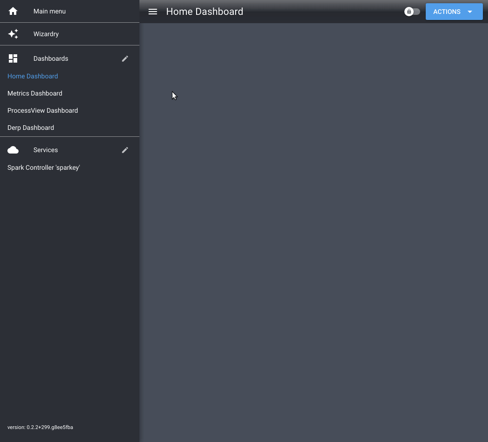

# Adding a Spark service

After you've followed the [Getting Started guide](./startup.md), you may want to connect your second or third Spark.

The [Multiple Devices](./multiple_devices.md) guide explains how Services work in Brewblox. This guide walks you through the steps to add a new Spark service.

## What you will need

* Existing Brewblox installation
* BrewPi Spark
* Micro-USB cable

## Step 1: Stop your system

You'll be changing the configuration of your Brewblox system. For the changes to take effect, you must stop and start your system.

In your Brewblox directory (default: `./brewblox`), run this command:

```bash
brewblox-ctl down
```

## Step 2: Flash the firmware

::: warning
Make sure no other Sparks are connected over USB while you're flashing your controller.
:::

In your Brewblox directory (default: `./brewblox`), run this command:

```bash
brewblox-ctl flash
```

Follow the instructions until the menu exits.

## Step 3: Edit configuration

We will be using the `brewblox-ctl add-spark` command to add the service. It will ask you some questions, and then automatically edit your `docker-compose.yml` file.

If you run `brewblox-ctl add-spark` without any arguments, it will prompt you for required info, and then create a sensibly configured service.

If you want to fine-tune your service configuration, multiple arguments are available. The [Connection settings](./connect_settings.md) guide describes these in detail.

Some arguments that can be set:
- `--device-id`: If you already know the device ID.
- `--device-host`: If your Spark controller has a fixed IP address, you can skip discovery, and immediately connect to its IP address. You must assign the Spark controller a static DHCP lease in your router for this to work.
- `--discovery`: If you want to restrict device discovery to only use USB (`--discovery=usb`), or only use Wifi (`--discovery=wifi`).


## Step 4: Add the service in the UI

After you started the newly added service, it will automatically show up in the UI sidebar a few seconds later.

Click on it to start using the service in the UI.


