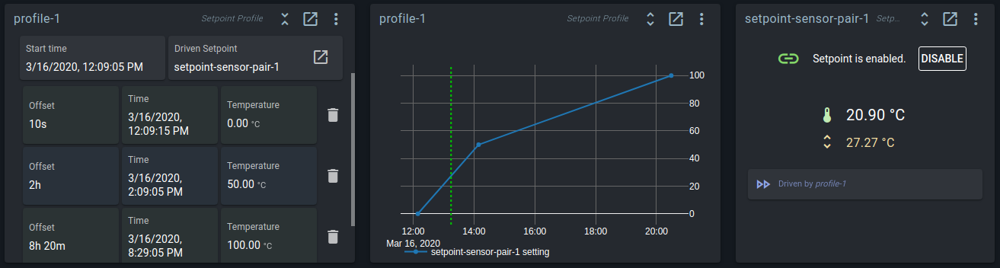
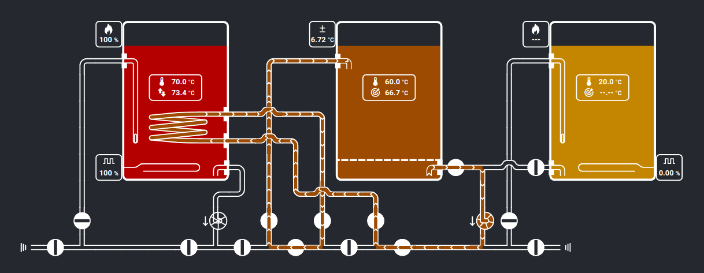
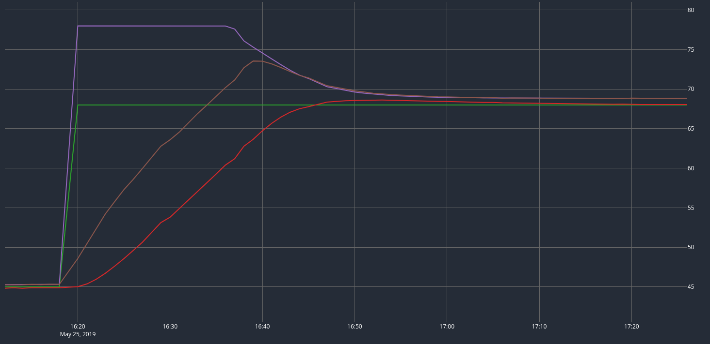
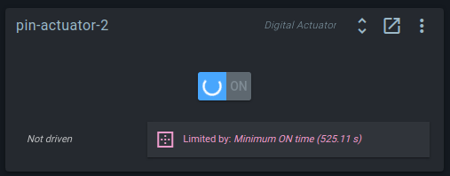
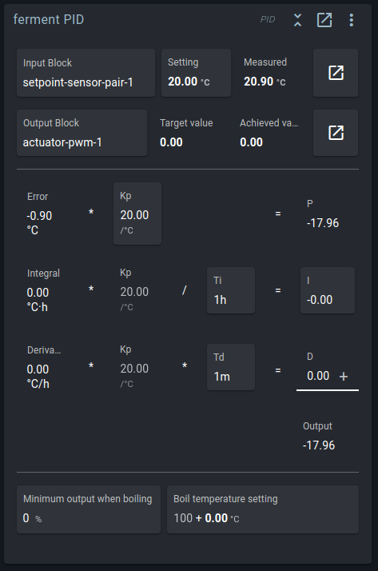

# Block types

::: tip Note
Blocks are combined to build [control chains](./control_chains.md) to run on the Brewblox Spark.

In the UI, they can be displayed by widgets on a dashboard. For more information on blocks vs widgets, see the [Blocks in depth guide](./blocks_in_depth.md).

For a description of widgets, see the [Widget types page](./all_widgets.md).
:::

## Sensors
Sensors measure something. Currently we only have sensor blocks for temperature.

### OneWire Temp Sensor
OneWire sensors are identified by address and can be automatically discovered.
They can be plugged into a connected expansion board, or directly into the Spark itself.

To look for new sensors, go to the service page of the Spark and click on 'Discover new OneWire blocks' in the top right menu.

You can apply a calibration offset to a OneWire sensor in its settings.

### Temp Sensor (Mock)
This is a simulated sensor that allows you to manually set the 'measured' value.
You can use it to play with the system, to see how it will respond.

## Setpoints
A Setpoint holds the target value for a specific sensor. It used as input for a PID.

Each Setpoint has a link to a sensor.
The Setpoint provides the PID with averaged sensor values to filter noise.
How many values are averaged is set by the Filter period.
The filter can be bypassed to respond faster when the filtered value differs too much from the current value.
The bypass threshold sets the difference at which this happens.

### Setpoint Profile
If you want to slowly change a Setpoint over time, you can use the *Setpoint Profile* block.

You configure it by setting a temperature value at specific dates / times. The firmware will calculate the values between those two points and gradually change the target Setpoint.

In the example above, the Setpoint Profile is between point 1 and 2, changing temperature from 0°C to 50°C.
It is about halfway, so the Setpoint is set to 27.27°C.

All points are saved as an offset from the start time, so you can easily re-use profiles. 
Change the start time, and all other points will be shifted.
You can also create, load, and save profiles from the action menu.

The profile is stored on the Spark itself. The Setpoint Profile continues to run if the Spark has no connection to the server.

When the Spark loses power, it forgets the date and time. 
The profile is on hold until the Spark reconnects and receives the actual date and time.

## Digital Actuators
Actuators act on things in the real world, like temperature or water flow.
Digital actuators turn things ON or OFF: a heater, cooler, pump or valve.
For all of these, the *Digital Actuator* block can be used.

A few blocks provide digital output pins.
These blocks are *Spark Pins*, *DS2413 Chip*, and *DS2408 Chip*. 
They are automatically detected and represent hardware elements.

A *Digital Actuator* is a software block that manages a single digital output pin. The *Minimum ON time*, *Minimum OFF time*, and *Mutually exclusive* constraints can be set.

### Spark Pins
The *Spark 2 Pins* / *Spark 3 Pins* block is a system block and cannot be deleted.
Through this block, the (physical) green digital outputs on the Spark itself can be used.

Digital output pins can't be toggled without a Digital Actuator block, but the Spark Pins widget will show the current state of driving actuators.
If you click on the toggle button here, it will toggle the desired setting in the actuator.

On the Spark 3, you can also see the current values of the 5V and 12V power supply.
Putting 12V on the RJ12 connectors can be enabled or disabled here.
If you don't have motor valve expansion boards, leave it disabled to avoid any damage if things are connected wrongly.

### DS2413 Chip
The DS2413 is used on the SSR extension board and DC Switch extension board.
It makes two extra digital outputs available for use via OneWire.
Channel A and B can be used as target for Digital Actuator blocks.

This block is added by clicking 'Discover new OneWire block' in the Spark service page menu.

### DS2408 Chip
The DS2408 is used on the Motor Valve Expansion board.
It has 8 pins, which can be used by two Motor Valve blocks: each Motor Valve requires four pins.

This block is added by clicking 'Discover new OneWire block' in the Spark service page menu.

Technically, you can connect Digital Actuators to DS2408 Chips.
There is an [issue](https://github.com/Brewblox/brewblox-firmware/issues/152) on the backlog for improving the distinction between DS2408 chips that are used for valves, and those used for actuators.

### Motor Valve
The *Motor Valve* functions like a Digital Actuator, but is a special block to be used with our Motor Valve expansion board and the DS2408 Block.
The board uses 4 pins per valve to drive the motor bidirectionally and to read open/closed feedback pins.

If you use valves that take a single digital signal, like solenoid valves for example, you should just use the Digital Actuator block.
Both the *Digital Actuator* and the *Motor Valve* block can be linked to a valve in the Brewery Builder.

The Motor Valve block can be driven by a PWM block. It also supports the *Minimum ON*, *Minimum OFF*, and *Mutexed* constraints.

## Analog Actuators
Analog actuators have a numeric output value, between a minimum and maximum.
A PID requires an analog actuator as output.

We currently have three types of analog actuator: 
- *PWM*
- *Setpoint Driver*
- *Analog Actuator (Mock)*

The *Minimum*, *Maximum*, and *Balanced* constraints can be set on all analog actuator blocks.

### PWM
Digital Actuators can only be turned ON or OFF.
But by turning them on and off repeatedly, you can run them at 20% or 50% on average over a certain time.
This is the function of the PWM block.
It toggles a Digital Actuator target repeatedly to achieve an average ON percentage.
The duration of each ON-OFF cycle is the period.

PWM stands for [Pulse Width Modulation](https://en.wikipedia.org/wiki/Pulse-width_modulation). 

::: tip Example
The period is configured to be 4 seconds.
When the PWM actuator is set to 40% it will turn the target ON for 1.6 seconds and OFF for 2.4 seconds and repeat.
So the output is repeatedly pulsed, with a changing (modulated) pulse width.
:::

This turns a digital ON/OFF actuator into an 'analog' actuator with a range between 0% and 100%.

Note: The PWM block keeps a short history of when it toggled and tries to maintain the correct average.
To do this it can make a period a bit longer or shorter than what is configured.

### Setpoint Driver
Sometimes a temperature is best controlled indirectly by managing another temperature.
An example is a HERMS system, where the mash temperature interacts with the HLT temperature.

The *Setpoint Driver* block turns the difference between two temperatures into an actuator.

Lets look at the HERMS example.

The wort in the mash tun (MT, middle) is picking up heat when it flows through the HERMS coil in the hot liqor tun (HLT, left).
The water in the HLT is warmer than the wort in the MT. The wort will come back to the MT at a temperature close to that of the water in the HLT.

Directly using the MT sensor as input for the HLT heater can result in too much overshoot, or a slowly reacting system.
Because of the long delay between heating the HLT and measuring the effect in the MT, heating has to be slow to give the process time to respond.

If we control HLT temperature in relation to the MT temperature, we can have more control over the system.
We can heat the HLT to a temperature above the desired mash temperature if we know that the extra heat in the HLT can eventually be transferred to the MT without overshoot.

Brewblox lets you build this scenario using two PIDs:
* One PID will directly control the HLT temperature, using the HLT sensor, HLT setpoint, and HLT heater.
* One PID will continuously change the HLT setpoint to the value that will get the wort in the MT to the desired temperature as quickly as possible without overshoot.
  This PID will have a Setpoint Driver as output.

In the example above the MT setpoint is 66.7 °C.
The PID calculated that HLT setpoint should be 6.72°C higher than the MT setpoint.
The Setpoint Driver applied this by changing the HLT setpoint to: 66.7°C + 6.72°C = 73.4°C.

The effect of a driven HLT setpoint can be seen in the graph below.
With the MT temperature well under MT setting, the HLT setting was set to its maximum. 

The HLT was heated quickly until its temperature approached the setting.
When the MT temperature approached the MT setting, the HLT setting was lowered to minimize overshoot.

This combination of control blocks is generated by the HERMS wizard.
More details and an example of the Setpoint Driver in a fermentation fridge are described in the [control chains guide](./control_chains.md#controlling-beer-temperature-with-a-dynamic-fridge-setpoint).

### Analog Actuator (Mock)
This is a dummy actuator that is mostly used for testing and development.

## Digital Actuator Constraints
Digital actuators can have constraints that limit when they can turn on or off.
*Minimum OFF time*, *Minimum ON time*, and *Mutually exclusive* constraints can be set.
A minimum on and off time are often used to protect a fridge compressor from overheating.

A digital actuator has a *desiredState*, set by you or PWM block driving it, and a *state*, the actual status of the physical pin.
Every update tick, the firmware tries to change *state* to *desiredState*, if the constraints allow it.

For example: you have a Digital Actuator with a *Minimum ON time* (10 seconds) constraint, and a current state of OFF.

If you toggle the actuator, it will turn on.
If you immediately try to toggle it again, it will remain on for 10 seconds, and then turn off.
During this period, the widget will display a spinner, and a description of the currently limiting constraint.

### Mutex
When two digital actuators should never be active at the same time, they can be constrained with a Mutex. *Mutex* stands for **Mut**ually **ex**clusive.
This can be used to prevent a heating and cooling at the same time, or ensure that two high power heating elements are not both turned on and blow a fuse.

To use a mutex, you first create a Mutex block.
It provides the token that actuators have to posess to be allowed to turn on.
When they take this token, they lock the mutex for other actuators.

After creating the Mutex block, you can add a *Mutually exclusive* constraint to each Digital Actuator, with the Mutex block as target.

In the constraint, you can configure the *extra lock time* setting to hold the mutex for a while after the actuator turns off.
This can let a cooler block the heater from turning on for a certain time, to prevent heating too quickly after cooling.
When the *extra lock time* is not set in the constraint, the duration falls back to the default, which is set in the Mutex block.

Note that the mutex limits actuators from turning on at *exactly* the same time.
If you have two heating elements that are driven by PWM, the PWM cycles can overlap.
When one turns off, the other can turn on.
This makes it possible to run both elements at 50% at the same time!
To ensure that they will each take their fair share and not hog the mutex, you should also add a Balancer (see below).

## Analog Actuator Constraints
On analog actuators, you can limit the range of the output by adding constraints.
You can set *Minimum*, *Maximum*, and *Balanced* constraints.

Analog actuators have 3 values to manage this: *desiredSetting*, *setting*, and *value*.

**Desired setting** is the number set by either you, or by the PID.

**Setting** is the number after constraints have have been applied.

**Value** is the value that has actually been measured. It can differ from the setting if the actuator cannot reach the setting.
The target of a PWM Block can have its own constraints that hold it back.
The SetPoint Driver uses the measured value of the setpoint, which needs time to reach the desired value.

### Balancer
When two actuators need to share a total available amount, the balancer can ensure it is shared fairly.

The most common example is using two heating elements with a *Mutually exclusive* constraint. The sum of their settings should be limited to 100%.

When a *Balanced* constraint is set on both PWM blocks, they ask their target Balancer how much they can use.
The Balancer scales down their setting proportionally so the sum does not exceed 100%.
Without the balancer, a heater with PWM at 100% would never release the mutex to give the other heater some time.

Usage of the Balancer block has its own section in the [control chains guide](./control_chains.md#when-you-only-have-power-for-1-element-sharing-power-over-multiple-elements).

## PID
The PID block is the block that actually controls a temperature:

* It reads the sensor input
* It compares the measured value with a setpoint
* It then calculates the desired output value for the target actuator

[Wikipedia](https://en.wikipedia.org/wiki/PID_controller) offers a good explanation of how PID controllers work.

The PID has more configuration settings than most other blocks.
If this seems daunting, and you just want to keep your fermentation fridge at 18°C: don't worry.
QuickStart wizards create preconfigured PID blocks that need little to no changes.

Settings are divided in three sections:

#### Input / Output
You can choose which Setpoint is used as input here and assign which Analog Actuator is driven by the PID. 
By Clicking on the *Setting* button, you can also directly edit setting of the Setpoint block.

Below the input and output, the math of the PID algorithm is shown.

#### Proportional
The first equation calculates the proportional part of PID, or **P**.
Kp is called the *proportional gain*.
The difference between the measured value and the setting, the error, is multiplied by Kp.
A higher value of Kp will give a higher output value and more agressive correction.

::: warning Important
Kp should be **positive** if the PID controls a **heater**.
Kp should be **negative** if the PID controls a **cooler**.
:::

#### Integral
The second equation calculates the integral part of PID, or **I**.
Every second, the error value is added to the integral.
This means that a small error slowly builds up and the integral will inrease over time.
The integral value is multiplied by Kp and divided by Ti, the *integral time constant*.
The result is that the time it takes for **I** to rise to the same value as **P** is Ti.

The purpose of the integral is to slowly move the process to the desired value, when the process is constantly losing energy to the environment.

::: tip Example
When you are fermenting a beer in a cold room, the heater might need to run at 10% to offset the heat lost to the environment. 
With a setpoint of 20°C and Kp at 20, the actuator will be set to 10% when the beer reaches 19.5°C. 
At this point the energy added will be equal to energy lost.

Without the integrator, the beer would stay at 19.5°C, but with the integrator, the small error slowly accumulates in the integral and raises the **I** part of PID.
The integral will continue to rise until the error is zero at 20°C.

Ti should be long enough to only affect these equilibrium situations.
If Ti is too short, the integral will accumulate before equilibrium is reached and overshoot will happen.

Note that the algorithm does not increase the integral if the output value cannot be achieved by the actuator.
This is called anti-windup.
::: 

#### Derivative
The last equation calculates the derivative part of PID, or **D**.
The derivative is the slope of the error.
When it is negative, the process is already moving in the right direction and less actuator action might be needed.

The derivative reduces the actuator output to avoid overshoot.
Td is the *derivative time constant*, roughly the duration of overshoot that is expected.

The derivative is taken from a filtered value of the input. The duration over which the derivative is calculated depends on Td.

#### Boil mode
Boil mode is an optional feature of the PID. 
Boil mode lets the PID approach the boil temperature at full power and maintain a minimum output when it is reached.

Normal PID behavior is to stop heating when the temperature gets close to the setpoint.
When you are boiling, you want to keep heating when the temperature reaches 100°C (212 °F) to maintain the boil.

When the *minimum output when boiling* is set, the output value will never drop under the configured minimum if the setpoint is at or above the boil temperature. 

The minimum output is automatically applied based on the value of the setpoint.
If the setpoint is below the configured boil temperature, boil mode does nothing.

Of course, if the minimum output is 0%, boil mode also does nothing.

## Logic Actuator
The logic actuator allows to toggle a digital actuator based on a combination of comparisons.
Examples of comparisons are: `beer temperature >= 20`, `frige setpoint <= 10`, `heater == ON`.

For controlling temperature, the PID block is almost always a better choice. The logic actuator is for additional behavior while the PID controls the temperature.

Some examples of when the Logic Actuator can be used:
- Multiple fermenters sharing a glycol pump. Each individual fermenter controls a valve connecting its own coil from a shared loop, and the pump should be active if one or more valves are open.
- Turning on a fan in a fridge to circulate the air when either the heater or the cooler is ON.
- Turning on a fan if the PWM setting of a heater is over a limit. The fan might not be needed if the heater is under 10%, it is good to circulate air if the heater is running at higher power.
- Turning on a warning light if a temperature exceeds a threshold.

### Comparisons

The Logic Actuator drives a Digital Actuator, and evaluates one or more *comparisons* to determine whether the result is ON or OFF.

You can add comparisons based on Digital Actuator, Motor Valve, Setpoint, and PWM blocks. 
Each comparison compares the value or setting of the block to a value configured in the comparison.
The result is displayed as a green dot for comparisons that are `true` and red for `false`.

In the above picture, `Digital Actuator` and `Setpoint` have a `true` result, and `Digital Actuator-2` and `PWM` have a `false` result.

You can add multiple comparisons that use the same block, so to check whether a value is within a range, you can use *if value is greater or equal to 25 AND smaller or equal to 75*.

For digital comparisons, the comparison can be based on the *measured state*, the actual digital pin state, or the *desired state*, the state set by PWM or the user, regardless or constraints or whether the hardware could apply the state succesfully.

For analog comparisons, the comparison can be based on the setting, or the measured value. For a setpoint, setting will use the target temperature and value will use the reading from the temperature sensor.

### Expression
You combine multiple comparisons into an expression to get the final result.

Each comparison is assigned a reference letter. The letters are combined with `! & | ^` operators and brackets.

`!` is the logical NOT operator. It is placed before a comparison or sub-expression, and inverts its result. `!true` is `false`, and `!false` is `true`. 
Example: `!a`.

`&` is the logical AND operator. The result is only `true` if both values are `true`.
Example: `a&b`, `a&b&c`.

`|` is the logical OR operator. The result is `true` if one of the values or both values are `true`. Example: `a|b`, `a|b|c`.

`^` is the logical XOR operator. The result is `true` if exactly one of the values is `true`.
Example: `a^b`, `a^b^c`.

`(` and `)` work exactly the same as brackets in maths. Sub-expressions are evaluated first to get a result that is then used in the rest of the expression. 
Example: `a&(a|b)`.

### Example

In the above image, the expression is `(a|b)&(A|B)`.

Brackets are evaluated first, so we'll start with `(a|b)`.

- `a` is the Comparison for the `Digital Actuator` block. Here it is `true` (as shown by the green indicator).
- `b` is the Comparison for the `Digital Actuator-2` block. The red indicator shows this currently evaluates to `false`.
- `true | false` is `true`.

The second set of brackets is evaluated next: `(A|B)`.

- `A` is the Comparison for the `Setpoint` block. It has a green indicator showing it to be currently `true`. Apparently, its setting is higher than 25 °C.
- `B` is the Comparison for the `PWM`. It has a red indicator. Its measured value is below 25 °C, resulting in a `false`.
- `true | false` is `true`.

At this point, the expression has been simplified from `(a|b)&(A|B)` to `true & true`. This evaluates to `true`, meaning that `Digital Actuator-4` will be turned ON.

### Combining logic with constraints
When you use the logic actuator to drive a fan, it will set the desired state of the Digital Actuator of the fan. You use an expression like `a|b`, to check that the heater or cooler is turned on.

Next you can set a `Delayed ON` and a `Delayed OFF` constraint on that fan actuator. This would cause the fan to start a while after the heater/cooler has turned ON and run for a while after it has turned off.

## Display Settings
The Spark controller has a LCD screen that can show up to six blocks.
Sensors, setpoints, PWMs, and PIDs can be shown on the display.

You can use the *Display Settings* block to add blocks to the screen and edit how they are displayed.
Eligible blocks also have an *Add to Spark display* action in their action menu (top right button in the widget).

The *Display Settings* block has its own temperature unit setting, separate from the service unit setting. 
This only sets the display unit on the Spark. If you wish to configure your system to use Fahrenheit, you will need to edit both settings.
