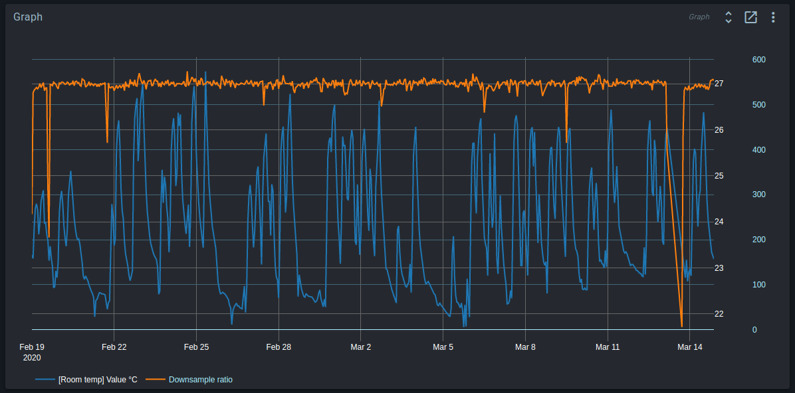
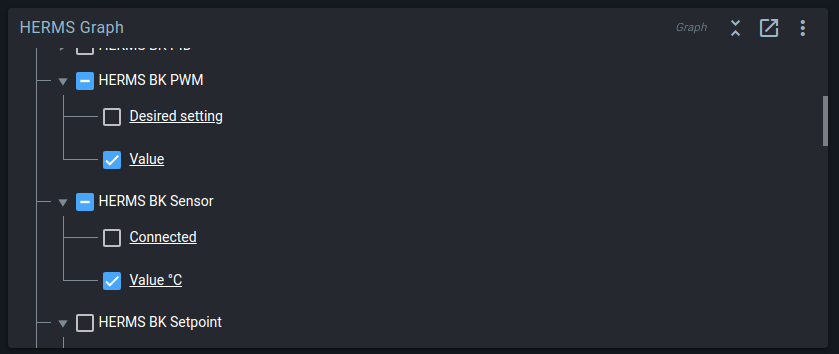
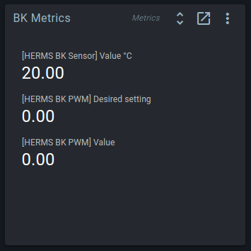
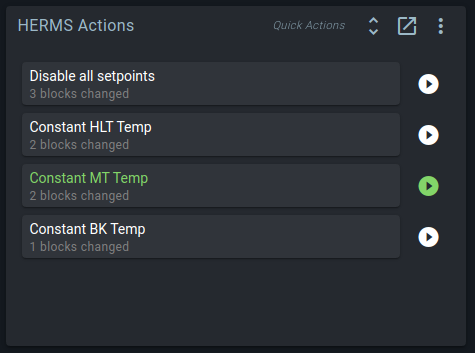
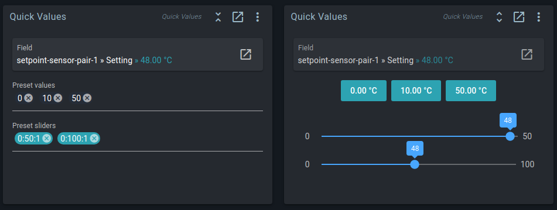
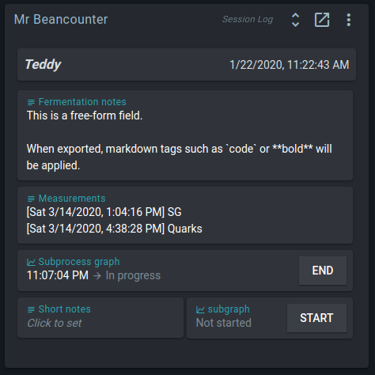
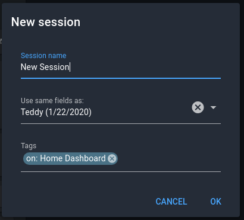
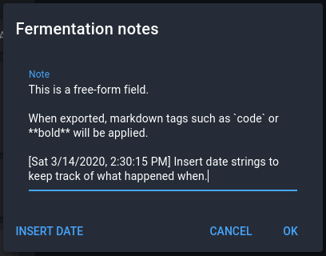
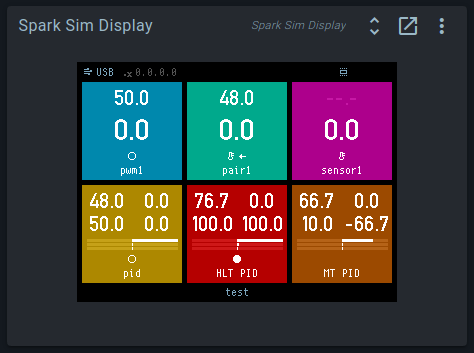
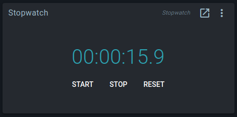

# Widgets

::: tip
For a description of blocks and their widgets, see the [blocks page](./all_blocks.md).
:::

## Brewery Builder

The Brewery Builder shows a live view of your system. This includes a simulation of how liquid is flowing through your pipes and kettles, based on actual pump and valve states.

You can create your own layouts, or generate them with a Quick Start Wizard. For more info on how this works, see [the Brewery Builder guide](./builder_guide.md).

## Graph

The Spark and other [devices](./multiple_devices.md) continuously generate history data. The Graph widget can fetch fields from the history database, and render them as graphs on your dashboard.

The widget has a live link to the history database, and will automatically re-render if new data is available.

To improve rendering of values with different scales, two Y-axes are supported. Fields shown on Y2 use the right-most Y-axis, and have a cyan label.

In the screenshot above, `Downsample ratio` is using Y2, because it requires an Y range of 0-600, while `[Room temp] Value C` has a much narrower range of 22-27.

In the Graph settings (accessible by clicking the `Show full widget` button in the top right corner), you can select which fields you want to show. Click on a field to edit display settings such as label, line color, or used Y-axis.

## Metrics

The Graph widget can show you how a value changed during the last day, but sometimes you only really want to know the current value.

For this, the Metrics widget exists. It is a live view of the latest value of a field in the history database.
As with the Graph widget, you can pick and match which fields you want to show.

It is often used for combining fields from multiple blocks, or showing data from third-party services that do not have widgets of their own.

## Quick Actions

Quick Actions are shortcuts for making multiple changes to Spark blocks with one click.

They are useful for automating common configuration toggles that involve multiple blocks.
Common examples are: switching between beer and fridge mode in fermentation setups, or rerouting flow by opening or closing multiple valves.

The widget keeps track of the current state of blocks.
A Quick Action is considered "Active" if its changes would not change the current state.
Active Quick Actions are rendered in green.
Hover over the Quick Action to see a comparison of its changes with the current state.

After applying a Quick Action, you can still manually edit any of the changed blocks.

## Quick Values

Where the Quick Actions widget is used for changing multiple blocks at once,
the Quick Values widget lets you define multiple preset values for the same block field.
This lets you toggle between common values without having to use a (virtual) keyboard.

## Session Log

To keep track of individual brews, there is the Session Log widget.
A session consists of text notes and graph notes to document individual brews.
After the brew is done, you can export the session to a formatted html file.

When creating sessions, you can re-use the field configuration of a previous session.

Text notes can be seen as a replacement for the chalkboard in your brewery: a place to quickly jot down observations, or record when you did what.

Graph notes are configured just like the Graph widget: pick any history field you want. Click on the note to view the graph.

## Spark Sim Display

When using a simulation Spark service, this widget will show what would be rendered on the physical controller's LCD screen.

**This widget is only available for simulation services.**

## Stopwatch

A simple, but useful widget.
The timer will keep running when the UI is reloaded, or opened on another device.