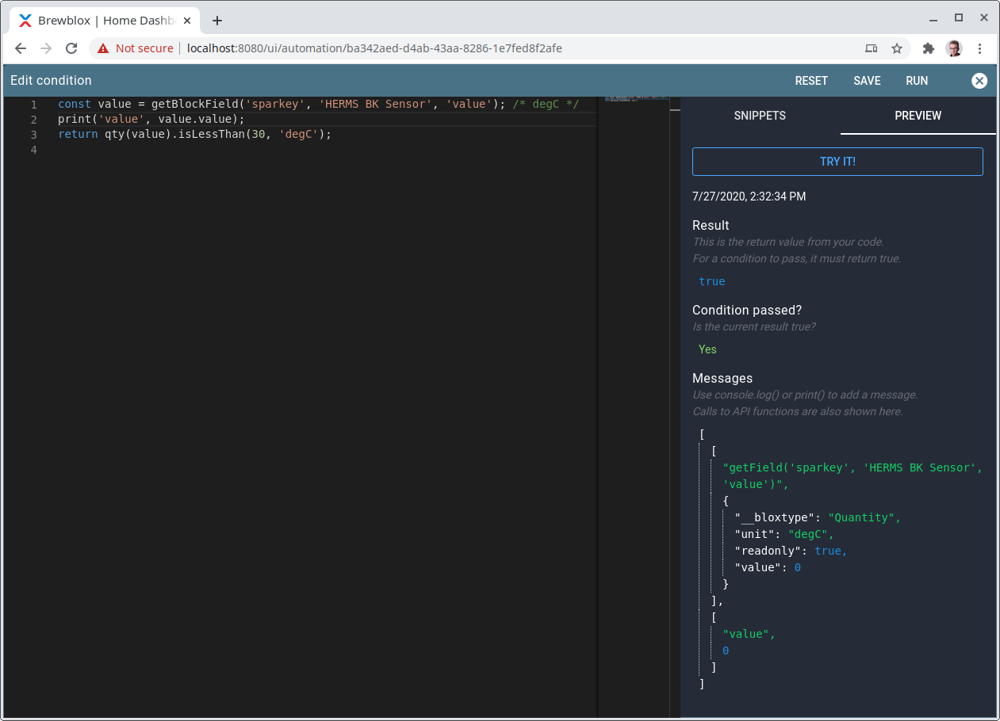
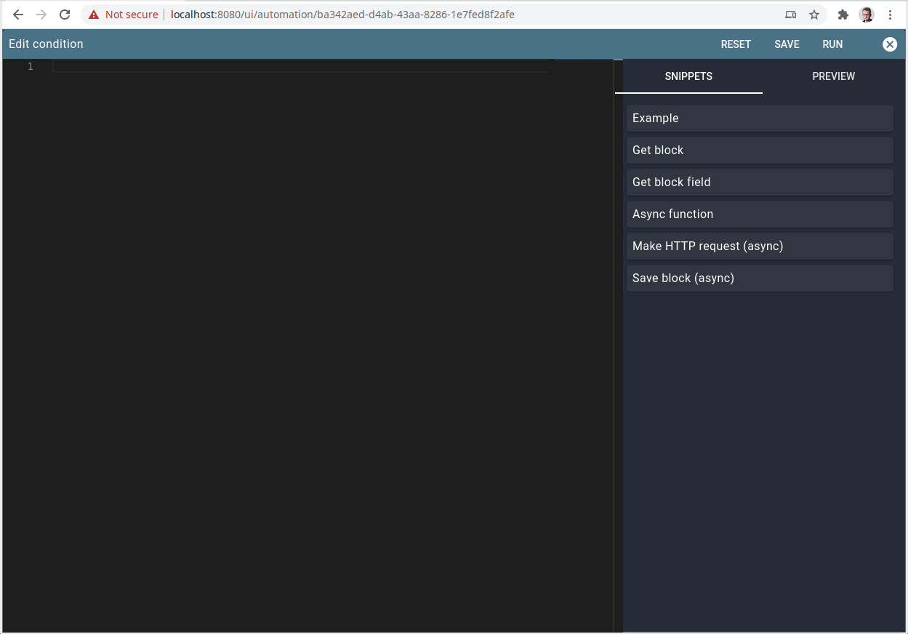

# (PREVIEW) Automation sandbox scripting

::: warning
The automation service is currently in alpha.

It is not feature complete, and there will be bugs.
Use at your own risk.
:::

## Introduction

To aid with complex or repetitive tasks, the automation service supports using scripted conditions and actions.
Scripts are written using JavaScript, and can see and change blocks on the Spark.
Scripts are editable in the Brewblox UI, and tooling is provided to make it easy to get started.

## Editor

To assist with editing scripts, the editor offers Previews and Snippets.



When you click the "Try It!" button (or press Ctrl+Enter), the code in the editor is sent to the automation service to be evaluated.

You can see the return value from your script here, and all generated messages.
In the screenshot we have two messages: one generated by the `getBlockField()` function, and one we added by using the `print()` function.



Snippets are a quick way to get started writing scripts.
They can ask you to select a value in a dropdown, and will then convert your selection into code.

You can then modify the generated code to your liking.

## Async functions

In JavaScript, functions that have to wait for something to finish are declared `async`.

API functions that have to make a network call (saving blocks, publishing events, making HTTP requests) are `async`.

When calling an async function, you need to put the `await` keyword before your call:
```javascript
const value = await asyncFunction();
```

Example:
```javascript
const block = getBlock('spark-one', 'Ferment Fridge Setpoint');
block.data.setting = qty(20, 'degC'); 
await saveBlock(block); // change value on other service -> async
```

## API

Scripts are run in a *sandbox*.
This means that they are isolated from the rest of the program.

We added some helper functions to make it easy to write scripts.

---
### print(...args)

The `print()` function adds a message to the preview output.
When executing the process, messages are logged but not evaluated.

You can add as many arguments as you want. Objects (`{ key: 'value' }`) and lists (`['value']`) can be printed, and will be rendered as collapsible items in the message view.

`console.log(...args)` is an alias for `print(...args)`.

Example:
```javascript
print('value 1', 1234, {key: 'value'}, ['value1', 'value2']);
console.log('value 1', 1234, {key: 'value'}, ['value1', 'value2']);
```

---
### getBlock(serviceId, blockId)

`getBlock()` finds a currently active block with the requested ID. <br>
It returns `null` if the block was not found.

For a description of how a block looks like, see the [block types documentation](../dev/reference/block_types).

In the editor is a snippet that lets you select a block from a dropdown, and then generates the `getBlock()` call.

Example:
```javascript
const block = getBlock('spark-one', 'Ferment Fridge sensor');
print(block);
```

---
### getBlockField(serviceId, blockId, fieldName)

Often you don't need the full block, but only a specific value. <br>
`getBlockField(serviceId, blockId, fieldName)` returns that value.

For a description of what fields are available for each block type, see the [block types documentation](../dev/reference/block_types).

In the editor is a snippet that lets you select a block and a field from dropdown menus, and then generates the `getBlockField()` call.

Example:
```javascript
const field = getBlockField('spark-one', 'Ferment Fridge sensor', 'value');
print(field);
```

---
### blocks

`blocks` is a list of block objects. It contains all blocks from all Spark services. <br>
Typically you want to use `getBlock()` or `getBlockField()` if you want a specific value.

For a description of how a block looks like, see the [block types documentation](../dev/reference/block_types).

Example:
```javascript
print(blocks);
```

---
### events

`events` is a list of cached [state or history events](https://brewblox.netlify.app/dev/reference/event_logging.html).

The data also includes published topic, and time received.
Only the last received event for a given topic is included.
If you want to read events published by your service here, it is advised to publish to a unique topic.

Example:
```javascript
print(events)
```

---
### qty(field) / qty(value, unit) / qty(duration)

Many block fields are quantities. This means that they have both a *value* (eg. `10`), and a *unit* (eg. `degC`).

If you print them, they will look like
```json
{
  "__bloxtype": "Quantity",
  "unit": "degC",
  "value": 10
}
```

The `qty()` helper function takes this data, and creates a `Quantity` object that lets you convert and compare quantities.

You can call `qty()` in four different ways:
- With a block field that is a quantity object: `qty(getBlockField(...))`
- With a value and a unit: `qty(20, 'degC')`
- With a time string: `qty('1d2h8m')`
- Another `Quantity` object: `qty(qty(20, 'degC'))`

You can compare two quantities if the units are compatible. `degC` and `degF` are compatible, but `degC` and `delta_degC` are not.

Available comparison functions are:
- `eq(other)` or `isEqualTo(other)`
- `lt(other)` or `isLessThan(other)`
- `lte(other)`
- `gt(other)` or `isGreaterThan(other)`
- `gte(other)`
- `compareTo(other)`

The argument(s) for all comparison functions are the same as that for `qty()` itself.

All comparison functions except `compareTo()` return a boolean true/false. <br>
`compareTo()` returns `-1`, `0`, or `1`, depending on whether the base or compared quantity is higher.

Examples: 
```javascript
qty('1h10m').eq(70, 'min'); // true
qty('1h10m').eq(qty(70, 'min')); // true

qty(20, 'degC').lt(50, 'degF'); // false
qty(20, 'degC').isLessThan(50, 'degF'); // false

qty(20, 'degC').lte(20, 'degC'); // true
qty(20, 'degC').lte(21, 'degC'); // true

qty(20, 'degC').gt(50, 'degF'); // true
qty(20, 'degC').isGreaterThan(50, 'degF'); // true

qty(20, 'degC').gte(20, 'degC'); // true
qty(20, 'degC').gte(19, 'degC'); // true

qty(10, 'degC').compareTo(15, 'degC'); // -1
qty(15, 'degC').compareTo(15, 'degC'); // 0
qty(20, 'degC').compareTo(15, 'degC'); // 1
```

To convert a quantity to another compatible quantity, you can use the `to(unit)` function.
When converting a quantity, the original is unchanged.

Examples:
```javascript
qty('10m').to('s');
qty(20, 'degC').to('degF');
```
```javascript
const original = qty(20, 'degC');
const converted = original.to('degF');

print(original.value, original.unit); // [ 20, 'degC' ]
print(converted.value, converted.unit); // [ 67.9999, 'degF' ]
```

You can also add or subtract one quantity from another.
As with conversion, all mathematical operations return a new quantity, and leave the original unchanged. The new quantity has the original's unit.

When modifying absolute temperatures (`degC`, `degF`), the argument must be a relative value (`delta_degC`, `delta_degF`).

Available operations:
- `plus(other)`
- `minus(other)`

Examples:
```javascript
const original = qty(20, 'degC');
const other = qty(20, 'delta_degF');

const result = original.plus(other);
print(original.value, original.unit); // [ 20, 'degC' ]
print(result.value, result.unit); // [ 31.11111, 'degC' ]
```

---
### saveBlock(block)

To change a block on a Spark, you need to explicitly save it.

It will write all values in the block data you send, except for readonly fields. Those are ignored.

This is an `async` function, and must be called using `await`.

Example:
```javascript
const block = getBlock('spark-one', 'Ferment Fridge setpoint');
block.data.storedSetting = qty(20, 'degC');
await saveBlock(block);
```

---
### publishEvent(topic, payload)

You can publish arbitrary MQTT events with the `publishEvent()` function.

You can send objects or lists as payload. They will be automatically converted to a JSON string.

This is an `async` function, and must be called using `await`.

Example:
```javascript
await publishEvent('brewcast/history/my-process', {
  key: 'my-process',
  data: {
    'value': 1234,
  },
});
```

Everything after `brewcast/history` in the topic is optional, but recommended.
It makes it easier to identify and listen to your events while debugging.

---
### axios

[Axios](https://www.npmjs.com/package/axios#example) is a popular JavaScript library for making HTTP requests.
It comes pre-installed in the automation sandbox.

HTTP requests are always made from the automation service, both when the process is running, and when you are previewing your script.

Example:
```javascript
const resp = await axios.get('https://www.example.com');
print(resp);
return resp.status === 200;
```
