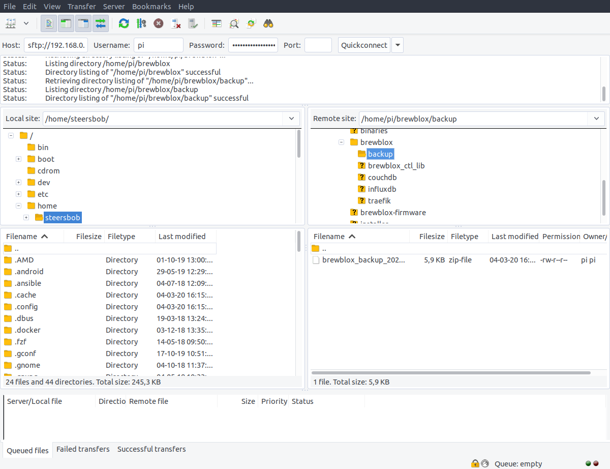

# Configuration Backups

It is often useful to create backups of your settings. You may wish to migrate Brewblox to a different host, or simply be prepared for possible SD card failures.

For these scenarios, it is possible to create and load backups of your Brewblox settings and databases.

## How to

Backups are both made and loaded using the brewblox-ctl commandline tool.

To create a backup, use the `backup save` command.

```sh
brewblox-ctl backup save
```

This will create a new zip archive in the `backup/` directory inside your Brewblox directory. The file name includes the current date and time.

To load settings from a backup, use the `backup load [ARCHIVE]` command,
and run brewblox-ctl update to migrate any outdated settings.

```sh
brewblox-ctl backup load /home/pi/brewblox/backup/brewblox_backup_20200303_1433.zip
brewblox-ctl update
```

## Content

The backup archive includes the following:

- .env
- docker-compose.yml
- Datastore databases
  - Dashboards
  - Widgets
  - Block names
  - Builder layouts
- Exported Spark blocks

**NOT** included in the backup archive:

- History data
- Docker images

## Transferring backup files

The easiest way to move files between your computer and the Pi is to use [FileZilla](https://filezilla-project.org/).

The host field should be `sftp://IP_ADDRESS`. Username / password are the same as when logging in over SSH.



## Limitations

Backups make a copy of your settings, not a snapshot of your entire system. Backups cannot be used to revert to an earlier Brewblox release.

After loading an old backup, it is advisable to run `brewblox-ctl update` to migrate your configuration to the latest version.

## Automatically creating backups

You can use [cron](https://ostechnix.com/a-beginners-guide-to-cron-jobs/) to automatically run scripts daily/weekly/hourly.

For example, to create weekly backups:

```sh
crontab -u $USER -e
```

Choose Nano as editor, and append the following line to the file:

```sh
@weekly (cd $HOME/brewblox; $HOME/.local/bin/brewblox-ctl backup save)
```

Press ctrl+X to save and exit.

If you now run `crontab -l`, you should see the file, including the line you just added.
