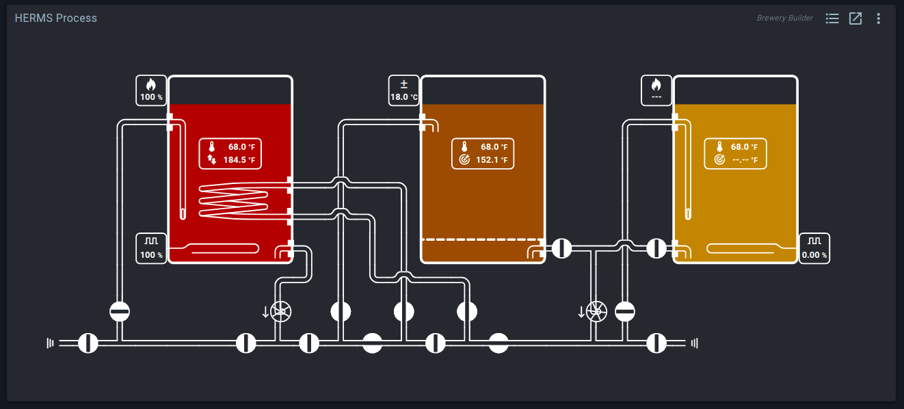
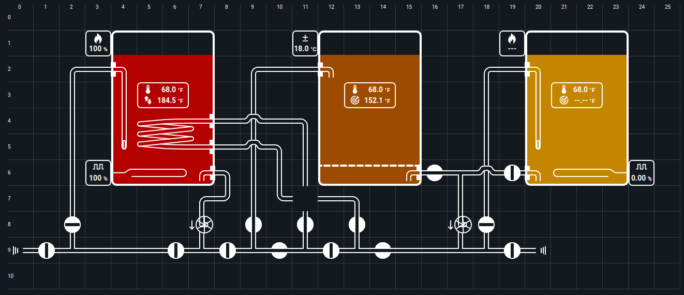
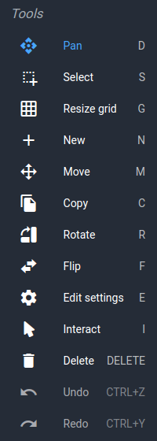
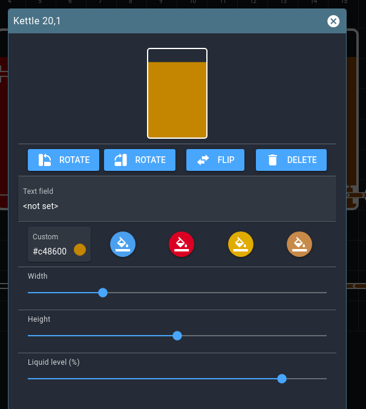
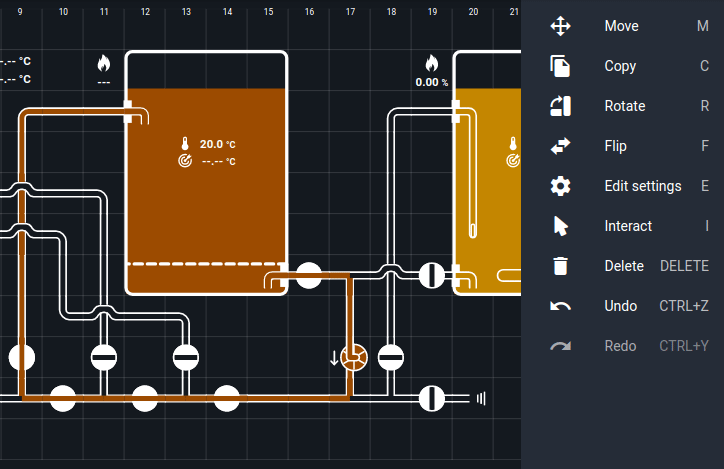
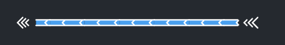
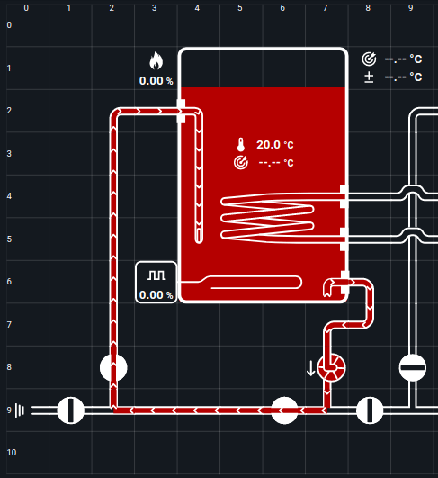
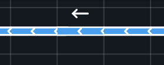
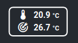
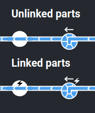

# Brewery Builder guide

The Brewery Builder (or *Builder* for short) is a responsive and fully configurable view of your system.
Whenever you make a change, it will immediately recalculate the new flow.

Quickstart wizards will automatically generate Builder layouts and widgets, but you can also add and edit your own.

## Terminology

**Layouts** are the basic canvas or document for the Builder.
All layouts are listed in the sidebar, and Builder widgets always show a layout.
If you edit the layout, the change will be visible in all widgets that show that layout.

**Parts** are the individual elements placed on a layout. There are parts for tubing, kettles, valves, pumps, sensors, PIDs, and much more.
Some parts are used by the flow simulation, and others serve to display and control block values.

Builder widgets show your layouts, and allow you to interact with elements. To add, move, or edit parts, you need the **Editor**.
You open the editor by clicking on the *Builder* button at the top of the sidebar, or by toggling the button in the top right corner of the layout page.

In the editor, you'll notice the **Grid**. Parts can be placed or moved anywhere in the layout, but the grid is considered the default area.
When a layout is shown in a widget, page, or editor, the initial zoom level is set to best fit the grid.
You can change the grid size at will in the editor.

## Tools

In the Builder editor right-hand sidebar, you can find the tools required for changing your layout.
To activate the tool, click the menu button or use the associated shortcut.
Depending on the tool, you can click or drag to use it.

The function of most tools is self-explanatory, but we'll take a closer look at two of them: `Edit settings` and `Interact`.

**Edit settings** will open a dialog with the settings available for a part.
For many parts this only includes generic settings: rotate, flip, or remove the part.

Some have more settings. For example, the kettle allows setting:
- The label (displayed at the top)
- The liquid color.
- The width and height (measured in grid squares).
- The liquid level (for display only - ignored in flow calculations).

**Interact** is the equivalent of clicking on a part in the Builder widget. Click on valves to open/close them, or click on linked parts to open the block dialog.

## Flow calculations

Whenever there is a viable route from a liquid source (a kettle or inlet) to a liquid sink (another kettle or inlet), the route and flow speed will be shown.

Building routes is straightforward: if it looks like a tube, it works like a tube. Valves and pumps can be used to redirect and speed up flows.

## Inlets

Liquid flows must always start and end at inlets. Simply having a tube without a connecting part does not count as being an inlet. There are two kinds: global inlets, and kettle inlets.

Flow direction is always determined by the pressure on both ends of the route. You can have a flow route where both start and end inlets have pressure: liquid will flow towards the inlet with the least pressure.

**global inlets** show liquid entering and leaving the system. You can use them to model fresh water taps, floor drains, kitchen sinks, or even tubes to and from other systems.

Enable the inlet in its settings dialog if it models an inflow of liquid. You can also customize liquid color here.

**kettle inlets** function like global inlets, but take their pressure and liquid color settings from the kettle they are placed in.
The kettle liquid color is not changed when a different liquid flows into the kettle.

## Pumps

Just like in real life, pressure and flow speed will gradually decrease the longer the distance between inlet and outlet.
Pumps increase pressure without being a liquid source themselves.

To simulate height differences in your system, there's also the `Tube: gravity` part. It works like a pump that's always on.

## Linked blocks

Some Builder parts can be linked to Spark blocks. Most of these display block values, but you can also link valve and pump parts.

When a valve or pump is linked to a block, it will use the block's state. Clicking on the part will toggle the block. If the block can't be toggled because (for example) it is constrained by a mutex, the part state will also not update.

Linked valves and pumps are identified by a lightning bolt icon.

For other linked parts: if you use the `Interact` tool (editor) or simply click on them (widget), it will show the linked block in a dialog.

There is some intelligence in the system here. For example: if you click a heating element (linked to a PWM), it will show you the PID dialog. You can set desired temperature here.
