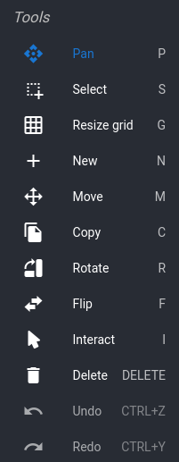

# Brewery Builder guide

The Brewery Builder is a responsive and fully configurable view of your system.
Whenever you make a change, it will immediately recalculate the new flow.

Quickstart wizards will automatically generate Builder widgets, but you can also add and edit your own layouts.

## Builder widget, Builder editor

Builder widgets show your layouts, and allow you to interact with elements. To add, move, or edit parts, you need the Builder editor.

You can access it from the sidebar, or by double clicking on a builder widget.

## Layouts

Builder layouts are not bound to any single widget. You can select all layouts in the editor, and can use a widget to show any layout.

## Tools

In the Builder editor sidebar, you can find the tools required for changing your layout.

Either hover your cursor over the grid and press the shortcut, or select one or more parts, and then click the tool.

The function of most tools is fairly self-explanatory, but we'll take a closer look at two of them: `Edit Settings` and `Interact`.

**Edit Settings** will open a dialog with the settings available for a part. For many parts this will be fairly generic: rotate, flip, or remove the part.

Some have more settings. For example, the kettle allows setting:
- The label (displayed at the top)
- The liquid color.
- The width and height (in squares).
- The liquid level (for display only - ignored in flow calculations).

**Interact** is the equivalent of clicking on a part in the Builder widget. Click on valves to open/close them, or click on linked parts to open the block dialog.

## Mouse actions

Builder mouse actions are always active, and determine what happen when you first click on a part.

The default action is `select`. Click, or click and drag in the grid to select one or more parts. You can then copy, move, or remove those parts.

Not all tools work when multiple parts are selected.

The other action is `interact`. It is equivalent to using the interact tool, but on every click.

## Flow calculations

Whenever there is a viable route from a liquid source (a kettle or inlet) to a liquid sink (another kettle or inlet), the route and flow speed will be shown.

Building routes is fairly self-explanatory: if it looks like a tube, it'll work like a tube. Valves and pumps can be used to redirect and speed up flows.

To simulate height differences in your system, there's also the `Tube: gravity`. It works like a pump that's always on.

## Inlets

Liquid flows must always start and end at inlets. Simply having a tube without a connecting part does not count as being an inlet. There are two kinds: global inlets, and kettle inlets.

Flow direction is always determined by the pressure on both ends of the route. You can have a flow route where both start and end inlets have pressure: liquid will flow towards the inlet with the least pressure.

**global inlets** show liquid entering and leaving the system. You can use them to model fresh water taps, floor drains, kitchen sinks, or even tubes to and from other systems.

Enable the inlet in its settings dialog if it models an inflow of liquid. You can also customize liquid color here.

**kettle inlets** function like global inlets, but take their pressure and liquid color settings from the kettle they are placed in.
The kettle liquid color is not changed when a different liquid flows into the kettle.

## Linked blocks

Some Builder parts can be linked to Spark blocks. Most of these display block values, but you can also link valve and pump parts.

When a valve or pump is linked to a block, it will use the block's state. Clicking on the part will toggle the block. If the block can't be toggled because (for example) it is constrained by a mutex, the part state will also not update.

Linked valves and pumps are identified by a lightning bolt icon.

For other linked parts: if you use the `Interact` tool (editor) or simply click on them (widget), it will show the linked block in a dialog.

There is some intelligence in the system here. For example: if you click a heating element (linked to a PWM), it will show you the PID dialog. You can set desired temperature here.
