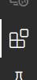
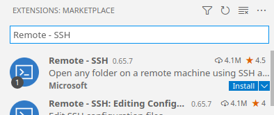
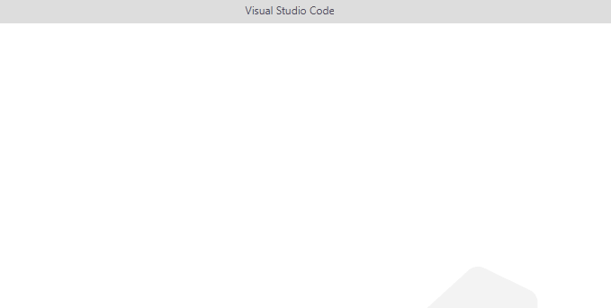
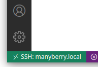
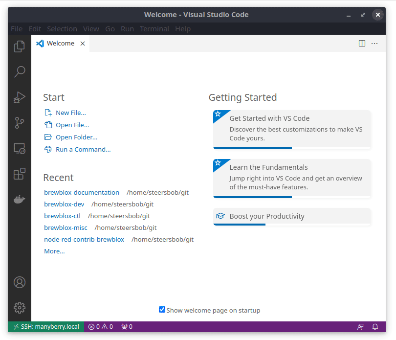
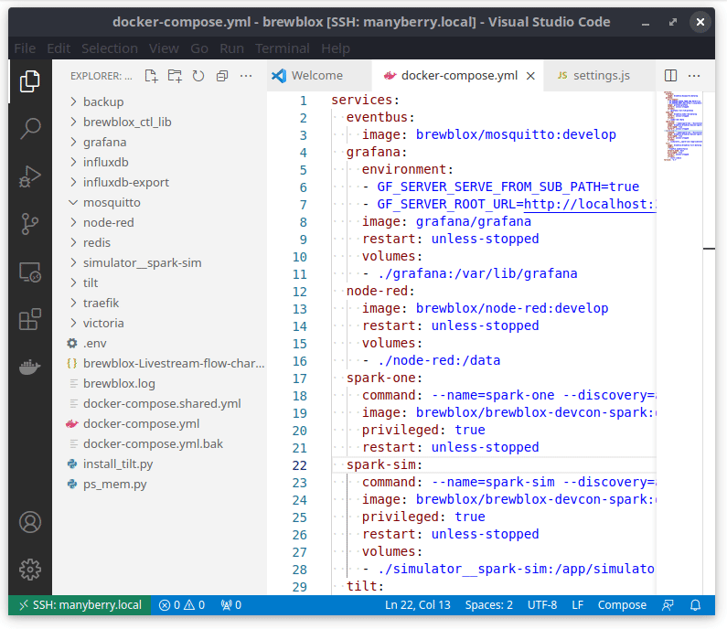

# Getting started: config editor

Brewblox service configuration is defined in various files placed in your installation directory (default `~/brewblox`).

*brewblox-ctl* has commands for common configuration changes.
If you need to change something, be sure to check there first.

If you have to read or edit configuration files, we recommend [Visual Studio Code](https://code.visualstudio.com/) with a remote editor plugin.
This way, you can use a graphical text editor, and the absolute minimum of terminal commands.

## Installation

First, install [Visual Studio Code](https://code.visualstudio.com/download).

If you're on Windows, you'll need an [SSH client](https://code.visualstudio.com/docs/remote/troubleshooting#_installing-a-supported-ssh-client).
If you used anything other than PuTTY while installing Brewblox, you already have one.

To actually connect to your Brewblox service host, you'll need the [Remote - SSH](https://marketplace.visualstudio.com/items?itemName=ms-vscode-remote.remote-ssh) extension for Visual Studio Code.

To install it, open Visual Studio Code, and click on the *Extensions* tab in the left-hand sidebar.



At the top, search for *Remote - SSH*, and click *Install*.



## Setup

To connect to your Brewblox service host, press **F1** in Visual Studio Code, and start typing "connect".
This will bring up suggestions.
Select **Remote SSH - Connect to Host**, and then **Add New SSH Host**.

It will now ask for a connection command.
This is the same `ssh [USER]@[ADDRESS]` command you normally use to connect to the Brewblox service host.
The `-A` argument is optional.

Example command:

```sh
ssh pi@192.168.1.1
```



It will now ask you some questions before and after connecting.

- Pick the first option for the SSH config file
- The server platform will be *Linux*
- You can trust the workspace

When this is done, you have a editor that uses the files on the remote machine as if they were local.

You can always check your connection status with the remote host in the bottom left corner. If it is connected it will show `SSH [ADDRESS]` in the green bar.



## Brewblox files

Once you are connected, select **File** -> **Open**Folder**** in the top bar.
Select the *brewblox* directory, and click **OK**.



## Terminal commands

The Visual Studio Code editor includes a built-in terminal.
When connected to a remote, terminal commands will also be run on the remote. <br>
This means you can use this terminal to run `brewblox-ctl` commands.

To toggle it, press **ctrl + `**

The `` ` `` (backtick) key is typically located under the Esc key.

Alternatively, press **F1**, and use the **View: Toggle Terminal** command.


