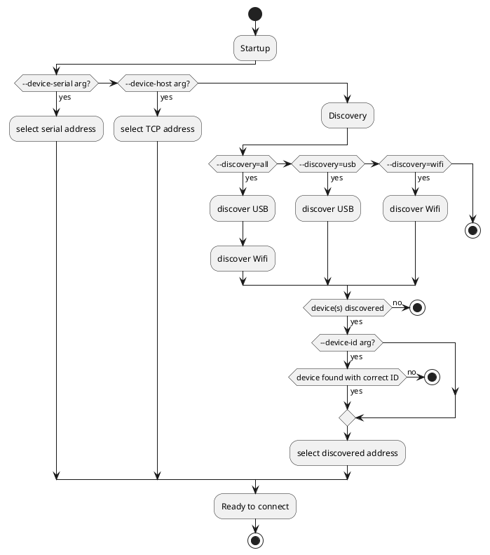

# Spark connection settings

The Spark service can connect to the controller using either Wifi, or USB. Once connected, there is no difference.

Connection settings are specified by editing the Spark service arguments in the `docker-compose.yml` file, or by using the `brewblox-ctl add-spark` command.

See the [Multiple Devices](./multiple_devices.md) guide for an explanation on service configuration.

The service can either connect immediately to a fixed address, or first try to discover the controller address.

## What settings to use

There are multiple arguments you can use (and combine) to configure how the Spark Service connects to the Spark Controller.

These arguments can be used both in the `docker-compose.yml` file, and with the `brewblox-ctl add-spark` command.

**If: you want to make sure the service always connects to same controller**
- Use `--device-id`

**If: your controller has a static IP address**
- Use `--device-host`

**If: you only want to use Wifi, even if USB is connected**
- Use `--device-host` or `--discovery=wifi`

**If: you only want to use USB, even if Wifi is connected**
- Use `--discovery=usb`


## Finding the device ID

Every Spark controller has a unique serial number that can be used as device ID. The Spark service can use this ID to check that it doesn't accidentally connect to the wrong Spark controller.

The simplest way to find the controller device ID is to use `brewblox-ctl discover`. This will scan for devices: both over USB, and Wifi.

The output format is `connection type` + `device ID` + `additional values`.

Example output:

```bash
pi@fridgepi:~/brewblox $ brewblox-ctl discover
usb 280038000847343337373738 Photon
wifi 280038000847343337373738 192.168.0.57 8332
wifi 240024000451353432383931 192.168.0.86 8332
```

In the example, two devices were found. We know this because there are only two unique device IDs in the list. The first can be reached over both USB and Wifi, the second is only reachable over Wifi.

For USB devices, "additional values" is the chip model (Spark v2 = Photon, Spark v3 = P1).
For Wifi devices, the IP address and port are listed here.

## `--device-id`

If you set the `--device-id` argument, device discovery will skip any devices with a different ID. This goes for discovery in both USB, and Wifi.

Example call to `add-spark`:

```
brewblox-ctl add-spark --name=spark-two --device-id=300045000851353532343835
```

Example configuration with `--device-id` set:

```yaml
  spark-two:
    image: brewblox/brewblox-devcon-spark:rpi-${BREWBLOX_RELEASE:-stable}
    privileged: true
    restart: unless-stopped
    labels:
      - "traefik.port=5000"
      - "traefik.frontend.rule=PathPrefix: /spark-two"
    command: >
      --name=spark-two
      --mdns-port=${BREWBLOX_PORT_MDNS:-5000}
      --device-id=300045000851353532343835
```

## `--device-host`

If you enabled Wifi on the Spark, you can use the management page in your router to give it a fixed IP address. To find out how to do so, google "static dhcp lease" + the brand and model of your router.

After you have done so, you can tell the service to always connect to the same address by using the `--device-host` argument.

Example call to `add-spark`:

```
brewblox-ctl add-spark --name=spark-two --device-host=192.168.0.101
```

Example configuration with `--device-host` set:

```yaml
  spark-two:
    image: brewblox/brewblox-devcon-spark:rpi-${BREWBLOX_RELEASE:-stable}
    privileged: true
    restart: unless-stopped
    labels:
      - "traefik.port=5000"
      - "traefik.frontend.rule=PathPrefix: /spark-two"
    command: >
      --name=spark-two
      --mdns-port=${BREWBLOX_PORT_MDNS:-5000}
      --device-host=192.168.0.101
```

## `--discovery=wifi` / `--discovery=usb`

If you haven't used `--device-host` to set a fixed address, the Spark service will try to discover the Spark controller.

Controllers can be discovered both over USB, and over Wifi. By default, the service tries both: first USB, then Wifi.

You can restrict discovery by using the `--discovery` argument. This can be used in combination with `--device-id`. Valid options for `--discovery` are: `all`, `usb`, or `wifi`.

Example call to `add-spark`:

```
brewblox-ctl add-spark --name=spark-two --discovery=usb
```

Example configuration to only discover USB devices:

```yaml
  spark-two:
    image: brewblox/brewblox-devcon-spark:rpi-${BREWBLOX_RELEASE:-stable}
    privileged: true
    restart: unless-stopped
    labels:
      - "traefik.port=5000"
      - "traefik.frontend.rule=PathPrefix: /spark-two"
    command: >
      --name=spark-two
      --mdns-port=${BREWBLOX_PORT_MDNS:-5000}
      --device-id=300045000851353532343835
      --discovery=usb
```

## Connection flowchart

The Spark service uses multiple arguments to determine how and where to find the Spark controller it should connect to.
These arguments are:
* `--device-serial`
* `--device-host`
* `--discovery`
* `--device-id`

The following diagram is a (simplified) display of the decision process to select a device.
If discovery fails, the service reboots. This is because of a limitation in how Docker handles USB devices: the service must be started after the device was plugged in.



`--device-serial` and `--device-host` are the most specific arguments, and will take priority.
Note that device ID will still be checked after connection is made.

Examples:
```yaml
  spark-one:
    ...
    command: >
      --device-host=192.168.0.60
```
```yaml
  spark-one:
    ...
    command: >
      --device-serial=/dev/ttyACM0
```

`--discovery` has three possible values: `all`, `usb`, or `wifi`. `all` is the default. <br>
Because USB devices are more specific, they will always be checked first.

`device-id` is used to disqualify discovered devices. If `--device-id` is not set, all discovered devices are valid.

The argument value is the unique device ID of your Spark controller. 

Specific device, over Wifi or USB:
```yaml
  spark-one:
    ...
    command: >
      --device-id=300045000851353532343835
```
Specific device, USB only:
```yaml
  spark-one:
    ...
    command: >
      --discovery=usb
      --device-id=300045000851353532343835
```
First discovered device, Wifi only:
```yaml
  spark-one:
    ...
    command: >
      --discovery=wifi
```
