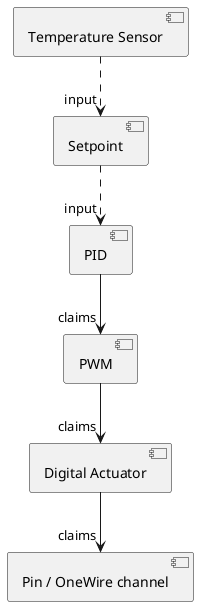
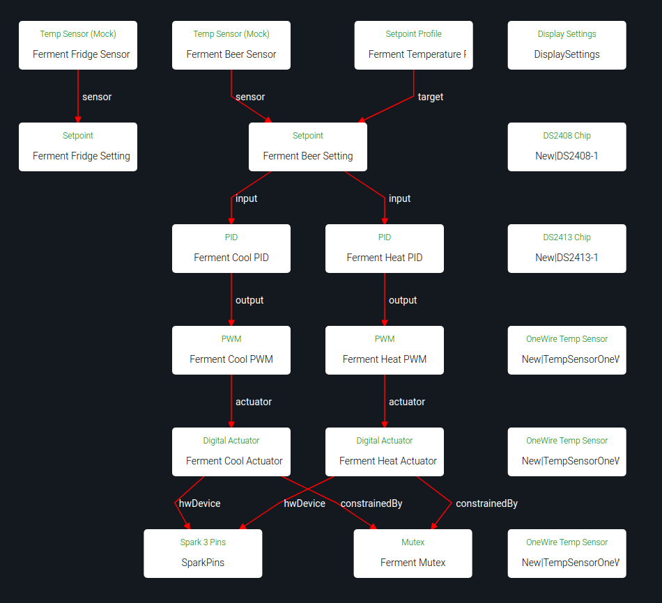
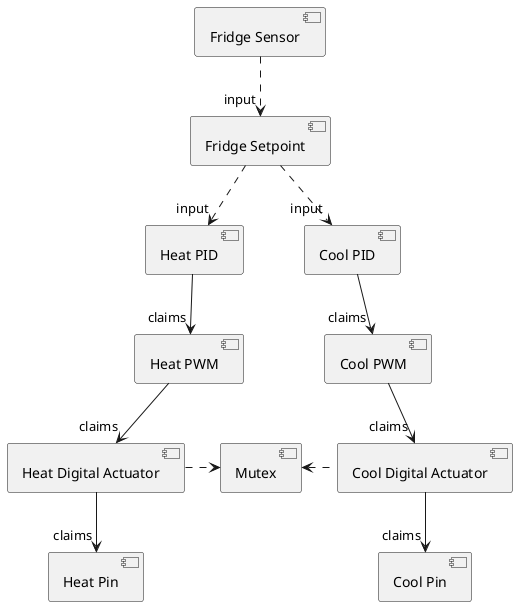
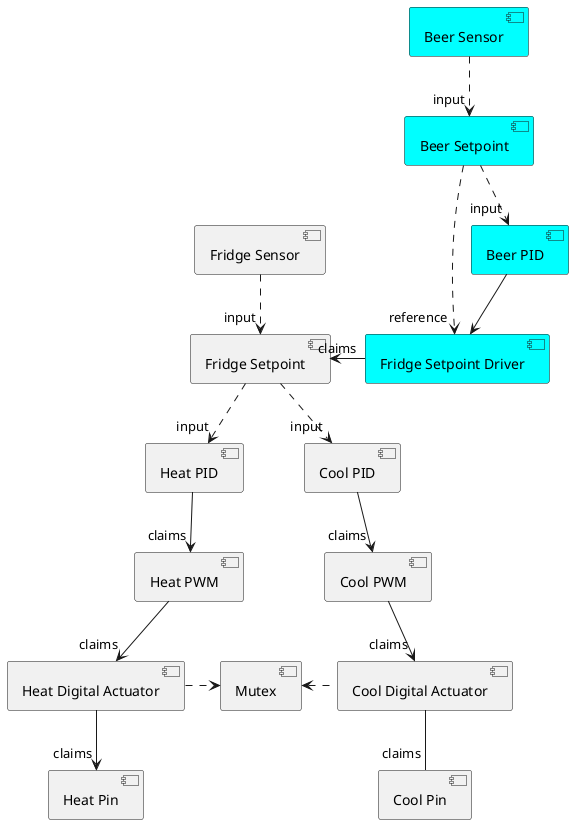
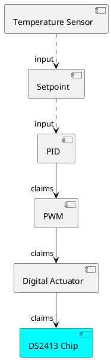
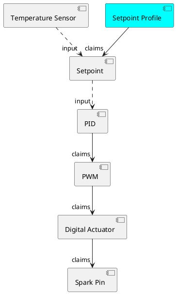
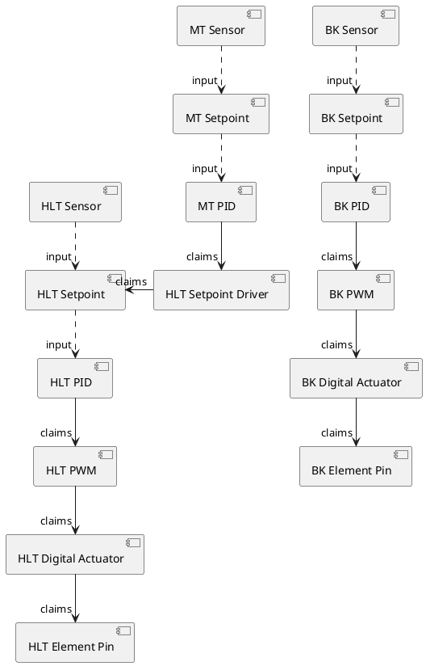
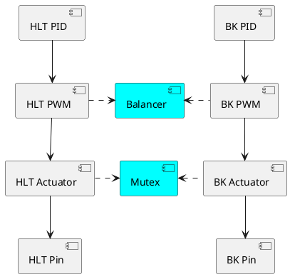

# Control chains

When first installing Brewblox, it can be a bit overwhelming.
We designed Brewblox to be very flexible and modular to give you a lot of freedom (and responsibility) to adapt it to your brewery.
The downside of this flexibility is that it there are a lot of parts that you can combine and should understand.

This page describes some common ways on how blocks can be combined to create control chains.
We will add wizards to the UI to create the most common arrangements, but still it helps to understand their design.

## A basic example

The minimal building blocks for a control system are:

- A sensor, to measure what you want to control.
- A setpoint, the target value for the sensor.
- An actuator, to drive the sensor value towards the setpoint setting.
- A controller, in our case a *PID*, to calculate what the value for the actuator should be from the sensor and setpoint value.

In Brewblox, the input of a PID is a *Setpoint*. This block contains the target value (setpoint setting) and a link to the sensor.

The *PID* calculates the error, the difference between setpoint setting and sensor value, and keeps a history of to calculates an output value.
[Wikipedia](https://en.wikipedia.org/wiki/PID_controller) offers a good explanation of how PID controllers work.

The *Digital Actuator* toggles an output pin. It can either use a pin on the Spark itself, or one connected through OneWire (DS2408 or DS2413).\
Digital Actuators can only be turned ON or OFF, but the PID calculation generates a numeric value, like 20 or 56. This is solved with a *PWM* block between the PID and the Digital Actuator.

PWM stands for [Pulse Width Modulation](https://en.wikipedia.org/wiki/Pulse-width_modulation). The PWM block has a configurable time period of for example 4 seconds.
It will turn ON the actuator for a part of that 4 second period and off for the remaining time.
A PWM value of 40% will turn ON for 1.6 seconds and OFF for 2.4 seconds and repeat.
This turns the digital ON/OFF actuator into an 'analog' numeric actuator with a range between 0% and 100%.

## Control chains in the UI

In this guide, we'll be using diagrams to show the relations within control chains.

You can also show block relations in the Spark service page.
In the top right corner there is a button that lets you toggle between blocks as list, and blocks as diagram.

The below example shows blocks on a service after running the Fermentation Fridge quickstart wizard.

Click on any of the nodes to open a dialog with block settings.

## Heating and cooling a Fridge

As a second example, we'll look at controlling fridge temperature.
You can cool the air in the fridge by turning the fridge compressor on.
To be able to also raise the fridge temperature, you can install a heater inside the fridge.

Because the system responds differently to the heater and cooler, they will each get their own PID and PWM block.
They can both use the same sensor / setpoint pair as input.

The cooling PID will have an opposite sign compared to the heating PID, so they generally do not overlap (The cooling PID should have a negative Kp setting).
If the system needs heating, the output of the heating PID will be positive and the output of the cooling PID wil be negative.
The heating PWM will start pulsing and the cooling PWM will remain off.

### Adding a mutex block

To prevent simultaneous simultaneous cooling and heating, we add a constraint to the digital actuators.
The actuators are linked to a Mutex (**mut**ually **ex**clusive) Block. When one of them already holds the Mutex, the other one cannot turn on.
This ensures only one will ever be active at the same time.
The Mutex block has an additional wait time setting: when the heater has been ON, the cooler has to wait at least 30 minutes. This prevents quickly alternating.

### Minimum ON and OFF time to protect the compressor

Heaters can be switched on and off every 4 seconds, but a fridge compressor can be damaged by short bursts of power.
It needs some time to cool down after it has has run.
So for the fridge we choose a PWM period of 30 minutes and configure a minimum OFF time constraint of 5 minutes on the output pin.

## Controlling beer temperature with a dynamic fridge setpoint

To control beer temperature, we could use 2 PIDs directly like we did for the fridge, but with the beer sensor as input.
Brewblox also supports a more advanced form of indirect control with a dynamic fridge temperature setting.

To set this up, we start with the same fridge temperature control arrangement as above, but we add a new PID to control the fridge setting.
The *Setpoint Driver* can be set as output of a PID and uses a reference setpoint (beer) to drive a target setpoint (fridge).

This sounds complicated, but is actually pretty simple. An example situation:
The beer temperature is 18 degrees, but should be 20 degrees. The beer PID has a gain (Kp) of 5, so the setpoint driver is set to 10 by the PID.
The setpoint driver in turn sets the fridge setpoint 10 degrees higher than its reference, resulting in a fridge setpoint of 30.

With this arrangement, the fridge setpoint will be automatically adjust to what the beer needs to reach the desired temperature.

### When not to use a dynamic fridge setpoint

A dynamic fridge point should only be used if the fridge air is what cools and heats the beer.
If your fermenter is very close to the cooled wall of the fridge or close to the heater, it will respond to heating/cooling independent of the fridge air temperature.
Using the fridge air temperature to try to control your beer temperature doesn't work well in this case.

Your air temperature sensor should be between the cooler and heater and the beer. If it is not, move it or use the beer temperature directly as input to your heating and cooling PIDs.

## Controlling beer temperature with cold water or glycol

As fermenters get bigger, finding a large enough fridge becomes difficult and unpractical.

Cooling with cold water works great in this situation. You will need a cooling coil in your fermenter or a cooling jacket.
Your source of cold water can be an undercounter beer line chiller or glycol chiller.
For each fermenter you can put a submersible pump in the water reservoir to pump water through your cooling coil or jacket.

Heating can be done with a heating belt around the fermenter.

## OneWire Actuators (DS2413)

Next to the five actuator pins on the Spark 3, Brewblox supports extension boards to add extra outputs.
The SSR expansion board that we sell has a DS2413 OneWire chip that provides 2 extra output pins.
To use it, use the 'discover blocks' button on the Spark service page. The discovered *DS2413* will be added.

The DS2413 can be used just like a Spark 3 output pin. It can be the target of a Digital Actuator, but it does not support soft start or fast PWM.

## Setpoint Profiles

A Setpoint has a constant setting. If you want to automatically change the setting over time, you can add a *Setpoint Profile*.
This Setpoint Profile block gradually changes the setting in the Setpoint block, to avoid sudden jumps in temperature.

The Setpoint Profile is very useful to slowly change your temperature setting to ensure the yeast has time to adapt.
By adding 2 points 3 days apart, with a setting of 20 degrees and 23 degrees, the temperature setting will increase 1 degree per day, 1/24 degree per hour.

The value is interpolated between points, so the setting increases slowly from point 1 to point 2.
If you want a sudden step, create 2 points with the same time but a different temperature setting.

## Mashing with Brewblox

When you want to use Brewblox to control the hot side of brewing (mashing, boiling), the arrangement of blocks is almost identical to the examples for fermentation control.

For each kettle with a heating element, you will have a temperature sensor, sensor setpoint pair, PID, PWM and a digital output.

For reference:

- HLT stands for Hot Liquor Tun, your hot water kettle with a HERMS coil inside.
- MT stands for Mash Tun
- BK stands for Brew Kettle, in which you boil the wort.

### A HERMS with dynamic HLT setpoint

Similar to the dynamic fridge temperature setting, we can let the measured mash temperature determine what the HLT temperature must be to raise the mash temperature during circulation.

**An example:**

Your mash temperature is 64, but should be 67. The system will set the HLT setpoint to 70.
If you mix equal volumes of 64 degree water and 70 degree water, the mixed water will be 67 degrees.
Pumping the wort through the HERMS coil in your HLT has the same effect.

While you are recirculating, the mash temperature will rise and the HLT setpoint will be lowered towards the desired mash temperature.

A higher HLT temperature will raise your mash temperature quicker. But if you build up too much heat in your HLT, more than should eventually be transferred to your mash tun, you will overshoot your setpoint.
This is why it is best to minimize the amount of water in the HLT: mount your HERMS coil as low as possible and fill the HLT only to just above the coil.

If the amount of water in your HLT is only halve of the volume in your mash tun, you could raise the HLT temperature to 73 degrees without overshoot in the previous example.
This will give you much more responsive system.

To have no overshoot, the gain of the mash tun PID should be set to MT volume divided by HLT volume. Setting it higher will make the system faster, but will give you some overshoot.

### Constant HLT temperature

If you have a Setpoint Driver driving your HLT setpoint, you should disable it when you want a constant HLT temperature. You will only use dynamic setpoint when mashing, not for pre-heating or heating your sparge water.

### Boiling

When boiling your wort, you want to boil with constant power. You can do this by disabling the BK PID or BK setpoint. Once they are disabled, you can manually set the amount of power (0-100%) of the BK PWM block.

## When you only have power for 1 element: sharing power over multiple elements

Heating large volumes of water takes a lot of power, so brewers buy the biggest heating element that their fuses can handle.
In most cases, they can therefore only power for 1 element at a time. This is not pratical, so Brewblox offers you a solution!

### Mutex

First, we create a mutex block that both elements will have to share and add a mutex constraint linking to it to both output pins.
This will prevent the elements from turning on at the same time. When one element is turned on, it will block the other one from turning on.

### Balancer

We have prevented blowing fuses, but what happens when you want to pre-heat both your HLT and BK at the same time?
If both kettles are cold, both PIDs will set their output to 100%.

The first kettle will hold the mutex until it drops below 100%, preventing the other kettle from getting any power.
This is not what we want, we want equal sharing. Both kettles should get 50% of the available power.

The arbiter for fair power sharing is the Balancer Block. It will limit the power to each client so they add up to 100%.

If the BK and HLT both request 100%, they each get 50%.  
If the HLT requests 80% and the BK 40%, the HLT gets 67% and the BK gets 33%.

### PWM with Mutex and Balancing

The result of a mutex on the digital actuators and a Balancer ensuring that the PWM blocks leave enough OFF time for each other, is that the PWM cycles overlap.
As soon as one element turns off, the other one can turn on.
If the PWM period is configured to be 4 seconds, the power will switch between elements every 2 seconds if they are balanced 50/50.
The power draw through your fuses will be nearly 100%.

Balancing is set up by creating a *Balancer* block and adding a *Balanced* constraint to each PWM block.
