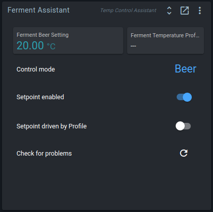

# Getting started: fermentation fridge

While going through the [startup guide](./startup.md), you may have run the *Fermentation fridge* quick start wizard.
The wizard asked you some questions, and then generated a dashboard and four widgets.

This guide walks you through the basics of using these widgets to monitor and control your fridge.

## Ferment Assistant

The Temp Control Assistant widget groups the most common settings, and makes it easy to switch between fridge and beer modes.

**Control modes** keep track of the PID settings for Beer and Fridge modes.
When changing modes, your system will adjust the PID settings, and start using the other temperature sensor.
For more information, click on the control mode.

The **Setpoint enabled** toggle indicates whether your system is active at all.
If the Setpoint is disabled, your PIDs will be inactive, and your actuators will not cool or heat.

If the **Setpoint driven by Profile** toggle is enabled, your Setpoint and Setpoint profile are both enabled.
More on temperature profiles below.

The **Check for problems** button verifies your block settings, and offers to fix any and all problems it found.

::: tip
If you are still using a fermentation fridge setup with a Quick Actions widget, you can also manually add a Temp Control Assistant widget.

Configure it to use the PIDs from your fridge, and it will automatically show a button to store PID settings as mode.
:::

## Temperature profiles

Temperature profiles are a list of points with a **time** and a **temperature**.
When enabled, the controller gradually changes a setpoint to follow the line between the profile points.

All points are saved as an offset from the start time, so you can easily re-use profiles.
Change the start time, and all other points will be shifted.
You can also create, load, and save profiles from the action menu.

The profile is stored on the Spark itself. The Setpoint Profile continues to run if the Spark has no connection to the server (the Pi).

The Ferment Assistant shows a **Setpoint driven by Profile** toggle that indicates the current state of the Setpoint Profile.

## Graphs

Spark data is logged whenever your services and controller are running.
You do not have to explicitly start or stop logging.

In the Graph settings you can add or remove tracked fields, or change the tracked period.
The wizard generated a Graph widget with some useful values already added,
but feel free to customize this at will.
You will not lose any data when deselecting fields.

::: tip
To keep track of data for specific brews, you can add a [Session Log](./all_widgets.md#session-log) widget.
:::

## Builder layout

The Quick Start wizard also created a Brewery Builder layout with a representation of your setup.
The layout is shown in a widget on your dashboard, but also has its own page.

Click on the values in your layout to edit block settings, or get more information.

::: tip
There's a lot more you can do with the builder.
See the [Brewery Builder guide](./builder_guide.md) for more details.
:::

## Blocks

The wizard placed widgets on your dashboard to control common functionality such as updating a setpoint setting, or starting a profile.
If you want to customize, extend, or tweak your setup, then there is a lot of freedom to do so.

The fermentation setup uses a set of interdependent *Blocks* that run on your Spark controller.
You can mix and match blocks at will, and blocks for multiple setups can be active simultaneously.
To see all blocks on your controller, open the side bar, and go to the service page for your Spark.

The toggle button in the top right corner lets you switch between showing blocks in a list, and showing them in a relations diagram.

## Further reading

If you want to discover what more you can do with Brewblox, we have other guides that may prove useful:

- The [control chains guide](./control_chains.md) is a good place to get an understanding of how blocks can be combined.
- More [widgets](./all_widgets.md) and [blocks](./all_blocks.md) can be added to customize your setup.
- A single Spark can control multiple fermentation setups, but sometimes it's more convenient to [add another Spark](./services/spark.md).
