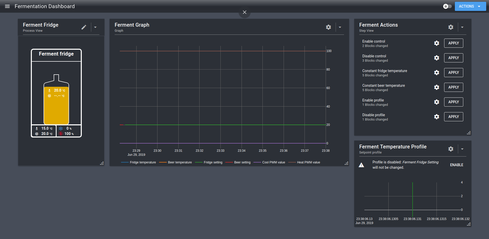

# Fermentation Arrangement Guide

While going through the [startup guide](./startup.html), you may have run the `Fermentation Fridge` wizard. This wizard asked you some questions, and then slapped some widgets on a dashboard. 

In this guide we'll shed some light on what they do, and why they do it.

## Ferment Fridge (Process View)

This is the simplest representation of your fridge: it shows you the temperature and desired temperature for both your fridge and your beer, along with how much it's currently heating or cooling your fridge.

In the wizard, we chose to use the fridge setpoint as target.
As a result, the beer setpoint is not displayed in the carboy, and the heater is now trying to get the fridge temperature up to 20°C.

You can edit both the fridge setpoint and the beer setpoint by clicking on them.

In the Ferment Actions widget you can switch to using the beer setpoint, but we'll get to that.

## Ferment Graph (Graph)

By default the graph displays the following values:
- Temperature values
- Temperature setpoints
- PWM values (0-100)
- Pin states (0-1)

To best display all values, the graph uses two vertical axes. If values use the right (blue) axis, their name is also shown in blue in the legend.

Depending on your setup and temperature unit you may want to change this. You can do so by clicking on the cogwheel, and expanding the `Axes` section.

## Ferment Actions (Step View)

This widget lists some shortcuts for common actions.
It works by applying new settings to the blocks that control your fridge.

Click on the cog wheel next to each step to see exactly what will happen when you apply the step.

For example, the `Constant beer temperature` configures the system to start using the beer setpoint for temperature control.

It will make the following changes:
- Enables the beer setpoint
- Disables the fridge setpoint
- Makes the beer setpoint the input block for the cooling/heating PIDs
- Makes the beer setpoint the target for the Setpoint Profile block

## Ferment Temperature Profile (Setpoint Profile)

Setpoint Sensor Pairs (fridge setpoint, beer setpoint) have a constant setting. If you want to automatically change the setting over time, you can use the Setpoint Profile generated by the wizard.

This Setpoint Profile block changes the setting inside a Setpoint Sensor Pair for you between two or more dates/times that you add.

The Setpoint Profile is very useful to slowly change your temperature setting to give the yeast has time to adapt.
By adding 2 points 3 days apart, with a setting of 20 degrees and 23 degrees, the temperature setting will increase 1 degree per day, 1/24 degree per hour.

The value is interpolated between points, so the setting increases slowly from point 1 to point 2.
If you want a sudden step, create 2 points with the same time but a different temperature setting.

## Blocks

You can view all blocks used by your setup, and how they relate.
- Go to the Spark service page (left menu).
- Click on `Actions` (button, top right corner).
- Click on `Show Relations` in the dropdown.

These are the building blocks of your configuration. For an in-depth explanation, you can check the [control chains guide](./control_chains.html).

Some observations:

The `Ferment Beer Sensor` and `Ferment Beer Setting` blocks are not connected to anything else right now. This indicates that the fridge is configured to maintain a constant fridge temperature.  
You can use the `Constant beer temperature` action to change this.

There are two PID controllers: one for heating, one for cooling. They both use the same Sensor/Setpoint Pair as input.

The `Ferment Cool Actuator` and `Ferment Heat Actuator` are both constrained by `Ferment Mutex`.  
**Mut**ually **Ex**clusive blocks act as traffic light. Only one actuator can be turned on at the same time, and if one turns off, the other one can't immediately turn on.  
This prevents feedback loops where the heater and cooler keep the correct temperature by both being turned on all the time.
