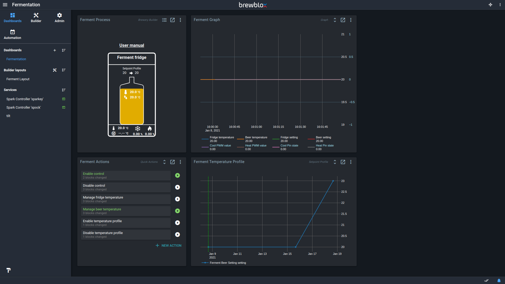
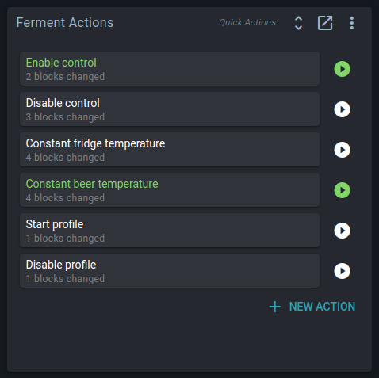
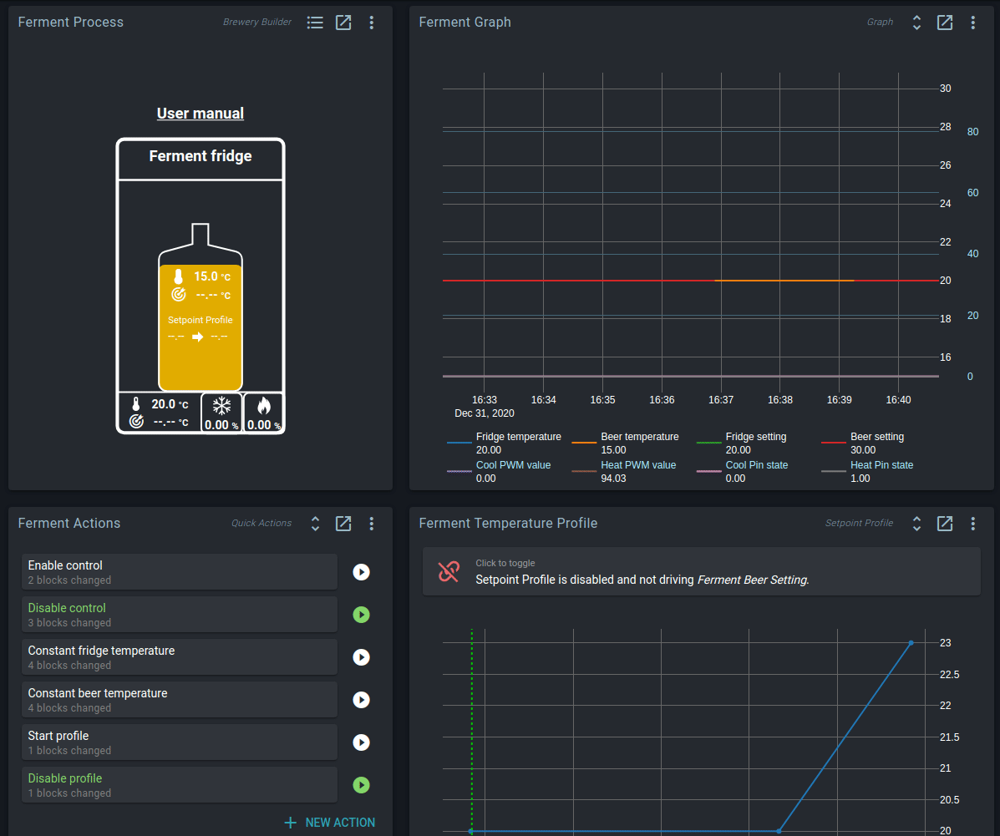
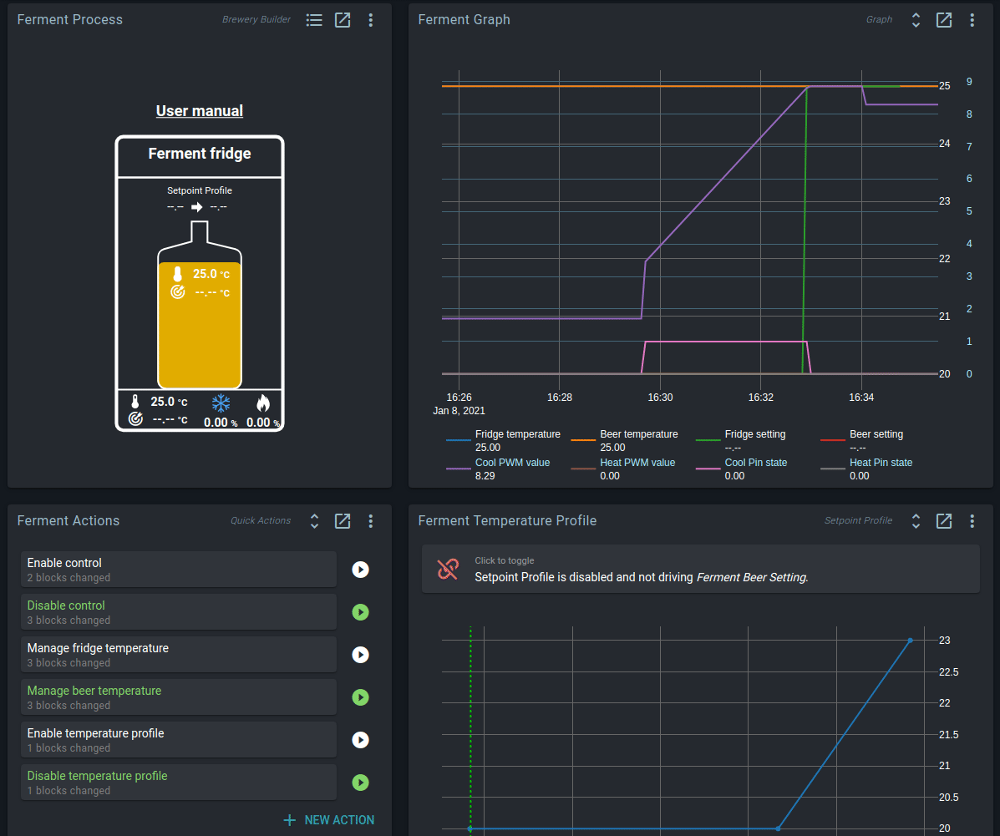
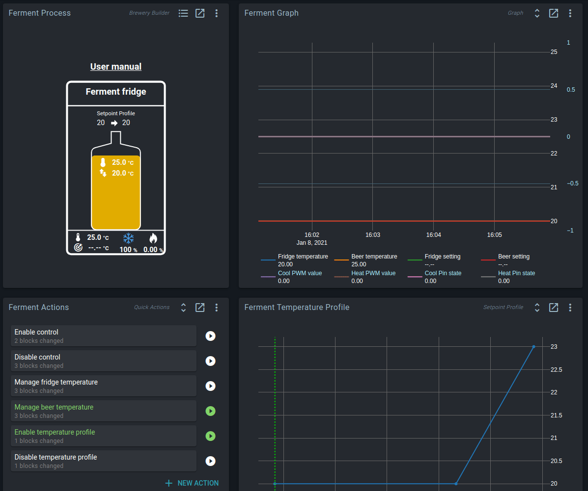
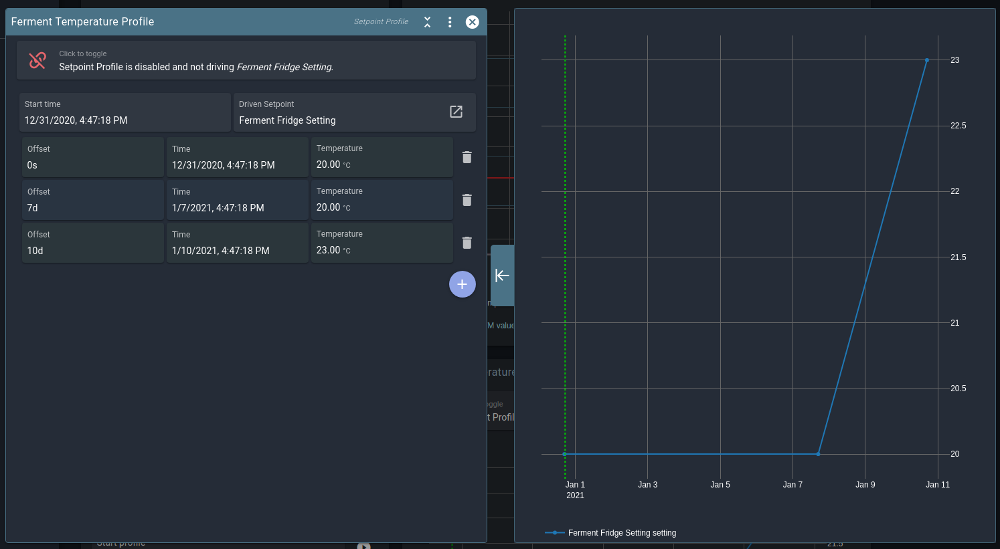
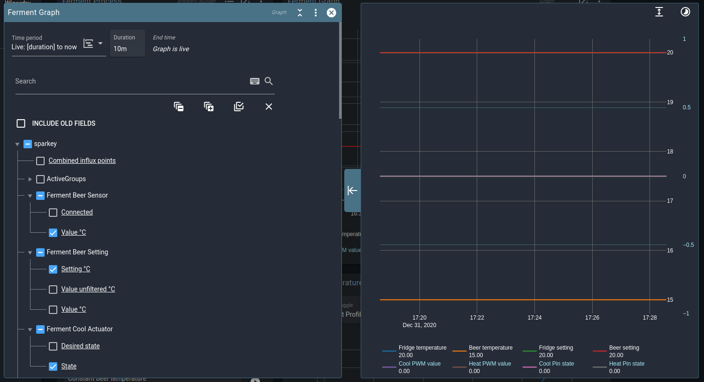
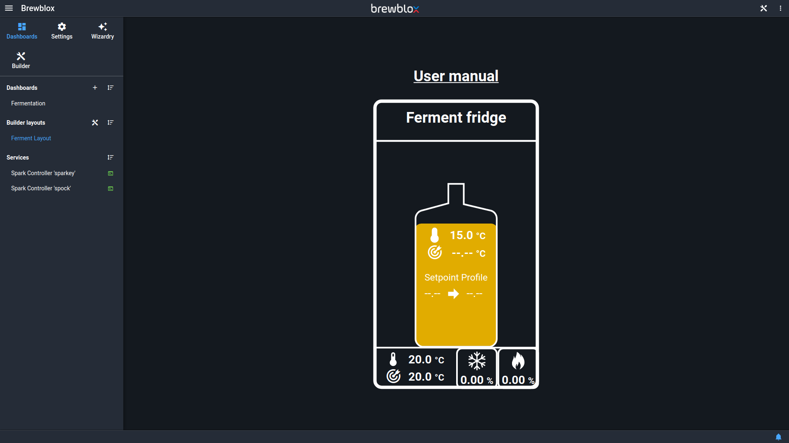
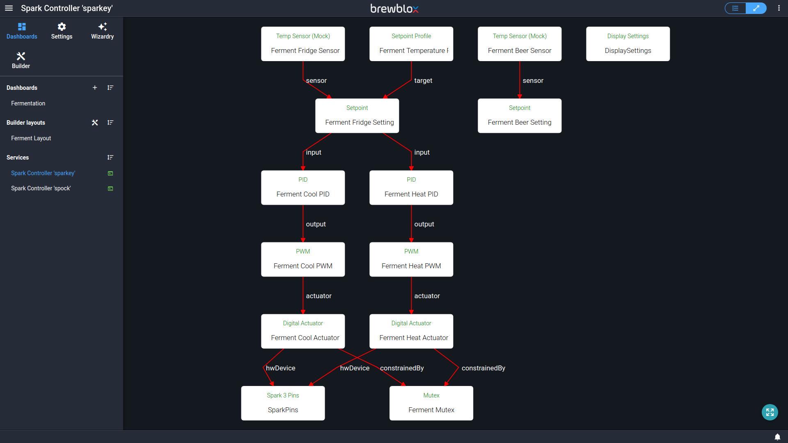

# Getting started: Fermentation fridge

While going through the [startup guide](./startup.md), you may have run the *Fermentation fridge* quick start wizard. This wizard asked you some questions, and then generated a dashboard and some widgets.

This guide walks you through the basics of using these widgets to monitor and control your fridge.

## Quick actions

For high-level control of your setup, there is a *Quick Actions* widget on your dashboard.

You can use this to start or stop fermentation control.

**Enable control** enables PID control of your heater and cooler.
The contents of your fridge will now be heated or cooled to make measured value equal to the setpoint setting.

**Disable control** disables PID control of your heater and cooler.
They will not be turned on by the system.
If they were on, they will be turned off.

**Constant fridge temperature** switches PID control to monitor your fridge temperature. Your PID settings will be adjusted.
This does not automatically enable control.

**Constant beer temperature** switches PID control to monitor your beer temperature. Your PID settings will be adjusted.
This does not automatically enable control.

**Start profile** enables the *Setpoint Profile*. This block will automatically adjust your setpoint setting to follow the configured profile. (more on this below)

**Disable profile** disables the *Setpoint Profile* block.
You can now manually edit the setpoint setting again, and the setting will not change over time.

## Quick actions: examples

### Bring beer to a constant 20°C

- Set the beer setpoint setting to 20°C
- Use **Constant beer temperature**
- Use **Enable control**

### Bring the fridge to a constant 20°C

- Set the fridge setpoint setting to 20°C
- Use **Constant fridge temperature**
- Use **Enable control**

### Start a temperature profile

- Use **Enable control**
- Use **Start profile**

### Turn off heating and cooling

- Use **Disable profile**
- Use **Disable control**

## Temperature profiles

Temperature profiles are a list of points with a **time** and a **temperature**.
When enabled, the controller gradually changes a setpoint to follow the line between the profile points.

All points are saved as an offset from the start time, so you can easily re-use profiles.
Change the start time, and all other points will be shifted.
You can also create, load, and save profiles from the action menu.

The profile is stored on the Spark itself. The Setpoint Profile continues to run if the Spark has no connection to the server (the Pi).

When you use the **Start profile** quick action, you will be prompted to set the profile start time.

## Graphs

Spark data is logged whenever your services and controller are running.
You do not have to explicitly start or stop logging.

In the Graph settings you can add or remove tracked fields, or change the tracked period.
The wizard generated a Graph widget with some useful values already added,
but feel free to customize this at will.
You will not lose any data when deselecting fields.

::: tip
To keep track of data for specific brews, you can add a [Session Log](./all_widgets.html#session-log) widget.
:::

## Builder layout

The Quick Start wizard also created a Brewery Builder layout with a representation of your setup.
The layout is shown in a widget on your dashboard, but also has its own page.

Click on the values in your layout to edit block settings, or get more information.

::: tip
There's a lot more you can do with the builder.
See the [Brewery Builder guide](./builder_guide) for more details.
:::

## Advanced settings

The fermentation setup uses a set of interdependent *Blocks* that run on your Spark controller.

Your dashboard offers you shortcuts to make changes to your block settings such as updating a setpoint setting, or starting a profile.
If you want to customize, extend, or tweak your setup, then there is a lot of freedom to do so.

The [control chains guide](./control_chains) is a good place to get an understanding of how blocks can be combined.

There are also other [widgets](./all_widgets) that may prove useful to add to your dashboard.

A single Spark can control multiple fermentation setups, but sometimes it's more convenient to [add another Spark](./adding_spark).
