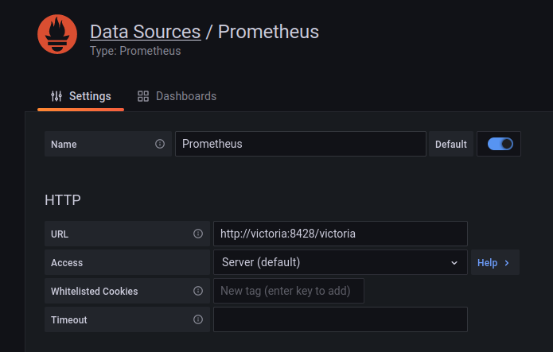

# Viewing history data with Grafana

UI graphs and CSV exports provide a convenient and straightforward way to view history data.
For notifications or more advanced data analysis,
you can install and use [Grafana](https://grafana.com/).

## Installation

If you already have Grafana installed, you can skip this step, and immediately go to [Setup](#setup).

We'll add the `grafana` service to docker-compose.yml.
It will then run alongside the other Brewblox services.

First, we need to create the directory where grafana stores its configuration.

Go to your Brewblox directory (default `~/brewblox`), and run these commands:

```sh
mkdir -p ./grafana
sudo chown -R 472 ./grafana
```

Then edit your `docker-compose.yml` file, and add the following configuration under `services`.
As always with [YAML](https://learnxinyminutes.com/docs/yaml/) files, indentation matters.

```yaml
  grafana:
    image: grafana/grafana
    restart: unless-stopped
    volumes:
      - ./grafana:/var/lib/grafana
    environment:
      - "GF_SERVER_SERVE_FROM_SUB_PATH=true"
      - "GF_SERVER_ROOT_URL=http://localhost:3000/grafana"
```

::: details Example compose file
```yaml
version: "3.7"
services:
  spark-one:
    image: brewblox/brewblox-devcon-spark:${BREWBLOX_RELEASE}
    privileged: true
    restart: unless-stopped
    command: --name=spark-one
  grafana:
    image: grafana/grafana
    restart: unless-stopped
    volumes:
      - ./grafana:/var/lib/grafana
    environment:
      - "GF_SERVER_SERVE_FROM_SUB_PATH=true"
      - "GF_SERVER_ROOT_URL=http://localhost:3000/grafana"
```
:::

Now start your services:

```sh
brewblox-ctl up
```

If you navigate to `http://{ADDRESS}/grafana`, you will be greeted by a login screen.
The default username and password are **admin** / **admin**.


## Setup

To use history data, we must add the Brewblox history database as data source.

To do so, click on the cog wheel in the left sidebar.
Then, in the *Data sources* tab, click the *Add data source* button.
Here, select the *Prometheus* option.


The HTTP URL field must be `http://victoria:8428/victoria`.
All other values can be left default.



:::tip
Grafana can also be installed somewhere else, as long as it can reach your Brewblox service host.

Change the data source URL to `http://{ADDRESS}/victoria`.
If you want to use HTTPS, enable the `Skip TLS Verify` option.
:::

## Queries

If you add a new panel, and select the newly added data source,
it will prompt you for a PromQL query.

Click on the *Metrics browser* button to show a list of known fields.

Because it is common for Brewblox fields to contain spaces,
the resulting selector is often invalid.


You can fix this by using the `__name__` argument inside the `{}` brackets.

**BAD**: `service/block name/value{}`<br>
**GOOD**: `{__name__:"service/block name/value"}`


