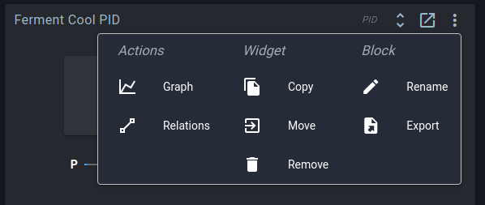
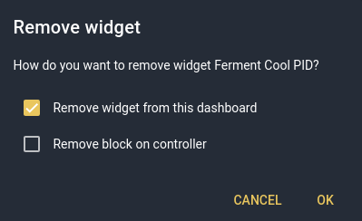
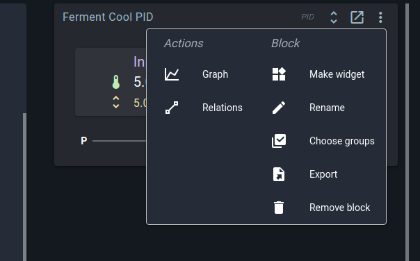
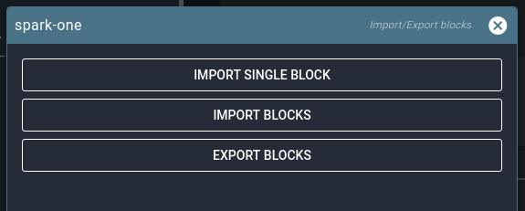
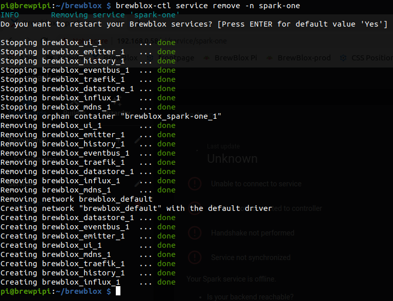
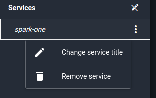

# Removing things

It's possible to remove block names or widgets without removing the block itself, and vice versa.
For an in-depth explanation of why this can happen, see [this page](./blocks_in_depth.md).

This guide explains how and where to remove widgets, blocks, services, or your entire system.

There are multiple options. We'll go from least to most drastic.

## Remove a block widget



When you click the action menu on a widget, you'll see this menu. 
Among other options, you can choose to remove the widget.



Whenever you remove a block widget from a dashboard, this dialog appears.

If you leave the second box unchecked, the widget will disappear from the dashboard, but the block will still exist on the controller. You can find it again on the spark service page.
Check the box to also remove the block on the controller - it will automatically disappear from the service page.

## Remove a block



On the spark service page, you'll notice that the action menu is somewhat different.
The option to remove the widget is gone, and instead you can immediately remove the block.

This will remove the block from the controller. If you have a block widget for this block on a dashboard, it will now show an error.

## Spark service actions


On the spark service page, you can find a dropdown menu with service actions. Many of these are useful for managing blocks on the controller.

## Remove unused block names

As explained in the [blocks in depth guide](./blocks_in_depth.md), block names are not stored on the controller. In the spark service action menu you can choose **Remove unused block names** to remove all block names that are not associated with an existing block on the controller.

You don't normally need to do this, but it is possible for the controller to end up in a state where all blocks are gone, but the names are still there.

## Remove all blocks

In the spark service actions, you can choose to remove all blocks. This does as promised: it removes all blocks on your controller, and all block names from the datastore.

It will not remove any widgets or Builder parts linked to those blocks.

## Import/Export blocks



Accessed from the spark service actions, you can use this menu to download or upload a JSON file containing all block data and block names.

If you import blocks, all blocks and block names will be removed before importing those from the file. If you export blocks, the blocks on the controller will not be changed.

## Remove Spark service





There are two steps to removing a Spark service: removing it on the Pi, and removing it in the UI.

To remove it on the Pi, run `brewblox-ctl service remove -n <SERVICE_NAME>`.
To remove it in the UI, edit services in the sidebar, click on the service, and choose `Remove service`.

This will remove the service, but not the blocks on the controller, or the block names in the datastore. For that to happen, remove all blocks before removing the service.

## Reinstall Brewblox from scratch

To completely wipe all blocks, block names, history data, dashboards, and widgets:

First **remove all blocks** (spark service page, action menu).
Then run the following commands in the brewblox directory on your Pi:

(Assuming you chose the default install directory name `brewblox/`)
```
brewblox-ctl down
cd ..
sudo rm -rf ./brewblox/
```

You can then use `brewblox-ctl install` and `brewblox-ctl setup` to reinstall your system.
