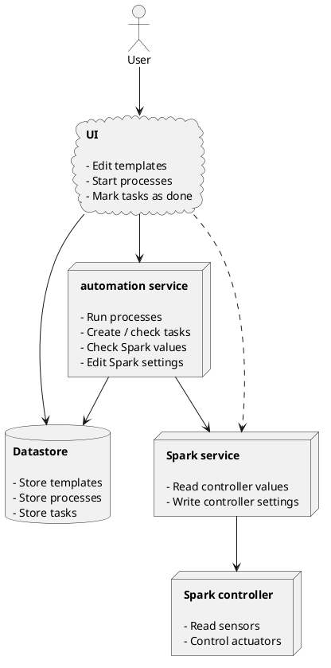
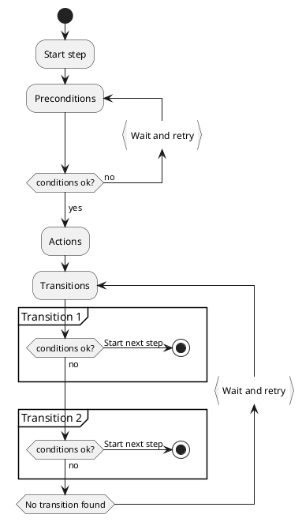

# (Deprecated) Automation service

::: danger
The automation service is deprecated, and will be disabled in a future update.

::: details
We've taken a long hard look at our automation service and its backlog, and concluded that we need to drastically curtail our ambitions here.

The purpose of the automation service is to support custom functionality that is not (yet) provided by the Spark firmware.
There are plenty of use cases for this, ranging from recipe integration to automated alerts to custom sensors and actuators.

Backlog estimates, and our experience making the main UI more user-friendly paint a less rosy picture.
The runtime engine for executing custom automation functionality is relatively simple.
Building an editor UI to handle all desired native and custom functionality is not complicated either, but it is *a lot* of work.
Making said UI intuitive and user-friendly while handling complex control logic takes even more work.

Brewblox is process control software with an emphasis on brewing. Adding a generic low-code platform would be a prime example of the [Not Invented Here](https://en.wikipedia.org/wiki/Not_invented_here) syndrome.

A happy compromise is to make our software compatible with one or more off-the-shelf low-code platforms.
The important thing is that users should not have to switch UIs when brewing.
This can be accomplished if the external editor is only required for creating the custom subroutines, and the Brewblox UI is used to start/stop/monitor them.

We've had good experiences with our prototype integration with Node-RED, and will continue development there.
Integrations with Brewfather, Home Assistant, and IFTTT are also under consideration.

To summarize:

- We are ending development of the current automation service.
- We will keep developing automation functionality.
- You can use a third-party editor to create and edit automation subroutines.
- You should not have to switch UIs during brew days or active fermentations.
:::

## Getting started

You can enable the automation services by adding the following services to your `docker-compose.yml` file:

```yaml
  automation:
    image: brewblox/brewblox-automation:${BREWBLOX_RELEASE}
    restart: unless-stopped
    init: true
  automation-ui:
    image: brewblox/brewblox-automation-ui:${BREWBLOX_RELEASE}
    restart: unless-stopped
```

## Context

The Spark controller is built to keep your system in a steady state.
You set a desired temperature, and add a sensor to measure actual temperature.\
The UI lets you change what is desired.
The Spark ensures actual becomes desired.

If this behavior is what you need, it works great.
If you have a process with multiple steps, or arbitrary conditions,
you would need to manually change settings between steps.

This is where the *automation service* comes in: you define the process,
and the service edits Spark settings when required - even when you're not looking.

## Runtime



The templates for processes are edited in the UI, but the automation service runs the process.

A process consists of a copy of the source template + a list of results.
Each result lists current step and phase.\
You can see the most recent results when hovering over a process in the Automation Widget.

Closing the UI does not interrupt the automation service.\
Restarting the automation service will cause processes to resume from the last saved result.

## Steps and Phases

Processes are split into multiple steps.

Each step has three phases: *Preconditions*, *Actions*, and *Transitions*.



Actions change the system. Preconditions and transitions are used to control the process itself.

In each step, the process waits until all preconditions are satisfied before it applies actions.

After actions are applied, transitions are checked.
Each transition has its own list of conditions.
The first transition where all conditions are satisfied is used. The transition defines the next step.\
If no viable transition is found, the process waits, and checks again.

## Tasks

Processes may require manual actions or confirmation.
*Tasks* are used to coordinate these manual actions with the automated process.

Processes can create tasks, and check their status in conditions.
You can set or reset task status using the UI.

For example, you could have a step where a kettle is heated from room temperature to 70 °C.
This will take a while, and you'd rather do something else while it's heating up.\
The problem is that you do need to be present for the next step.

The solution is add a transition with two conditions:

- Kettle temp >= 70 °C.
- Task "continue" is marked as done.

The system will now wait for your confirmation before the next step is started.
You can also confirm early, and then it will continue immediately when the temperature reaches the setpoint.

Some other typical tasks are:

- Swap hoses
- Add grain
- Kettle is full
- Handle alarm

Multiple conditions and actions can refer to the same task.
Because of this, tasks have a *reference ID*. Multiple tasks can have the same ID.

If no tasks exist with the desired reference ID, conditions and actions will create a new task.
Conditions and actions will check / edit all tasks with the matching reference ID.

## Using transitions

Every transition has a list of conditions, and a "next step" property.
For the transition to be used, all its conditions must have been met.

The next step is either a direct reference to a step, a generic "next", or "end process".
If a step does not have any transitions, the next step in the list is always used.

If you want to run step 1 -> step 2 -> step 3 -> end, you can leave all transitions blank.

If you want to create a looping process (step 1 -> step 2 -> step 1 -> etc.),
you can add a transition to step 2 without any conditions, but with *next step* = *step 1*.

If you need logical OR behavior in conditions, you can create two transitions with the same *next step* property.

::: warning
If step 1 has a task condition, and step 2 transitions back to step 1, the task condition will still be satisfied.

You can reset the task status in the task condition if the user must mark the task every time the step repeats.
:::

## Scripting Sandbox

For complex or repetitive conditions and actions, a UI-based configuration quickly becomes cumbersome and restrictive.
In addition to UI-based configuration, you can define conditions and actions as script.

As an example, to check measured temperature:

``` javascript
const value = getBlockField('spark-one', 'Ferment Fridge Sensor', 'value');
return qty(value).isGreaterThan(20, 'degC');
```

To close all valves:

``` javascript
const valves = [
    'valve1',
    'valve2',
    'valve3',
    // etc
];

for (const valve of valves) {
    const block = getBlock('spark-one', valve);
    block.data.desiredState = 'VALVE_CLOSED';
    await saveBlock(block);
}
```

The sandbox is not meant to replace UI configuration, but to offer an alternative.
The editor in the UI offers snippet wizards that ask you some questions (which service / block / field?),
and then generate the required code.

You can freely edit and combine multiple snippets to get the desired condition.
The editor offers a preview function to help inspect and test your code.

For more information, see the [documentation page](./automation_sandbox.md) for the automation sandbox.

## Coming Soon

Automation is a large set of features. Many of them will be added later: the initial release only includes the bare minimum.

### Variables

Templates should be able to refer to eg. `$MASH_TEMP`.
When creating a process from the template, the variable must be defined (`MASH_TEMP=70`).

This allows better support for tweaking settings while using the same template.

### Recipe integration

There are multiple standards for defining recipes (eg. [BeerXML](http://www.beerxml.com/)).

In combination with settable variables, you should be able to define your brewing template,
and then load a beer.xml recipe to start your batch.

### Editable processes

In the initial version, templates are editable, but processes are not.
If you wish to change a process, you have to stop it, make the change, and start it again.

Making running processes editable is not impossible, but not trivial, and not critical.
That is why this feature will be added later.

### Status of individual conditions

For processes to function, only the status of the combined conditions is relevant.
If the first condition fails, the second doesn't even have to be checked.

Users would prefer status feedback in the form of a checked list:

- ✔ condition A
- ✘ condition B
- ✘ condition C
- ✔ condition D

### Lots of conditions and actions

A condition is "anything with a yes/no answer", and an action can be pretty much anything the automation service can do.

We're starting out with a basic set of conditions and actions to do things like getting / setting block settings, checking current / elapsed time, and managing tasks. More will be added over time. If you have any suggestions, please let us know.

## Glossary

### Template

The blueprint for a process.

### Process

A "script" executed by the automation service.
When a process is done, it can be removed.

### Task

A notification for the user.
Conditions can require the user to mark the task as done.

### Step

Each template / process consists of multiple steps.\
A process goes through all phases of the current step, and then transitions to the next step.

### Phase

There are three pre-defined phases in each step:

- Preconditions
- Actions
- Transitions

The process first waits for preconditions, then applies actions, and then transitions to the next step.

### Condition

Preconditions and invididual transitions have conditions.

A condition has a type, and some settings.
When evaluated, the condition returns `true` or `false`.

Examples of conditions:

- Current date/time is later than 2020/10/10 23:11
- Task "add grain" is marked as done
- Measured temperature in Fridge Sensor is > 50 °C.

### Preconditions

A list of conditions that must all return `true` before actions are applied.

### Actions

Actions change the system.

You can use them to create or edit tasks, create or change blocks,
make HTTP requests to remote endpoints, and any other "action" we end up supporting in the automation service.

### Transitions

Transitions make it possible to have branching and looping steps.

Each transition has a list of conditions, and a *next step* property.
The first transition in a step where all conditions return `true` determines the next step in the process.
