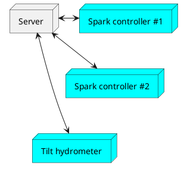
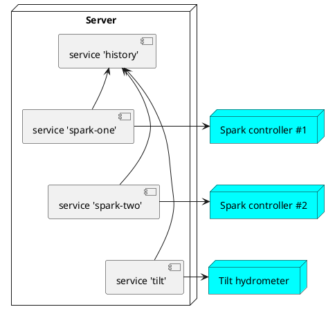

# Brewblox services

:::tip
This page explains how and why the service configuration works.

If you prefer to get started immediately with setting up a second Spark, you can skip forward to the [Brewblox Spark](./spark.md) page.
:::

Brewblox is designed to let you control multiple devices with a single application.

To make this both reliable and easy, devices are connected to a central hub (the **server**).



On the server, we need some software to talk to individual devices. To make it easy to add new devices, we split the software into **services**.

Some services are used for shared functionality: The **history service** collects data from device services, and stores it for later use in graphs. Others are used to control individual devices.



## Service configuration

Services are configured using the `docker-compose.yml` file. [YAML](https://learnxinyminutes.com/docs/yaml/) is a markup language that uses indentation to show nested values.
You can follow [this guide](../config_editor.md) to install a graphical text editor for your configuration files.

A shortened configuration file:

```yaml
version: '3.7'
services:
  history:
    image: ghcr.io/brewblox/brewblox-history:edge

  spark-one:
    image: ghcr.io/brewblox/brewblox-devcon-spark:edge

  spark-two:
    image: ghcr.io/brewblox/brewblox-devcon-spark:edge

```

There are three services here:

* history
* spark-one
* spark-two

All of them have a unique name, but `spark-one` and `spark-two` share the same type. That's ok: as long as the name is unique, services can have the same settings.

GOOD:

```yaml
version: '3.7'
services:
  service-one:
    image: brewblox-image-one

  service-two:
    image: brewblox-image-one
```

BAD:

```yaml
version: '3.7'
services:
  service-one:
    image: brewblox-image-one

  service-one:
    image: brewblox-image-two
```

## Adding devices

If we want to add a new device, we need a new service to manage it. Once again: the name must be unique, but the type can be the same.

Instructions for some service types can be found here, or in the [tutorials](../../dev/tutorials/brewscript/index.md).
