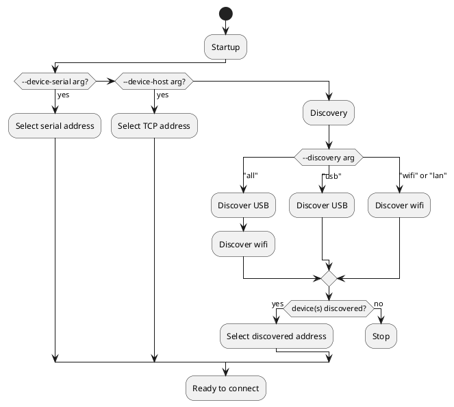

# BrewPi Spark

After you've followed the [Getting Started guide](../startup.md), you may want to connect your second or third Spark.

The [Services](../services/) guide explains how Services work in Brewblox. This guide walks you through the steps to add a new Spark service.

## What you will need

* Existing Brewblox installation
* BrewPi Spark
* Micro-USB cable

## Step 1: Stop your system

You'll be changing the configuration of your Brewblox system. For the changes to take effect, you must stop and start your system.

In your Brewblox directory (default: `./brewblox`), run this command:

```bash
brewblox-ctl down
```

## Step 2: Flash the firmware

::: warning
Make sure no other Sparks are connected over USB while you're flashing your controller.
:::

In your Brewblox directory (default: `./brewblox`), run this command:

```bash
brewblox-ctl flash
```

Follow the instructions until the menu exits.

## Step 3: Edit configuration

We will be using the `brewblox-ctl add-spark` command to add the service. It will ask you some questions, and then automatically edit your `docker-compose.yml` file.

If you run `brewblox-ctl add-spark` without any arguments, it will prompt you for required info, and then create a sensibly configured service.

If you want to fine-tune your service configuration, multiple arguments are available. These are described below.

Some arguments that can be set:

* `--device-id`: If you already know the device ID.
* `--device-host`: If your Spark controller has a fixed IP address, you can skip discovery, and immediately connect to its IP address. You must assign the Spark controller a static DHCP lease in your router for this to work.
* `--discovery`: If you want to restrict device discovery to only use USB (`--discovery=usb`), or only use TCP (wifi/ethernet) (`--discovery=mdns`).

## Step 4: Add the service in the UI

After you started the newly added service, it will automatically show up in the UI sidebar a few seconds later.

Click on it to start using the service in the UI.


## Spark connection settings

The Spark service can connect to the controller using either TCP, or USB. Once connected, there is no difference.

Connection settings are specified by editing the Spark service arguments in the `docker-compose.yml` file, or by using the `brewblox-ctl add-spark` command.
You can follow [this guide](../../dev/tutorials/dev_platform.md#remote-platform-ide) to install a graphical text editor for your configuration files.

See the [Services](../services/) guide for an explanation on service configuration.

The service can either connect immediately to a fixed address, or first try to discover the controller address.

## Device ID

TODO(Bob)

* device ID is always strongly recommended
* add-spark automatically sets device ID
* (TODO, new) add get device ID functionality to add-spark

## Discovery vs direct connections

TODO(Bob)

## What settings to use

There are multiple arguments you can use (and combine) to configure how the Spark Service connects to the Spark Controller.

These arguments can be used both in the `docker-compose.yml` file, and with the `brewblox-ctl add-spark` command.

### If: you want to make sure the service always connects to same controller

* Use `--device-id`

### If: your controller has a static IP address

* Use `--device-host`

### If: you only want to use TCP, even if USB is connected

* Use `--device-host` or `--discovery=mdns`

### If: you only want to use USB, even if TCP (wifi / ethernet) is connected

* Use `--discovery=usb`

::: warning
The Spark 4 does not support USB connections.
:::

## Finding the device ID

Every Spark controller has a unique serial number that can be used as device ID. The Spark service can use this ID to check that it doesn't accidentally connect to the wrong Spark controller.

If you run `brewblox-ctl add-spark` without any of the `--device-id` / `--device-host` / `--device-serial` arguments, it will automatically discover devices, and let you pick one.

You can also manually run `brewblox-ctl discover-spark`.

Example output:

```bash
pi@washberry:~/brewblox $ brewblox-ctl discover-spark
INFO       Discovering devices...
Type Model   Device ID                Device host     Service
---- ------- ------------------------ --------------- -------
USB  Spark 3 30003d001947383434353030
TCP  Spark 3 30003d001947383434353030 192.168.2.5
TCP  Spark 4 c4dd5766bb18             192.168.2.4     spark-four
```

In the example, two devices were found. We know this because there are only two unique device IDs in the list. The first can be reached over both USB and TCP, the second is only reachable over TCP.

While searching, the `docker-compose.yml` file is scanned for Spark services where the `--device-id` argument matches the discovered device ID.
If any is found, its name is listed in the *Service* column.

## `--device-id`

If you set the `--device-id` argument, device discovery will skip any devices with a different ID. This goes for both USB and TCP discovery.

Example call to `add-spark`:

```sh
brewblox-ctl add-spark --name=spark-two --device-id=300045000851353532343835
```

Example configuration with `--device-id` set:

```yaml
  spark-two:
    image: brewblox/brewblox-devcon-spark:${BREWBLOX_RELEASE}
    privileged: true
    restart: unless-stopped
    command: >-
      --name=spark-two
      --device-id=300045000851353532343835
```

:::tip
In YAML, `>-` indicates the start of a [multi-line string](https://yaml-multiline.info/).
:::

## `--device-host`

If you enabled wifi/ethernet on the Spark, you can use the management page in your router to give it a fixed IP address. To find out how to do so, google "static dhcp lease" + the brand and model of your router.

After you have done so, you can tell the service to always connect to the same address by using the `--device-host` argument.

Example call to `add-spark`:

```sh
brewblox-ctl add-spark --name=spark-two --device-host=192.168.0.101
```

Example configuration with `--device-host` set:

```yaml
  spark-two:
    image: brewblox/brewblox-devcon-spark:${BREWBLOX_RELEASE}
    privileged: true
    restart: unless-stopped
    command: >-
      --name=spark-two
      --device-host=192.168.0.101
```

## `--discovery=tcp` / `--discovery=usb`

If you haven't used `--device-host` to set a fixed address, the Spark service will try to discover the Spark controller.

Controllers can be discovered both over USB, and over Wifi. By default, the service tries both: first USB, then TCP.

You can restrict discovery by using the `--discovery` argument. This can be used in combination with `--device-id`. Valid options for `--discovery` are: `all`, `usb`, or `wifi`.

Example call to `add-spark`:

```sh
brewblox-ctl add-spark --name=spark-two --discovery=usb
```

Example configuration to only discover USB devices:

```yaml
  spark-two:
    image: brewblox/brewblox-devcon-spark:${BREWBLOX_RELEASE}
    privileged: true
    restart: unless-stopped
    command: >-
      --name=spark-two
      --device-id=300045000851353532343835
      --discovery=usb
```

## Connection flowchart

The Spark service uses multiple arguments to determine how and where to find the Spark controller it should connect to.
These arguments are:

* `--device-serial`
* `--device-host`
* `--discovery`
* `--device-id`

The following diagram is a (simplified) display of the decision process to select a device.
If discovery fails, the service reboots. This is because of a limitation in how Docker handles USB devices: the service must be started after the device was plugged in.



`--device-serial` and `--device-host` are the most specific arguments, and will take priority.

Examples:

```yaml
  spark-one:
    ...
    command: >-
      --device-host=192.168.0.60
```

```yaml
  spark-one:
    ...
    command: >-
      --device-serial=/dev/ttyACM0
```

`--discovery` has four possible values: `all`, `usb`, `lan`, and `wifi`. The default value is `all`. `wifi` is a synonym for `lan` \
Because USB devices are more specific, they will always be checked first.

`device-id` is used to disqualify discovered devices. If `--device-id` is not set, all discovered devices are valid.

The argument value is the unique device ID of your Spark controller.

Specific device, using any kind of connection:

```yaml
  spark-one:
    ...
    command: >-
      --device-id=300045000851353532343835
```

Specific device, USB only:

```yaml
  spark-one:
    ...
    command: >-
      --discovery=usb
      --device-id=300045000851353532343835
```

First discovered device, LAN only:

```yaml
  spark-one:
    ...
    command: >-
      --discovery=lan
```
