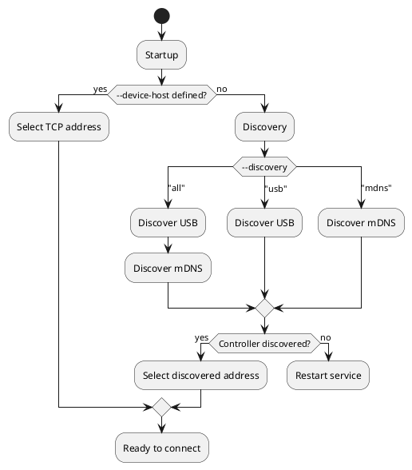

# BrewPi Spark

The [Services](../services/) guide explains how services work in Brewblox. Here, we'll look at how to add a new Spark service, and what settings are available.

## The Short Version

The basic process for adding a Spark service is straightforward.

You will need:

- [Existing Brewblox installation](../startup.md)
- BrewPi Spark
- USB cable
  - Spark 2 or 3 -> Micro-USB
  - Spark 4 -> USB-C

Connect your Spark controller with the USB cable to your Pi.\
If any other Sparks are connected over USB, disconnect them for now.

Open a terminal on your Pi, either in the desktop environment, or by logging in over SSH.

All the commands listed below should be run in the Brewblox directory:

```bash
cd ./brewblox
```

To flash the firmware, run:

```bash
brewblox-ctl flash
```

Follow the instructions until the menu exits.

*Wifi is not a requirement. If you want to use USB (Spark 2 / 3), or ethernet (Spark 4), you can skip this step.*

To set up wifi, run:

```bash
brewblox-ctl wifi
```

To add a service for your Spark, run:

```bash
brewblox-ctl add-spark
```

This will ask you some questions, and then edit your `docker-compose.yml` file to create or edit the service.

If you're using wifi/ethernet, you can now disconnect the Spark from USB, and reconnect any Sparks you disconnected earlier.

After starting the newly added service, it will automatically show up in the UI sidebar a few seconds later.
Click on it to start using the service in the UI.


## Connection settings

For a Spark service to communicate with a Spark controller, three things need to happen:

- The service needs to **discover** the address and connection type of the controller.
- The service needs to **connect** to the controller.
- The service needs to **identify** the controller, to make sure it is connected to the right controller.

For these purposes, there are multiple arguments that can be given to the Spark service.\
These arguments are declared in the `docker-compose.yml` file.
See the [Services](../services/) guide for an explanation on service configuration.
All settings discussed below are set in the `command` field of the Spark service, and are also valid arguments for the `brewblox-ctl add-spark` command.

### `--device-id`

All Spark controllers have a unique ID. This ID cannot be changed, and will remain the same after a factory reset.

The service uses the `--device-id` argument to identify its controller.
When you run `brewblox-ctl add-spark`, it will always attempt to find out and set `--device-id={ID}`.\
If this argument is not set, the service will connect to the first controller it discovers.
This is undesirable behavior when you have multiple controllers.

The UI will show a warning when no `--device-id` argument is set on a Spark service.

### `--discovery`

To prevent having to use hardcoded controller addresses, the service can discover controllers that are either connected over USB or connected to the local network over wifi/ethernet.\
Discovered controllers with an ID that does not match the service `--device-id` argument are ignored.

[Multicast Domain Name System (mDNS)](https://en.wikipedia.org/wiki/Multicast_DNS) is used to discover Spark controllers connected to the local network.
This is a local protocol: as a rule of thumb, only devices connected to the same router will be discovered by mDNS.

The discovery argument has three possible values:

- `--discovery=all`
- `--discovery=usb`
- `--discovery=mdns`

The default is `all`. In this case, both USB and mDNS will be used to discover potential controllers.

:::tip
Try `brewblox-ctl discover-spark` to run discovery without editing service settings.
:::

:::tip
Previously, `--discovery=wifi` and `--discovery=lan` were used as well.
These are still valid aliases for `--discovery=mdns`.
:::

### `--device-host`

In some scenarios, discovery is not a valid option.
Maybe your Pi and your Spark are on different subnets, maybe you're using a proxy or a VPN, or maybe mDNS just doesn't work, and you have no idea why.

In these cases, you can skip discovery, and declare a static hostname or IP address using the `--device-host` argument. For example: `--device-host=192.168.0.1`, or `--device-host=myspark.home`.

If you're declaring a static IP address, it is recommended to set a static DHCP lease for that particular Spark in your router settings. The Spark will then always be assigned the same IP address.

Even when a static address is set, the `--device-id` argument is checked.
If the Spark on the other side of the connection has a different ID, the service will not communicate with it.

## Connection flowchart

Some of the arguments described above take priority over others, and discovery is always done in the same order.

The following diagram is a (simplified) display of the decision process to determine the connection kind and address.
If discovery fails, the service restarts. This is because of a limitation in how Docker handles USB devices: the service must be started after the device was plugged in.



## MQTT connections (BETA)

:::warning
This feature is experimental.\
Future releases may include breaking changes to configuration.
:::

The normal TCP connection between the Spark service and controller is unsecured, and does not require authentication.
Anyone who connects to the right port on the Spark can send whatever commands they want.

If you want the Spark service and controller to be in a different locations, the connection must be secure, and one side must have a port exposed to the internet.

There are multiple solutions to this problem:

- Creating a [Virtual Private Network (VPN)](../wireguard.md).
- Tunneling through a [Reverse Proxy](https://github.com/fatedier/frp).
- Having the controller connect to a secure port exposed by the service.

[MQTT](https://randomnerdtutorials.com/what-is-mqtt-and-how-it-works/) connections implement the third solution.
Instead of the service connecting to the controller directly, both service and controller connect to the MQTT eventbus, and use it to exchange messages.

The Brewblox eventbus listens to a secured (SSL + password) MQTT port (default 8883). This port can be safely exposed to the internet by your router.

### Setup

Run the [basic setup steps](#the-short-version), but make sure the Spark is connected to your local network.

Then run:

```bash
brewblox-ctl experimental enable-spark-mqtt --system-host={PUBLIC_ADDRESS}
```

What happens:

- A new user and password are added to the eventbus user list.
  - The username is always the controller ID.
  - The password is randomly generated.
- The Spark is sent the login credentials over HTTP:
  - Server public hostname.
  - Server public port.
  - Password.

:::tip
To preview what happens, run:

```bash
# This does not make any configuration changes
brewblox-ctl --dry-run experimental enable-spark-mqtt
```

:::

### MQTT Discovery

For MQTT, a fourth option was added to the `--discovery` argument: `--discovery=mqtt`.
When set, the Spark service will wait for the controller to announce itself by publishing a message to the eventbus.

`--discovery=all` will also check for MQTT connections, but while the feature is in beta, this is done last.
If your controller is both in the same local network, and has MQTT enabled, the service will prefer to use a direct TCP connection.
