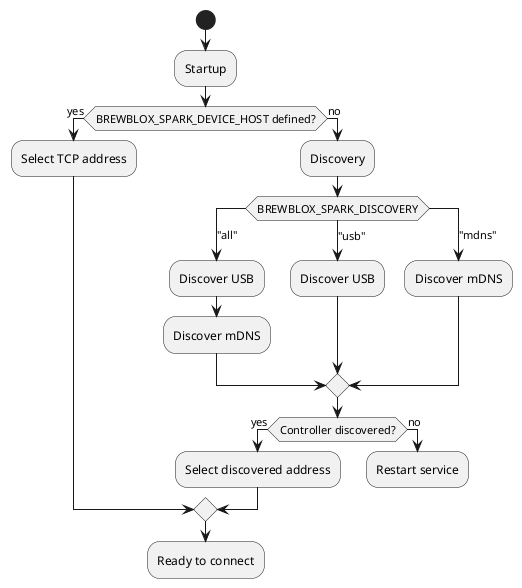

# Brewblox Spark

The Spark service is the bridge between Brewblox and the Spark controller.
You need a service for each controller.

The [Services](../services/) guide explains how services work in Brewblox. Here, we'll look at how to add a new Spark service, and what settings are available.

## The Short Version

The basic process for adding a Spark service is straightforward.

New Sparks are shipped with Brewblox firmware pre-installed.
If you have an older model, please also see the [Flashing a Spark](#flashing-a-spark) section below.

To use the Spark 4, it needs to be connected to your network. Ethernet and Wifi are both supported.

Setting up ethernet is as simple as plugging in a cable.
Wifi credentials are set over Bluetooth, using the **ESP BLE Provisioning** app.
The app is available on [Android](https://play.google.com/store/apps/details?id=com.espressif.provble)
and [iOS](https://apps.apple.com/us/app/esp-ble-provisioning/id1473590141).

To set Wifi credentials:

- Download the **ESP BLE Provisioning** app.
- Enable Bluetooth in your phone settings.
- Press and hold the **OK** button on the Spark for five seconds. It will beep twice.
- The Spark is ready for provisioning if its buttons are blinking blue.
- Open the app.
- Click **Provision New Device**.
- Click **I don't have a QR code**.
- Select the **PROV_BREWBLOX_** device.
- Select your Wifi network, and enter your credentials.

The app will now set Wifi credentials for your Spark.
An IP address will be shown in the top left corner of the Spark display.

To add the Spark service, open a terminal on your Pi, and navigate to the Brewblox directory (default `./brewblox`).

To add a service for your Spark, run:

```bash
brewblox-ctl add-spark
```

This will ask you some questions, and then edit your `docker-compose.yml` file to create or edit the service.

After starting the newly added service, it will automatically show up in the UI sidebar a few seconds later.
Click on it to start using the service in the UI.


## Service settings

Settings are set as "key=value" list items in the `environment` section of the service in `docker-compose.yml`.
For the Spark service, all settings are prefixed with `BREWBLOX_SPARK_`. \
For example:

```yaml
services:
  spark-one:
    environment:
      - BREWBLOX_SPARK_DEVICE_ID=AABBCCDDEEFF
      - BREWBLOX_SPARK_DISCOVERY=all
```

Legacy `--key=value` settings in the `command` section are supported to provide backwards compatibility. `environment` settings will override `command` settings.

## Connection settings

Normally, `brewblox-ctl add-spark` identifies the controller, and the service automatically discovers it.
If this is not the case, you may need to use more specific connection settings.

For a Spark service to communicate with a Spark controller, three things need to happen:

- The service needs to **discover** the address and connection type of the controller.
- The service needs to **connect** to the controller.
- The service needs to **identify** the controller, to make sure it is connected to the right controller.

### Controller ID

All Spark controllers have a unique device ID. This ID cannot be changed. \
A Spark service is linked to a specific controller, and it identifies the controller by its ID.

To link service and controller, the `BREWBLOX_SPARK_DEVICE_ID` setting is defined.
When you run `brewblox-ctl add-spark` it will get the controller ID from the selected Spark, and use it to set `BREWBLOX_SPARK_DEVICE_ID`.

If this setting is not defined, the service will connect to the first controller it discovers.
This is undesirable behavior when you have multiple controllers.

The UI will show a warning when `BREWBLOX_SPARK_DEVICE_ID` is not set.

### Controller discovery

[Multicast Domain Name System (mDNS)](https://en.wikipedia.org/wiki/Multicast_DNS) is used to discover Spark controllers connected to the local network.
This is a local protocol: as a rule of thumb, only devices connected to the same router will be discovered by mDNS.

You can run `brewblox-ctl add-spark` with the `--discovery` argument to specify what kind of discovery should be used.

The discovery argument has three possible values:

- `--discovery=all`
- `--discovery=usb`
- `--discovery=mdns`

The default is `all`. In this case, both USB and mDNS will be used to discover potential controllers.\
USB connections are not supported by the Spark 4, and the controller will not be discovered this way.

For the service itself, this settings is defined using `BREWBLOX_SPARK_DISCOVERY`.
For example, when you run `brewblox-ctl add-spark --discovery=mdns`, it will set `BREWBLOX_SPARK_DISCOVERY=mdns`.

:::tip
Try `brewblox-ctl discover-spark` to run discovery without editing service settings.
:::

### Static controller address

In some scenarios, discovery is not a valid option.
Maybe your Pi and your Spark are on different subnets, maybe you're using a proxy or a VPN, or maybe mDNS just doesn't work, and you have no idea why.

In these cases, you can skip discovery, and declare a static hostname or IP address using the `BREWBLOX_SPARK_DEVICE_HOST` setting. For example: `BREWBLOX_SPARK_DEVICE_HOST=192.168.0.100` or `BREWBLOX_SPARK_DEVICE_HOST=myspark.home`.

If you're declaring a static IP address, it is recommended to set a static DHCP lease for that particular Spark in your router settings. The Spark will then always be assigned the same IP address.

Even when a static address is set, `BREWBLOX_SPARK_DEVICE_ID` is checked.
If the Spark on the other side of the connection has a different ID, the service will not communicate with it.

## Connection flowchart

Some of the arguments described above take priority over others, and discovery is always done in the same order.

The following diagram is a (simplified) display of the decision process to determine the connection kind and address.
If discovery fails, the service restarts. This is because of a limitation in how Docker handles USB devices: the service must be started after the device was plugged in.



## Flashing a Spark

Normally, the Spark firmware can be updated using the UI.
If the firmware is very old, you may need to flash new firmware over USB.

You will need:

- [Existing Brewblox installation](../startup.md)
- Brewblox Spark
- USB cable
  - Spark 2 or 3 -> Micro-USB
  - Spark 4 -> USB-C

Connect your Spark controller with the USB cable to your Pi.\
If any other Sparks are connected over USB, disconnect them for now.

Open a terminal on your Pi, and navigate to the Brewblox directory (default `./brewblox`).

To flash the firmware, run:

```bash
brewblox-ctl flash
```

If you are upgrading an older Spark 2 or 3, you may need to flash the bootloader.

**Only if you have a Spark 2/3 AND the LED is blinking blue after the firmware is flashed**, run:

```bash
brewblox-ctl particle -c flash-bootloader
```

## MQTT connections (BETA)

:::warning
This feature is experimental.\
Future releases may include breaking changes to configuration.
:::

The normal TCP connection between the Spark service and controller is unsecured, and does not require authentication.
Anyone who connects to the right port on the Spark can send whatever commands they want.

If you want the Spark service and controller to be in a different locations, the connection must be secure, and one side must have a port exposed to the internet.

There are multiple solutions to this problem:

- Creating a [Virtual Private Network (VPN)](../wireguard.md).
- Tunneling through a [Reverse Proxy](https://github.com/fatedier/frp).
- Having the controller connect to a secure port exposed by the service.

[MQTT](https://randomnerdtutorials.com/what-is-mqtt-and-how-it-works/) connections implement the third solution.
Instead of the service connecting to the controller directly, both service and controller connect to the MQTT eventbus, and use it to exchange messages.

The Brewblox eventbus listens to a secured (SSL + password) MQTT port (default 8883). This port can be safely exposed to the internet by your router.

### Setup

Run the [basic setup steps](#the-short-version), but make sure the Spark is connected to your local network.

Then run:

```bash
brewblox-ctl experimental enable-spark-mqtt --server-host={PUBLIC_ADDRESS}
```

What happens:

- A new user and password are added to the eventbus user list.
  - The username is always the controller ID.
  - The password is randomly generated.
- The Spark is sent the login credentials over HTTP:
  - Server public hostname.
  - Server public port.
  - Password.
  - Server SSL certificate.

:::tip
To preview what happens, run:

```bash
# This does not make any configuration changes
brewblox-ctl --dry-run experimental enable-spark-mqtt
```

:::

### Setup without controller

It may be inconvenient to connect the Spark controller to the same local network as the Spark server.
In this case, you can use a `--device-id` argument for `brewblox-ctl experimental enable-spark-mqtt`.

To get the controller ID, navigate to the Spark IP address in your browser.
This will show a comma-separated handshake message. The last field is the ID.

On the Brewblox server, run:

```bash
brewblox-ctl experimental enable-spark-mqtt --device-id={ID} --device-host={SPARK_IP}
```

Instead of sending the credentials, it will print the commands you can use to manually send them.
Copy the commands, and run them on a computer that can reach the Spark.

If `--device-host` is not set, it will use a placeholder in the printed command.

### MQTT Discovery

For MQTT, a fourth discovery option was added: `BREWBLOX_SPARK_DISCOVERY=mqtt`.
When set, the Spark service will wait for the controller to announce itself by publishing a message to the eventbus.

`BREWBLOX_SPARK_DISCOVERY=all` will also check for MQTT connections, but while the feature is in beta, this is done last.
If your controller is both in the same local network, and has MQTT enabled, the service will prefer to use a direct TCP connection.
