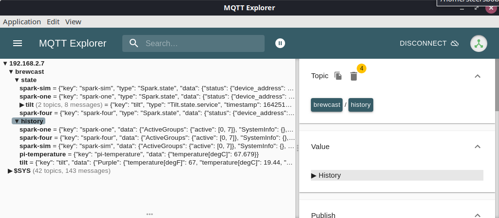

# Tilt Hydrometer

The [Tilt](https://tilthydrometer.com/) is a floating hydrometer and thermometer that publishes its values over Bluetooth.

The Tilt service listens to Bluetooth events, and pushes values to the Brewblox history database and UI.


## Installation

You can use the `brewblox-ctl` tool to add a new Tilt service to your system.
This will create the `./tilt` directory, and edit your `docker-compose.yml` file.
The Tilt service will appear automatically in the UI.

```
brewblox-ctl add-tilt
```

## Configure ports

By default, the Tilt services uses MQTT over WSS (HTTPS websockets).

If you are using a non-default HTTPS port (e.g. if you run brewblox on a NAS), you'll also want to add `--mqtt-port=<port>` to the command.

## Device names

Whenever a Tilt is detected, it is assigned a unique name.
The first Tilt of a given color will be named after the color.
If you have more than one Tilt of a single color, the name will be incremented.
For example, if you have three red Tilt devices, the names will be:
- Tilt
- Tilt-2
- Tilt-3

Device names can be edited in the Brewblox UI, or in the `./tilt/devices.yml` file.
In the `./tilt/devices.yml` file, device names are stored under `names`. The key is the device MAC address in uppercase without `:` separators, and the value is the name.
If you edit the file, you must restart the service for the changes to take effect.

Example `./tilt/devices.yml`:
```yaml
names:
  DD7F97FC141E: Purple
  AA7F97FC141E: Red
```

Device names must:
- Consist of at least 1, and at most 100 characters.
- Contain only alphanumerical characters, spaces, and `_-()|`.

If device names do not meet these criteria, they will be sanitized on startup.

## Calibration

Calibration is optional. While the Tilt provides a good indication of fermentation progress without calibration, it's values can be less accurate than a traditional hydrometer. With calibration its accuracy is approximately that of a traditional hydrometer. If you wish to use your Tilt for anything beyond simple tracking of fermentation progress (e.g. stepping temperatures at a given SG value) it is recommended you calibrate your Tilt.

Calibration is available for SG and temperature values. For both, calibration data should be provided in a CSV file, with the syntax:

```
<device identifer>, <uncalibrated_value>, <calibrated_value>
```

The device identifier is either the Tilt MAC address without `:` separators (eg. `DD7F97FC141E`), or the device name (described above).

Device identifiers are case insensitive: `black` will match the device names `black`, `Black`, `BLACK`, etc.

**SG Calibration**

If you wish to calibrate your Specific Gravity readings, create a file called `SGCal.csv` in the `./tilt` directory.

The uncalibrated values are the raw values from the Tilt. The calibrated values are those from a known good hydrometer or calculated when creating your calibration solution. Calibration solutions can be made by adding sugar/DME to water a little at a time to increase the SG of the solution. You can take readings using a hydrometer and the Tilt app as you go. You can include calibration values for multiple colours of Tilt in the calibration file.

Example `./tilt/SGCal.csv`:
```
Black, 1.000, 1.001
Black, 1.001, 1.002
Black, 1.002, 1.003
Black, 1.003, 1.004
Red, 1.000, 1.010
Red, 1.001, 1.011
Red, 1.002, 1.012
Red, 1.003, 1.013
Red, 1.004, 1.014
```

You will need multiple calibration points. We recommend at least 6 distributed evenly across your typical gravity range for each Tilt. For example, if you usually brew with a starting gravity of 1.050, you may choose to calibrate at the values 1.000, 1.010, 1.020, 1.030, 1.040, 1.050, and 1.060. The more calibration points you have, the more accurate the calibrated values the service creates will be. Strange calibrated values from the service are an indication you have used too few or poorly distributed calibration values.

**Temperature calibration**

Calibration values for temperature are placed in a file called `tempCal.csv` in the `./tilt` directory. **Temperature values in the calibration file MUST be in Fahrenheit.** The tempCal file can also contain calibration values for multiple Tilts. Again, it should contain at least 6 points distributed evenly across your typical range.

Example `./tilt/tempCal.csv`:
```
Black,39,40
Black,46,48
Black,54,55
Black,60,62
Black,68,70
Black,75,76
```

Calibrated values will be logged in Brewblox separately to uncalibrated values. If you don't provide calibration values for a given colour of Tilt, only uncalibrated values will be logged. You don't need to calibrate both temperature and SG. If you only want to provide calibration values for SG, that works fine. Calibrated temp values would not be generated in this case but calibrated SG values would be.

It is also recommended that you re-calibrate SG whenever you change your battery. Different batteries and different placements of the sled inside the Tilt can affect the calibration.

## Installation on a remote machine

The Tilt service does not have to be installed on the same server as the rest of Brewblox.
This is useful if it is not convenient to place the main Brewblox server within Bluetooth range of all your Tilts.

On the remote machine in the directory you wish to install the service, create a `docker-compose.yml` file like this with the relevant IP address for the brewblox host.

```yaml
version: '3.7'
services:
  tilt:
    image: brewblox/brewblox-tilt:${BREWBLOX_RELEASE:-edge}
    restart: unless-stopped
    privileged: true
    network_mode: host
    volumes: ['./tilt:/share']
    command: --mqtt-host=<brewblox_hostname/IP>
```

Create the directory for the tilt files
```bash
mkdir ./tilt
```

Start the service with the following command
```bash
docker-compose up -d
```

## Installation on a Pi Zero W

Due to its small size and built-in Bluetooth, the Pi Zero W can be easily installed close to the Tilt itself.
It does require a different installation process, as its processor architecture (ARMv6) is not supported by our Docker images.
The solution is to install and run the Python package directly.

**Warning: because there are no pre-built Python packages available, the installation process can take multiple hours.**

To install, run:
```sh
# Install system packages
sudo apt update
sudo apt install -y git python3-pip libbluetooth-dev python3-venv
sudo setcap 'cap_net_raw,cap_net_admin+eip' "$(which python3)"

# Install poetry - a python package manager
curl -sSL https://install.python-poetry.org | python3 -

# The calibration files for the tilt service are stored here
sudo mkdir /share
sudo chown $USER /share

# Clone the service repository
git clone https://github.com/BrewBlox/brewblox-tilt.git
cd brewblox-tilt
git checkout edge

# Install python packages
# This step can take multiple hours
export PATH="~/.local/bin:$PATH"
poetry install
```

To test the service`, run:
```sh
poetry run python3 -m brewblox_tilt --mqtt-host=${BREWBLOX_HOST_IP}
```
Replace `${BREWBLOX_HOST_IP}` with the host or IP address of the server that runs your other Brewblox services.

We want the service to start in the background when the Pi starts.
This is done using a systemd service.

Create the */etc/systemd/system/brewblox-tilt.service* file, with as content:
```ini
[Unit]
Description=Brewblox Tilt Service

Wants=network.target
After=syslog.target network-online.target

[Service]
Type=simple
WorkingDirectory=/home/pi/brewblox-tilt
ExecStart=/home/pi/.local/bin/poetry run python3 -m brewblox_tilt --mqtt-host=${BREWBLOX_HOST_IP}
User=pi
Group=pi
Restart=on-failure
RestartSec=10
KillMode=process

[Install]
WantedBy=multi-user.target
```
Again, replace `${BREWBLOX_HOST_IP}` with the Brewblox server address.

To enable and start the service, run:
```sh
sudo chmod 640 /etc/systemd/system/brewblox-tilt.service
sudo systemctl daemon-reload
sudo systemctl enable brewblox-tilt
sudo systemctl start brewblox-tilt
sudo systemctl status brewblox-tilt
```

Later, to update the service, run:
```sh
cd brewblox-tilt
git pull
poetry install
sudo systemctl restart brewblox-tilt
sudo systemctl status brewblox-tilt
```

## Limitations

As the Tilt does not talk directly to the Spark controller, you cannot use your Tilt to control the temperature of your system. This service currently only allows you to log values from the Tilt. To control your Brewblox setup you will need a temperature sensor connected to the Spark itself.

## Debugging

You have a Tilt, installed the service, and yet, no devices show up in the UI.
This can have a variety of causes, but we'll focus on the most common.

A very important tool here is the Tilt service log. You can access it by running:

```sh
brewblox-ctl follow tilt
```

This will show new messages as they appear. Press Ctrl-C to exit.

Example output:
```
pi@raspberrypi:~/brewblox$ brewblox-ctl follow tilt
Attaching to brewblox_tilt_1
tilt_1            | 2022/01/18 15:07:24 INFO     brewblox_tilt.names             Device names loaded from `/share/devices.yml`: {'DD7F97FC141E': 'Purple'}
tilt_1            | 2022/01/18 15:07:24 INFO     brewblox_tilt.parser            Calibration values loaded from `/share/SGCal.csv`: keys=()
tilt_1            | 2022/01/18 15:07:24 INFO     brewblox_tilt.parser            Calibration values loaded from `/share/tempCal.csv`: keys=()
tilt_1            | 2022/01/18 15:07:24 INFO     brewblox_service.service        Service name: tilt
tilt_1            | 2022/01/18 15:07:24 INFO     brewblox_service.service        Service info:  @ Tue Jan 18 14:56:02 UTC 2022
tilt_1            | 2022/01/18 15:07:24 INFO     brewblox_service.service        Service config: {'host': '0.0.0.0', 'port': 5000, 'name': 'tilt', 'debug': False, 'mqtt_protocol': 'wss', 'mqtt_host': '172.17.0.1', 'mqtt_port': None, 'mqtt_path': '/eventbus', 'history_topic': 'brewcast/history', 'state_topic': 'brewcast/state', 'lower_bound': 0.5, 'upper_bound': 2, 'inactive_scan_interval': 5, 'active_scan_interval': 10, 'simulate': None}
tilt_1            | 2022/01/18 15:07:24 INFO     brewblox_service.mqtt           Starting <EventHandler for wss://172.17.0.1:443/eventbus>
tilt_1            | 2022/01/18 15:07:24 INFO     brewblox_service.mqtt           listen(brewcast/tilt/tilt/names)
tilt_1            | 2022/01/18 15:07:24 INFO     brewblox_service.mqtt           subscribe(brewcast/tilt/tilt/names)
tilt_1            | 2022/01/18 15:07:24 INFO     brewblox_tilt.broadcaster       Looking for Bluetooth adapter...
tilt_1            | 2022/01/18 15:07:24 INFO     brewblox_tilt.broadcaster       Found Bluetooth adapter hci0
tilt_1            | 2022/01/18 15:07:24 INFO     brewblox_tilt.broadcaster       HCI Version native = <HCIVersion.BT_CORE_SPEC_5_0: 9>
tilt_1            | 2022/01/18 15:07:24 INFO     brewblox_tilt.broadcaster       HCI Version env = None
tilt_1            | 2022/01/18 15:07:24 INFO     brewblox_tilt.broadcaster       HCI Version max = <HCIVersion.BT_CORE_SPEC_4_2: 8>
tilt_1            | 2022/01/18 15:07:24 INFO     brewblox_tilt.broadcaster       HCI Version used = <HCIVersion.BT_CORE_SPEC_4_2: 8>
tilt_1            | 2022/01/18 15:07:24 INFO     brewblox_service.mqtt           <EventHandler for wss://172.17.0.1:443/eventbus> connected
tilt_1            | 2022/01/18 15:07:30 INFO     brewblox_tilt.parser            Tilt detected: mac='DD7F97FC141E', color='Purple', name='Purple'

```

**Hardware**
- Does the server have a working Bluetooth adapter?
- Is the Tilt in range?

The first question can be checked in the service log.
The service will wait idle until a Bluetooth adapter is found.

```
[...] Looking for Bluetooth adapter...
[...] Found Bluetooth adapter hci0
```

The second question is harder to answer. If you can do so, put the Tilt next to the server, to remove all doubt.

**Bluetooth**
- Is the adapter powered?
- Is Bluetooth Low Energy (BLE) enabled?

Host Bluetooth may be the problem if your Tilt service starts normally, but does not detect any devices.
You can check whether it detected any devices by looking for log entries like this:
```
[...] Tilt detected: mac='DD7F97FC141E', color='Purple', name='Purple'
```

This is something that must be checked manually, as these are settings on the server itself, and the Tilt service can't access them all.
To check this, we use the `bluetoothctl` tool.

```
brewblox-ctl down
sudo bluetoothctl
```

This will open a subshell to interact with bluetooth controllers.
To list controllers, use `list`:
```
[bluetooth]# list
Controller B8:27:EB:49:54:3C raspberrypi [default]
```

If your controller is not marked as default, use `select {MAC ADDRESS}`:
```
[bluetooth]# select B8:27:EB:49:54:3C
```

To show detailed info, use `show`:
```
[bluetooth]# show
Controller B8:27:EB:49:54:3C (public)
        Name: raspberrypi
        Alias: raspberrypi
        Class: 0x00000000
        Powered: yes
        Discoverable: no
        Pairable: yes
        UUID: Generic Attribute Profile (00001801-0000-1000-8000-00805f9b34fb)
        UUID: A/V Remote Control        (0000110e-0000-1000-8000-00805f9b34fb)
        UUID: PnP Information           (00001200-0000-1000-8000-00805f9b34fb)
        UUID: A/V Remote Control Target (0000110c-0000-1000-8000-00805f9b34fb)
        UUID: Generic Access Profile    (00001800-0000-1000-8000-00805f9b34fb)
        Modalias: usb:v1D6Bp0246d0532
        Discovering: no
```

If `Powered` is no, then run `power on`

After that, go to the *scan* menu, enable BLE, and clear filters (if any).
Use *back* to return to the main menu.
```
menu scan
clear
transport le
back
```

```
[bluetooth]# menu scan
Menu scan:
[...]
[bluetooth]# clear
SetDiscoveryFilter success
[bluetooth]# transport le
[bluetooth]# back
Menu main:
[...]
```

Then use `scan on` to start scanning for Bluetooth devices.
```
[bluetooth]# scan on
SetDiscoveryFilter success
Discovery started
[CHG] Controller B8:27:EB:49:54:3C Discovering: yes
[NEW] Device 78:E5:35:78:0F:94 78-E5-35-78-0F-94
[NEW] Device C4:DD:57:66:BB:1A PROV_BREWBLOX_66BB18
[NEW] Device 7A:6D:06:DD:0A:B3 7A-6D-06-DD-0A-B3
[NEW] Device DD:7F:97:FC:14:1E DD-7F-97-FC-14-1E
[CHG] Device 78:E5:35:78:0F:94 RSSI: -77
[CHG] Device C4:DD:57:66:BB:1A RSSI: -24
[CHG] Device 7A:6D:06:DD:0A:B3 RSSI: -67
[CHG] Device C4:DD:57:66:BB:1A RSSI: -36
[CHG] Device 7A:6D:06:DD:0A:B3 RSSI: -79
[CHG] Device DD:7F:97:FC:14:1E RSSI: -77
[CHG] Device DD:7F:97:FC:14:1E ManufacturerData Key: 0x004c
[CHG] Device DD:7F:97:FC:14:1E ManufacturerData Value:
  02 15 a4 95 bb 40 c5 b1 4b 44 b5 12 13 70 f0 2d  .....@..KD...p.-
  74 de 00 44 04 1e c5
```

In this case, DD:7F:97:FC:14:1E is a Tilt, but pretty much as soon as devices show up, it’s fine.
Exit bluetoothctl by running exit, and start brewblox again.

```
exit
brewblox-ctl up
```

**Eventbus communication**

The Tilt service uses MQTT to publish data.
If the device is found, is publishing Bluetooth events, and yet nothing shows up, the next step is to check the eventbus.

In the service log, it should show it is connected to the eventbus:
```
[...] <EventHandler for wss://172.17.0.1:443/eventbus> connected
```

If instead, it displays errors about not being able to connect, you may need to update the connection settings.

To directly check the published messages, install https://mqtt-explorer.com/.
Connect it to the Pi address, with protocol mqtt and port 1883 (the default).

If everything is working as intended, you should see `tilt` messages both under `brewcast/state` and `brewcast/history`.
The `brewcast/history/tilt` message may take a few seconds to show up.



**Still not fixed?**

If these steps did not reveal the problem, please let us know, on either the forum, or on Discord.
Be sure to include the output from `brewblox-ctl log`.
