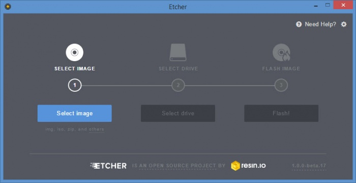
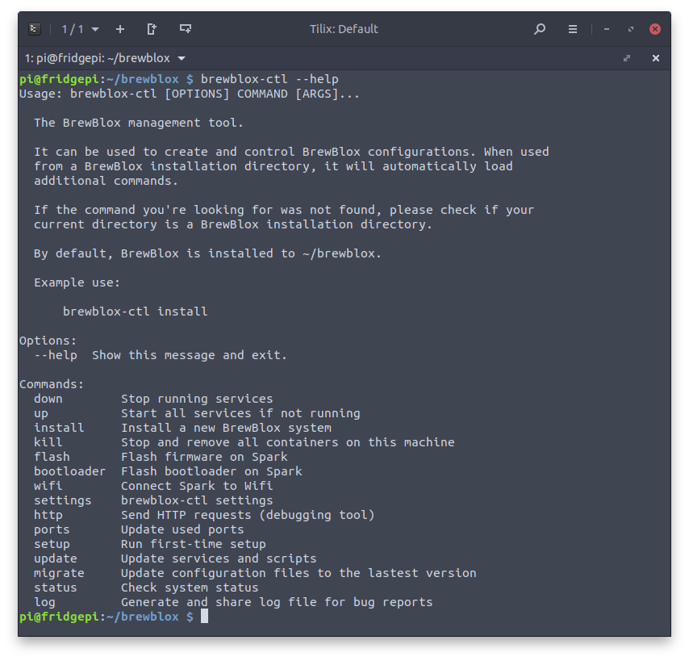

# Getting Started

This guide describes how to install the BrewBlox system on a Raspberry Pi. </br>
The default device for the BrewBlox system is the BrewPi Spark, but you can try this tutorial without it.

For an explanation of how to combine the various Spark Blocks, see the [BrewBlox control chains](./control_chains.md) page.

The default configuration uses a single Spark. The [Adding Services](./adding_services.md) guide describe how to add more.

For more advanced users, there are alternative ways for configuring and using the system. These are described in the [Advanced](./advanced.md) page.

::: warning
The following Raspberry Pi models are **not** compatible with BrewBlox.

- Raspberry Pi 1 Model A
- Raspberry Pi 1 Model B
- Raspberry Pi Zero
- Raspberry Pi Zero W
  :::

## What you will need

Always:

- Laptop or desktop computer
- [Raspberry Pi 3](https://www.raspberrypi.org/products/) minicomputer
- Raspberry Pi power supply (5V to micro USB)
- MicroSD card
- MicroSD card reader
- Wifi network or ethernet cable

When connecting the BrewPi Spark

- BrewPi Spark
- Micro-USB to USB cable

::: tip
You can also install BrewBlox on a desktop computer.
See the [Advanced](./advanced.md) page for instructions.
:::

## Step 1: Format the microSD card

Download the required software:

- [Raspbian OS](https://www.raspberrypi.org/downloads/raspbian/) (we recommend Raspbian Lite)
- [Etcher](https://www.balena.io/etcher/) for writing the image to the microSD card.

Insert your microSD card in the card reader, and connect the reader to your computer.

Now use Etcher to write it to your microSD card. Make sure to safely eject the microSD card before removing it from the card reader.



For more information, see the [official Raspberry install guide](https://www.raspberrypi.org/documentation/installation/installing-images/README.md).

## Step 2: Enable SSH and WiFi

::: tip
For Windows users, [Lee Bussy](https://community.brewpi.com/u/lbussy/summary) created a tool to automate this step.


You can download it [here](https://github.com/lbussy/headless-pi/releases/latest).
:::

After writing the image, your SD card will be recognized by the computer as a removable drive with two partitions. Download [this archive](/pi-files.zip) and extract the contents into the `boot` partition.

It contains two files: `ssh`, and `wpa_supplicant.conf`.

The `ssh` file enables SSH, just by being there.

To configure WiFi, open `wpa_supplicant.conf` in a text editor. The file contents should be:

```
country=YOUR_COUNTRY_CODE

ctrl_interface=DIR=/var/run/wpa_supplicant GROUP=netdev

update_config=1

network={
   ssid="YOUR_WIFI_NAME"
   psk="YOUR_WIFI_PASSWORD"
}
```

Replace `YOUR_COUNTRY_CODE`, `YOUR_WIFI_NAME`, and `YOUR_WIFI_PASSWORD` with the relevant values.

`YOUR_COUNTRY_CODE` should be the 2-letter acronym of your country (eg. US, GB, DE). You can use [this list](https://en.wikipedia.org/wiki/ISO_3166-1_alpha-2#Officially_assigned_code_elements) to look up your country. <br>
`YOUR_WIFI_NAME` is the name of your WiFi network. <br>
`YOUR_WIFI_PASSWORD` is the password you use to log in to your WiFi network.

Example file after editing:

```
country=NL

ctrl_interface=DIR=/var/run/wpa_supplicant GROUP=netdev

update_config=1

network={
   ssid="The Promised LAN"
   psk="SuperSecret1234"
}
```

## Step 3: Connect to the Raspberry Pi

::: warning
Make sure the power supply is **disconnected** at this point.
:::

On your desktop computer, you need an SSH client. This is already available on Linux and OSX, but must be installed on Windows. <br>
Popular choices are [PuTTY](https://www.putty.org/) and [Git Bash](https://git-scm.com/download/win). If you're unfamiliar with SSH, [this tutorial](https://www.howtogeek.com/311287/how-to-connect-to-an-ssh-server-from-windows-macos-or-linux/) might help.

After you installed your SSH client, insert the microSD card into your Pi, and connect the power supply. The Pi will start automatically.

Wait for the Pi to finish starting up, and connect to it using your SSH client.

The default user name is `pi`, and the default password is `raspberry`. It is strongly advised to change the password immediately.

## Step 4: Install BrewBlox

To execute the commands that follow, copy them and paste them in your SSH client.
Trying to type them yourself is frustrating and error prone.

If you use Putty, you can paste the contents of your clipboard with the right mouse button.

First, we have to fix some SSH settings on the Pi.
In your SSH terminal, run the following commands (one at a time):

```bash
sudo sed -i 's/^AcceptEnv LANG LC/# AcceptEnv LANG LC/g' /etc/ssh/sshd_config
sudo systemctl restart ssh
exit
```

This will exit your SSH session. That's fine: just open a new one. It will use the changed settings.

In your new SSH terminal, run the following commands:

```bash
sudo apt update && sudo apt upgrade -y
sudo apt install -y python3-pip
sudo pip3 install -U brewblox-ctl
```

These commands installed `brewblox-ctl`, a menu for installing and managing your BrewBlox system. <br>
To install a new system, run the following command:

```bash
brewblox-ctl install
```

This will walk you through the relevant choices, and then install BrewBlox in a directory of your choice.

## Interlude: Navigating Linux directories

For the next steps, a basic understanding of Linux commands makes things easier.
We'll stick to the basics, and assume the default settings on a Raspberry Pi.

After logging in over SSH, you'll see this text in front of your cursor:

```
pi@raspberrypi:~ $
```

This is the shell prompt, and it consists of three parts:

- `pi` is the current user. `pi` is the default user for a Raspberry Pi.
- `raspberrypi` is the computer host name. Again, `raspberrypi` is the default.
- `~` is the current directory.

`~` is a special character for the user home directory. When opening a new SSH terminal, you will start in this directory. You can use the `pwd` command to show the complete path, replacing the special character with directory names.

For example, on a Raspberry Pi:

```
pi@raspberrypi:~ $ pwd
/home/pi
pi@raspberrypi:~ $
```

By default, BrewBlox is installed in the `./brewblox` directory. This is a relative path: `.` means "current directory". The absolute path for this directory is `~/brewblox` or `/home/pi/brewblox`.

You can change directories by using the `cd` command. This can be used with either relative, or absolute paths. After you change directory, the current directory component of your shell prompt will change.

For example, after using `cd ./brewblox`, your shell prompt will be:

```
pi@raspberrypi:~/brewblox
```

You can navigate back to the home directory by using either one of these commands:

```
cd ~
```

```
cd ..
```

`..` is another special character. It means "one directory up".

Examples:

```
pi@raspberrypi:~/brewblox $ cd ..
pi@raspberrypi:~ $
```

```
pi@raspberrypi:~/brewblox/deeply/nested/subdirectory $ cd ..
pi@raspberrypi:~/brewblox/deeply/nested $
```

If you'd like some more explanation, this [guide to linux commands](https://www.raspberrypi.org/documentation/linux/usage/commands.md) explains how to use the most common commands on a Raspberry Pi.

## Step 5: First-time setup

To finish the installation, and initialize your system, run the first-time setup script.

Navigate to the directory you chose during the installation (default: `cd ~/brewblox`), and start the setup.

```bash
cd ./brewblox
brewblox-ctl setup
```

Follow the instructions until the menu exits.

## Step 6: Flash the firmware

For this step, your Spark should be connected to your Raspberry Pi over USB.

Navigate to the directory you chose during the installation (default: `cd ~/brewblox`), and run the following command in your terminal:

```bash
brewblox-ctl flash
```

If this is your first install, also run the following commands. You can skip these if you're reinstalling BrewBlox.

```bash
brewblox-ctl bootloader
brewblox-ctl wifi
```

Follow the instructions until the menu exits.

## Step 7: Start the system

If you connected your Spark to your Wi-Fi network, you can now disconnect from your Raspberry Pi, and connect the Spark to some other power source.

To list all possible commands, navigate to the directory you chose during the installation (default: `cd ~/brewblox`), and run:

```bash
brewblox-ctl --help
```



You can use brewblox-ctl to easily manage your system, and perform common actions. Run the following command to start your system:

```bash
brewblox-ctl up
```

After the project is done starting up, you can use the BrewBlox UI at `https://raspberrypi` (or your Raspberry Pi's IP address) to configure and monitor your Spark.

::: warning
Because we're using a local (self-signed) SSL certificate, your browser will display a warning the first time you visit the page.

There's no need to panic. Click advanced, and add an exception for the current host.

:::

## Step 8: Use the system

By default, temperature values are in Celsius. If you prefer Fahrenheit (or Kelvin), now is a good time to configure that.
The unit settings can be found under the `Actions` button in the Spark service page.


To easily replicate functionality from the original BrewPi, you can run the `Fermentation Fridge` wizard.

This will generate a set of blocks and widgets, configured to let you control the brew in your fridge.


