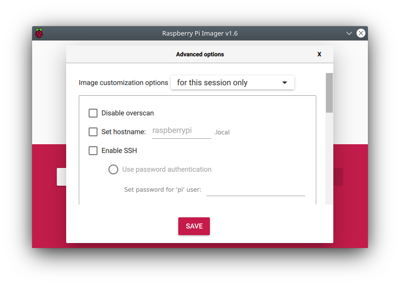

# Getting started

This guide describes how to install the Brewblox system on a Raspberry Pi.</br>
The default device for the Brewblox system is the BrewPi Spark.
To preview Brewblox, you can use a simulated Spark.

For an explanation of how to combine the various Spark Blocks, see the [Brewblox control chains](./control_chains.md) page.

The default configuration uses a single Spark controller. The [services guides](./services/) describe how to get started using more devices.

::: warning
The following Raspberry Pi models are **NOT** compatible with Brewblox.

- Raspberry Pi 1 Model A
- Raspberry Pi 1 Model B
- Raspberry Pi Zero
- Raspberry Pi Zero W
  :::

## What you will need

Always:

- Laptop or desktop computer
- [Raspberry Pi 3 or 4](https://www.raspberrypi.org/products/) minicomputer
- Raspberry Pi power supply cable
- MicroSD card
- MicroSD card reader
- Wifi network or ethernet cable

When connecting the BrewPi Spark

- BrewPi Spark
- (Spark 2 or 3) USB to Micro-USB cable
- (Spark 4) USB to USB-C cable

::: tip
[You can replace the SD card with a hard drive, or install Brewblox on a Synology NAS, desktop computer, or laptop - as long as it's using Linux.](./pi_alternatives.md)
:::

## Step 1: Format the microSD card

Download the [Raspberry Pi Imager](https://www.raspberrypi.org/downloads/)

Insert your microSD card in the card reader, and connect the reader to your computer.


Select Raspberry Pi OS Lite (32-bit), select your SD card, and hit **'Ctrl-Shift-X'** for the advanced menu. The advanced menu is available in the Raspberry Pi Imager v1.6 and higher.



In the advanced menu you want to define a few settings:

- **Set hostname:** a hostname is used to easily connect to your Pi on your network. Clear and short names work best. The default hostname is `raspberrypi`.
- **Enable SSH:** you connect remotely to the terminal of your Pi through SSH. Select *Use password authentication* and set your password.
- **Configure wifi:** here you configure the network name (SSID) & password of your wifi. Set the wifi country setting to your country to match the wifi channels of your access point.
- **Set username and password:** it's important to have a custom username and password, even inside your local network.
- **Set locale settings:** define your time zone and [keyboard layout](https://keyshorts.com/blogs/blog/44712961-how-to-identify-laptop-keyboard-localization).

Hit **SAVE** to exit the menu, and **WRITE** to write the image to your SD card.

For more information, see the [official Raspberry Pi install guide](https://www.raspberrypi.org/documentation/installation/installing-images/README.md).

## Step 2: Connect to the Raspberry Pi

::: warning
Make sure the power supply is **disconnected** at this point.
:::

We recommend to use the Pi as a headless device: no monitor, no keyboard.
Running a desktop environment takes memory and processing power on the Pi, and reduces the reliability of the system.

The UI is viewed in your browser anyway, and you can use SSH to remotely connect to your Pi's terminal.

On your desktop computer, you need an SSH client. On Linux and OSX, the `ssh` command is available by default.
On Windows, you can install [Terminal](https://www.microsoft.com/en-us/p/windows-terminal/9n0dx20hk701?activetab=pivot:overviewtab) from the Windows Store.

If you're unfamiliar with SSH, [this tutorial](https://www.howtogeek.com/311287/how-to-connect-to-an-ssh-server-from-windows-macos-or-linux/) might help.

After you installed your SSH client, insert the microSD card into your Pi, and connect the power supply. The Pi will start automatically.

Wait for the Pi to finish starting up, and connect to it using your SSH client.
The default user name is `pi`, and the hostname and password are what you defined in the RPi Imager advanced menu at [Step 1](#step-1-format-the-microsd-card). The default hostname `raspberrypi` is used in the example below.

```bash
ssh pi@raspberrypi
```

If the hostname of your Pi is not recognized on your network, you can use the instructions below to get the IP address of your Pi.

## Getting the IP address of your Pi

Connecting to your Pi using SSH requires you to know its address.
Often, your network already knows the address of your Pi by its hostname. If you haven't changed it at [Step 1](#step-1-format-the-microsd-card), the default hostname of your Pi is `raspberrypi`.

If using the name doesn't work, there are multiple tools to discover the IP address.

We like the [Fing](https://www.fing.com/products) app (available on both [iOS](https://apps.apple.com/us/app/fing-network-scanner/id430921107) and [Android](https://play.google.com/store/apps/details?id=com.overlook.android.fing&hl=en)), but you can also use your router's web interface to find the addresses of all connected devices.
A tutorial for that can be found [here](https://helpdeskgeek.com/how-to/determine-computers-connected-to-wireless-network/).

## Step 3: Install Brewblox

To execute the commands that follow, copy them and paste them in your SSH client.
Trying to type them yourself is frustrating and error prone.

For Windows Terminal, the default shortcuts to copy/paste in a terminal window are `ctrl+shift+C` and `ctrl+shift+V`.
You can also right click on the terminal window, and select the desired option from the dropdown menu.

To install package updates:

```sh
sudo apt update && sudo apt upgrade -y
sudo reboot
```

The `sudo reboot` command will restart your Pi. Reconnect the SSH client to continue.

To download and run the Brewblox installer:

```sh
wget -qO - https://www.brewblox.com/install | bash
```

After the installation is done, the Pi will restart again. Reconnect the SSH client to continue.

By default, `~/brewblox` is used as install directory.

## While you wait: Command line basics

For the next steps, a basic understanding of Linux commands makes things easier.
We'll stick to the basics, and assume the default settings on a Raspberry Pi.

After logging in over SSH, you'll see this text in front of your cursor:

```sh
pi@raspberrypi:~ $
```

This is the shell prompt, and it consists of three parts:

- `pi` is the current user. `pi` is the default user for a Raspberry Pi.
- `raspberrypi` is the computer hostname. Again, `raspberrypi` is the default.
- `~` is the current directory.

`~` is a special character for the user home directory. When opening a new SSH terminal, you will start in this directory. You can use the `pwd` command to show the complete path, replacing the special character with directory names.

For example, on a Raspberry Pi:

```sh
pi@raspberrypi:~ $ pwd
/home/pi
pi@raspberrypi:~ $
```

By default, Brewblox is installed in the `./brewblox` directory. This is a relative path: `.` means "current directory". The absolute path for this directory is `~/brewblox` or `/home/pi/brewblox`.

You can change directories by using the `cd` command. This can be used with either relative, or absolute paths. After you change directory, the current directory component of your shell prompt will change.

For example, after using `cd ./brewblox`, your shell prompt will be:

```sh
pi@raspberrypi:~/brewblox
```

You can navigate back to the home directory by using either one of these commands:

```sh
cd ~
```

```sh
cd ..
```

`..` is another special character. It means "one directory up".

Examples:

```sh
pi@raspberrypi:~/brewblox $ cd ..
pi@raspberrypi:~ $
```

```sh
pi@raspberrypi:~/brewblox/deeply/nested/subdirectory $ cd ..
pi@raspberrypi:~/brewblox/deeply/nested $
```

If you'd like some more explanation, this [guide to linux commands](https://www.raspberrypi.org/documentation/linux/usage/commands.md) explains how to use the most common commands on a Raspberry Pi.

## Step 4: Spark setup

::: details <span style="font-size: 150%; font-weight: bold">Spark 2 and 3</span>

For this step, your Spark should be connected to your Raspberry Pi over USB.

Navigate to the Brewblox install directory (default: `cd ~/brewblox`), and run this command:

```bash
brewblox-ctl flash
```

Follow the instructions until the menu exits.

If you are upgrading an older Spark, you may need to flash the bootloader.

**Only if the LED is blinking blue after the firmware is flashed**, run:

```bash
brewblox-ctl particle -c flash-bootloader
```

For now, keep the USB cable connected. You can configure Wifi in the UI during [Step 6](#step-6-use-the-system).

To add a Spark service, run:

```bash
brewblox-ctl add-spark
```

:::

::: details <span style="font-size: 150%; font-weight: bold">Spark 4</span>

To use the Spark 4, it needs to be connected to your network. Ethernet and Wifi are both supported.

Setting up ethernet is as simple as plugging in a cable.
Wifi credentials are set over Bluetooth, using the **ESP BLE Provisioning** app.
The app is available on [Android](https://play.google.com/store/apps/details?id=com.espressif.provble)
and [iOS](https://apps.apple.com/us/app/esp-ble-provisioning/id1473590141).

To set Wifi credentials:

- Press the **(R)ESET** button on your Spark.
- While the Spark restarts, press and hold the **OK** button for five seconds.
- The Spark is ready for provisioning if its buttons are blinking blue.
- Download the **ESP BLE Provisioning** app.
- Enable Bluetooth in your phone settings.
- Open the app.
- Click **Provision New Device**.
- Click **I don't have a QR code**.
- Select the **PROV_BREWBLOX_** device.
- Select your Wifi network, and enter your credentials.

The app will now set Wifi credentials for your Spark. An additional IP
address will be shown in the top left corner of the Spark display.

To add a Spark service, run:

```bash
brewblox-ctl add-spark
```

:::

::: details <span style="font-size: 150%; font-weight: bold">Spark simulator</span>

The Spark service comes with a built-in simulator.
This simulator won't control physical actuators or use OneWire sensors, but also doesn't need a Spark controller to function.

The Spark simulator is built into the Spark service.

To add a Spark simulator service, run:

```bash
brewblox-ctl add-spark --simulation
```

For more information on the simulator, and on how to later convert it to a service for a real controller, see [the spark sim page](./services/spark_sim.md);

:::

## Step 5: Start the system

To list all possible commands, navigate to the Brewblox install directory (default: `cd ~/brewblox`), and run:

```sh
brewblox-ctl --help
```

::: details Example output

```sh
pi@raspberrypi:~ $ cd brewblox
pi@raspberrypi:~/brewblox$ brewblox-ctl --help
Usage: python -m brewblox_ctl [OPTIONS] COMMAND [ARGS]...

  The Brewblox management tool.

  Example calls:

      brewblox-ctl install
      brewblox-ctl --quiet down
      brewblox-ctl --verbose up

Options:
  -y, --yes             Do not prompt to confirm commands.
  -d, --dry, --dry-run  Dry run mode: echo commands instead of running them.
  -q, --quiet           Show less detailed output.
  -v, --verbose         Show more detailed output.
  --color / --no-color  Format messages with unicode color codes.
  --help                Show this message and exit.

Commands:
  up              Start all services.
  down            Stop all services.
  restart         Recreates all services.
  follow          Show logs for one or more services.
  kill            Stop and remove all containers on this host.
  install         Install Brewblox and its dependencies.
  makecert        Generate a self-signed SSL certificate.
  env             List, get, or set env values.
  update          Download and apply updates.
  update-ctl      Download and update brewblox-ctl itself.
  discover-spark  Discover available Spark controllers.
  add-spark       Create or update a Spark service.
  add-tilt        Create a service for the Tilt hydrometer.
  add-plaato      Create a service for the Plaato airlock.
  add-node-red    Create a service for Node-RED.
  service         Edit or remove services in docker-compose.yml.
  flash           Flash Spark firmware over USB.
  wifi            Configure Spark Wifi settings.
  particle        Start a Docker container with access to the Particle CLI.
  log             Generate and share log file for bug reports.
  fix             Fix configuration on the host system.
  database        Database migration commands.
  backup          Save or load backups.
  snapshot        Save or load snapshots.
pi@raspberrypi:~/brewblox$
```

:::

You can use brewblox-ctl to easily manage your system, and perform common actions. Run the following command to start your system:

```bash
brewblox-ctl up
```

After the project is done starting up, you can use the Brewblox UI at `http://raspberrypi` (or your Raspberry Pi's IP address) to configure and monitor your Spark.

::: tip
Because we're using a local (self-signed) SSL certificate, your browser will display a warning the first time you visit the page when using HTTPS.

There's no need to panic. Click advanced, and proceed to the page.

:::

## Step 6: Use the system

Brewblox is now installed and running. The next step is to put it in charge of your fridges, kettles, and conicals.

You can build your configuration from scratch, or use one of the wizards.
To start a wizard, click the big *Get Started* button, and select the *Quick Start* option.

If you are upgrading from the old BrewPi software, the *Fermentation fridge* wizard will replicate its functionality.

To edit the settings of your system and controllers, go to the *Admin* page, accessible through the sidebar.
For example, this page can be used to set your preferred temperature unit and timezone.

## Later: Updating

Brewblox receives regular updates. Whenever a new update is released, the release notes are posted on [the forum](https://community.brewpi.com/), and added to the [overview](./release_notes.md).

To update, close the UI, and run the following command:

```bash
brewblox-ctl update
```

After the command is done, visit the UI page to verify everything is up and running again. The UI will then notify you if a new firmware version is available. Click on the notification to install the new firmware.
