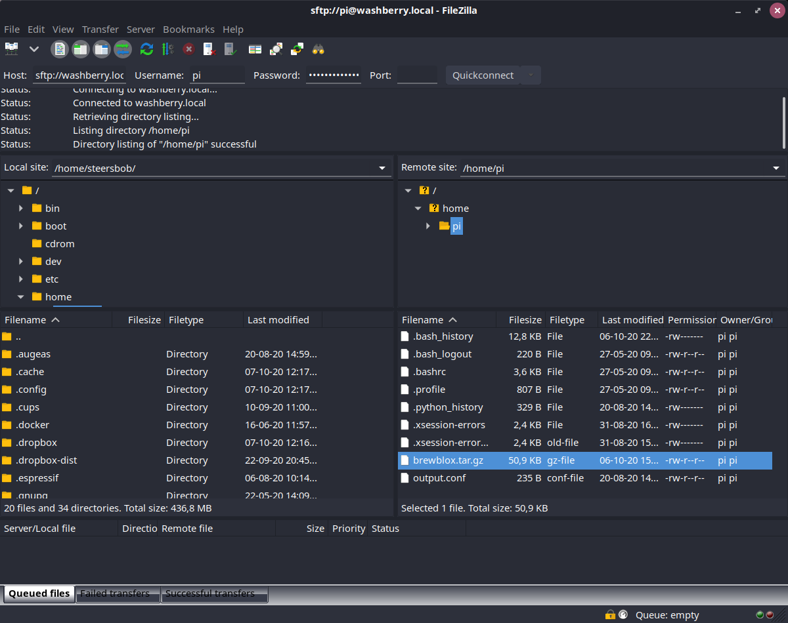

# Upgrading your system

Brewblox is designed to be compatible with the majority of Linux-based systems.
To achieve this, it has two major dependencies: Docker, and Python.
Both are available on most operating systems, but released versions have an End of Life (EOL) date.
Beyond this date, they are no longer supported, and compatibility is no longer guaranteed.

After an EOL date, tooling or dependencies may suddenly break.
This means that we cannot guarantee an error-free experience on a system with outdated dependencies.

When your system is (soon to be) no longer supported, we strongly recommend upgrading.
In the long run, it takes much more effort to keep an old system running than it is to upgrade.

To assist with reinstalls, `brewblox-ctl` can save and load snapshots of your installation.
This lets you easily move your Brewblox installation between hosts or operating systems.

## Deprecation schedule

We track two deprecation schedules: Debian (the base of the Raspberry Pi OS), and Python.
Linux distros come with a built-in version of Python.
For some systems, it's doable to upgrade Python versions.
For the Raspberry Pi, it's significantly easier and faster to reinstall the OS.

### Raspberry Pi OS

The Raspberry Pi OS is based on Debian,
and we support the releases based on the [stable Debian version](https://wiki.debian.org/DebianReleases).
Debian versions become stable a year after release.
This means their EOL date is *one year after the release of the next version*.

The EOL dates for the last three Debian versions are:

- Buster: ~2022
- Stretch: 2020/07/06
- Jessie: 2018/06/17

### Python

For Python, we support all [active Python3 versions](https://devguide.python.org/#status-of-python-branches).
Python versions are active for five years after release.

New versions may have some compatibility problems immediately after release.

The EOL dates for the last Python versions are:

- 3.9: ~2025
- 3.8: 2024/10
- 3.7: 2023/06
- 3.6: 2021/12
- 3.5: 2020/09

For reference, these are the default Python versions for various distros:

- Debian Stretch: Python 3.5
- Debian Buster: Python 3.7
- Debian Bullseye: Python 3.9
- Ubuntu 18.04: Python 3.6
- Ubuntu 20.04: Python 3.8

If you are using Synology, MacOS, or one of the many other flavours of Linux,
then the Python version is the most important factor for compatibility.

## Upgrading Brewblox

You can seamlessly move your Brewblox installation from one OS to another.
This is done by making a snapshot of your installation directory, and loading it on your new system.

### Creating a Snapshot

To make a snapshot, navigate to your Brewblox directory, and run:

```sh
brewblox-ctl snapshot save
```

This will create the *brewblox.tar.gz* archive in the parent directory of the Brewblox directory. By default, this will be *~/brewblox.tar.gz*.

### Exporting the snapshot

To move files between your Pi and your home computer, we recommend [FileZilla](https://filezilla-project.org/).

The host field should be `sftp://IP_ADDRESS`. Username / password are the same as when logging in over SSH.



### Using a snapshot during installation

Follow the [Startup Guide](./startup.md) to install Brewblox.
Then use FileZilla to copy your *brewblox.tar.gz* snapshot to the /home/pi directory on your Pi.

When this is done, navigate to your Brewblox directory, and run:

```sh
brewblox-ctl snapshot load
brewblox-ctl update
```

Your system is now configured exactly as it was at the time of the snapshot.
