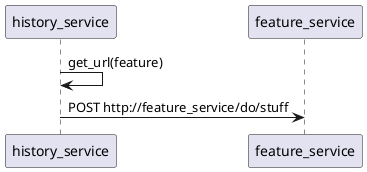
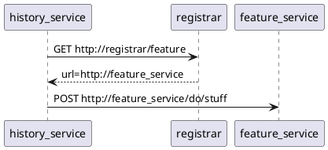

# Microservice Peer Configuration

## Context

In its initial version, all services assume that they and everyone else are on localhost.
This assumption is false for all but the most trivial scenarios.

Currently, clients practice [client-side discovery][2]. They announce themselves to the gateway, along with their current URL.

## Requirements

* Brewblox services must be able to connect to generic services
    * Gateway
    * RabbitMQ
    * InfluxDB
* Brewblox services must be able to connect to other brewblox services
* Gateway registration must be done using a correct url for reverse proxying
* Solutions must not involve deploying hard-coded url configuration to all services
* Solutions must work both on docker containers, and on real hosts

## Current

Currently, we use the [Janus][5] gateway. This is configured by making a REST request to its admin API.

One problem is that each service announces itself to the gateway, and has to supply an URL at which it can be reached. The problem is: we're not entirely sure about which url or host name can be used by the gateway to reach the service.

## HAProxy

In a [previous project][4], I used [HAProxy][3] for load balancing in a docker environment.
This worked well, but did not have the same requirements as we have here: traffic must be routed based on the first part of the url.

The dockercloud HAProxy container supports individual services registering their "virtual host". 
This allows services to share a port, and have requests matching a filter redirected to them.

```yaml
services:
  history:
    build: ../images/brewblox-history
    ports:
      - "5000"
    links:
      - influx
      - eventbus
    environment:
      # haproxy settings
      - TCP_PORTS="5000"
      - VIRTUAL_HOST=*/history/*
      # ----------------
      - BREWBLOX_NAME=history

  gateway:
    image: dockercloud/haproxy
    links:
      - history
    ports:
      - "80:80"
      # stats port
      - "1936:1936"
    volumes:
      - /var/run/docker.sock:/var/run/docker.sock
```

This docker-compose service declares a brewblox history service, and a HAProxy gateway.

The `history` service declares to the gateway that its handling requests at port 5000 using the `TCP_PORTS` environment variable. `VIRTUAL_HOST` sets a filter as to what requests are forwarded.

`gateway` knows to check the `history` container for these environment variables because it's linked to it.

## Peer discovery

The history service in the example has two peer dependencies: `eventbus` and `influx`. 

We could add url arguments for them to the command line arguments (or config).

Example:
```
python3 -m brewblox_history --name history --influx_url influx:8086 --eventbus_url eventbus:5672
```

Especially as we'd add more and more peer services, this can get awfully clunky, awfully fast.

## Feature discovery

Our default approach is to directly query the feature host (influx, rabbitmq, etc)


The disadvantage here is that each individual service needs to be configured with the host/IP of each peer service. This will not gracefully handle peer services moving host/IP, and the total amount of configuration will scale exponentially.

A different approach is to centralize getting feature addresses through a central registrar (eg. [Consul][12], or [Zookeeper][11]).



This way, each service only needs to remember the host/IP of the registrar. The registrar is the source of truth for all inter-service connections, and can be updated whenever a feature moves or drops.

The disadvantage here is that we just created more hosts.

Example (Consul / Registrator):
```yaml

  history:
    build: ../images/brewblox-history
    ports:
      - "5000"
    environment:
      - TCP_PORTS="5000"
      - VIRTUAL_HOST=*/history/*
      - BREWBLOX_NAME=history
      - SERVICE_5000_NAME=history

  consul:
    image: gliderlabs/consul-server
    ports:
      - "8500:8500"
    command:
      - -bootstrap

  registrator:
    image: gliderlabs/registrator
    volumes:
      - /var/run/docker.sock:/tmp/docker.sock
    depends_on:
      - consul
    command:
      - consul://consul:8500

```

Registrator is in charge of automatically adding Docker services to Consul, and we can ask consul where to find services.

Example query:
```bash
$ curl localhost:8500/v1/catalog/service/history

[{"Node":"f845f1747f2b","Address":"172.19.0.2","ServiceID":"fb86bef8b063:stage_history_1:5000","ServiceName":"history","ServiceTags":[],"ServiceAddress":"172.19.0.5","ServicePort":32824,"ServiceEnableTagOverride":false,"CreateIndex":9,"ModifyIndex":23}]
```

## Complexity

Centralized discovery is very fancy, and likely required for massive distributed service clouds.
A point of note is that our deployment architecture wants to be neither.

During implementation of consul-based service discovery, we reached the conclusion that supporting reconnecting and discovered services would be complex.
Not impossible, but it would certainly decrease maintainability and robustness of the system.

Given how we're increasingly certain we'll only be deploying to containerized environments, there was another alternative.
We hardcode the host names in Python code, and configure the environment to meet those expectations.

The resulting configuration is suddenly much simpler:

```yaml
services:
  eventbus:
    image: rabbitmq:alpine

  influx:
    image: influxdb:alpine

  history:
    build: ../images/brewblox-history
    depends_on:
      - influx
      - eventbus

  gateway:
    image: dockercloud/haproxy
    links:
      - history
    ports:
      - "80:80"
      # stats port
      - "1936:1936"
    volumes:
      - /var/run/docker.sock:/var/run/docker.sock

```

## Conclusion

In a Docker environment we can automate service discovery for both the gateway, and inter-container communication.
This does reduce compatibility with non-docker deployment environments, and significantly increases code complexity.

Design decisions are:
* Drop the Janus gateway, as HAProxy automatically recognizes online services.
* Make host configuration simple in Python (host="eventbus"), and configure deployment to match.
* We'll drop the "must function on localhost" requirement for now.


[1]: http://microservices.io/patterns/server-side-discovery.html
[2]: https://www.nginx.com/blog/service-discovery-in-a-microservices-architecture/
[3]: https://github.com/docker/dockercloud-haproxy
[4]: https://gitlab.com/ProftaakS61mGroepA/ProjectPub/blob/master/deploy-order/docker-compose.yml
[5]: https://github.com/hellofresh/janus
[6]: https://docs.docker.com/docker-cloud/apps/service-links/#discovering-containers-on-the-same-service-or-stack
[7]: https://success.docker.com/article/Docker_Reference_Architecture-_Service_Discovery_and_Load_Balancing_with_Docker_Universal_Control_Plane_(UCP)
[8]: https://serverfault.com/questions/816293/haproxy-reverse-proxy-and-virtual-host
[9]: http://jasonwilder.com/blog/2014/07/15/docker-service-discovery/
[10]: https://github.com/gliderlabs/registrator
[11]: http://blog.arungupta.me/zookeeper-microservice-registration-discovery/
[12]: https://www.consul.io/intro/index.html
[13]: https://gliderlabs.com/registrator/latest/user/quickstart/