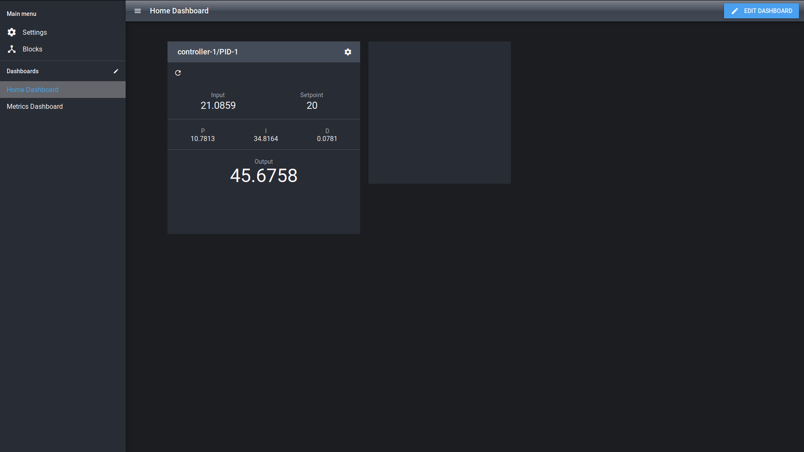

# Getting Started

This guide describes how to install the BrewBlox system on a Raspberry Pi. </br>
The default device for the BrewBlox system is the BrewPi Spark, but you can try this tutorial without it.

For more advanced users, there are alternative ways for configuring and using the system. These are described in the [Advanced](./advanced.md) page.

## What you will need

Always:
* Laptop or desktop computer
* [Raspberry Pi 3](https://www.raspberrypi.org/products/) minicomputer
* Raspberry Pi power supply (5V to micro USB)
* MicroSD card
* MicroSD card reader
* USB keyboard
* USB mouse
* HDMI monitor or tv
* HDMI cable
* Wifi network or ethernet cable

When connecting the BrewPi Spark
* BrewPi Spark
* Micro-USB to USB cable

::: tip
You can also install BrewBlox on a desktop computer, or install the Raspberry Pi using SSH. </br>
See the [Advanced](./advanced.md) page for instructions.
:::

## Step 1: Format the microSD card

Download the required software:
* [Raspbian OS](https://www.raspberrypi.org/downloads/raspbian/)
* [Etcher](https://www.balena.io/etcher/) for writing the image to the microSD card.

Insert your microSD card in the card reader, and connect the reader to your computer.

Now use Etcher to write it to your microSD card. Make sure to safely eject the microSD card before removing it from the card reader.


For more information, see the [official Raspberry install guide](https://www.raspberrypi.org/documentation/installation/installing-images/README.md).

## Step 2: Install the Raspberry Pi

::: warning
Make sure the power supply is disconnected at this point.
:::

Insert the microSD card into your Pi, and connect the keyboard, mouse, and monitor.

Now connect the power supply. The Pi will start automatically.

Wait for the Pi to finish starting up, and follow the first-time startup instructions. Make sure to connect to the internet, either using WiFi, or through an ethernet cable.


## Step 3: Install BrewBlox

Open the terminal, and run the following commands:

```bash
curl -sSL https://brewblox.netlify.com/install > install.sh
bash ./install.sh
```

This script installs Docker and docker-compose, and generates the default configuration in a directory of choice (default: `./brewblox`). It will ask for confirmation before installing a component.

If prompted, restart your Pi for the installation to complete.

## Step 4: Flash the firmware

Connect the Spark to the Raspberry Pi using USB, and run the following commands:

```bash
# Should be the directory you chose in the install script
cd brewblox

# You can't flash the firmware while the service is running
docker-compose down

# Flash the firmware
docker pull brewblox/firmware-flasher:rpi-develop
docker run -it --rm --privileged brewblox/firmware-flasher:rpi-develop trigger-dfu
docker run -it --rm --privileged brewblox/firmware-flasher:rpi-develop flash
docker run -it --rm --privileged brewblox/firmware-flasher:rpi-develop flash-bootloader

# If you want to connect your Spark to your Wi-Fi network
docker run -it --rm --privileged brewblox/firmware-flasher:rpi-develop wifi
```

## Step 5: First-time setup

To finish the installation, and initialize your system, run the first-time setup script.

Open the terminal, and run the following commands:

```bash
# Should be the directory you chose in the install script
cd brewblox

bash ./first-time.sh
```

This script creates an SSL certificate, downloads Docker images, and adds default UI settings. It will ask for confirmation before doing anything.

## Step 6: Start the system

If you connected your Spark to your Wi-Fi network, you can now disconnect from your Raspberry Pi, and connect the Spark to some other power source.

On your Raspberry Pi, open the terminal, and run the following commands:

```bash
# Should be the directory you chose in the install script
cd brewblox

docker-compose up -d
```

After the project is done starting up, you can use the BrewBlox UI at `https://raspberrypi` (or your Raspberry Pi's IP address) to configure and monitor your Spark.

::: warning
Because we're using a local (self-signed) SSL certificate, your browser will display a warning the first time you visit the page.

There's no need to panic. Click advanced, and add an exception for the current host.

:::

## Step 7: Done!


