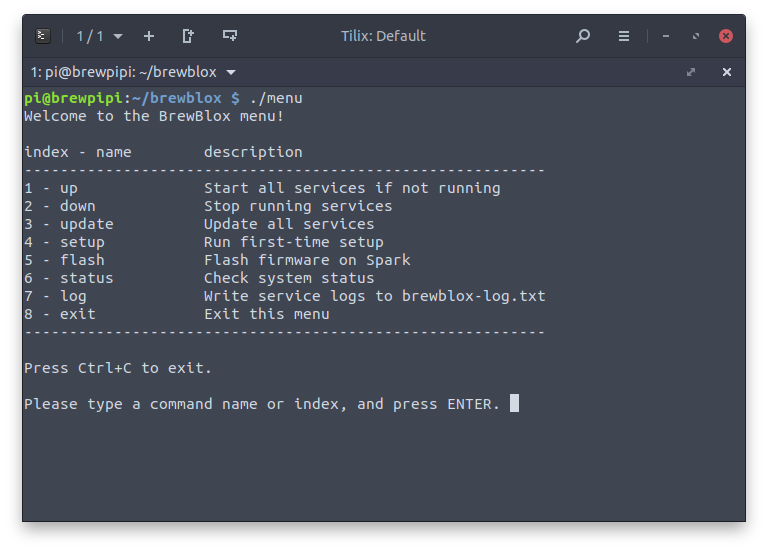

# Getting Started

This guide describes how to install the BrewBlox system on a Raspberry Pi. </br>
The default device for the BrewBlox system is the BrewPi Spark, but you can try this tutorial without it.

The default configuration uses a single Spark. The [Adding Services](./adding_services.md) guide describe how to add more.

For more advanced users, there are alternative ways for configuring and using the system. These are described in the [Advanced](./advanced.md) page.

## What you will need

Always:
* Laptop or desktop computer
* [Raspberry Pi 3](https://www.raspberrypi.org/products/) minicomputer
* Raspberry Pi power supply (5V to micro USB)
* MicroSD card
* MicroSD card reader
* Wifi network or ethernet cable

When connecting the BrewPi Spark
* BrewPi Spark
* Micro-USB to USB cable

::: tip
You can also install BrewBlox on a desktop computer.
See the [Advanced](./advanced.md) page for instructions.
:::

## Step 1: Format the microSD card

Download the required software:
* [Raspbian OS](https://www.raspberrypi.org/downloads/raspbian/) (we recommend Raspbian Lite)
* [Etcher](https://www.balena.io/etcher/) for writing the image to the microSD card.

Insert your microSD card in the card reader, and connect the reader to your computer.

Now use Etcher to write it to your microSD card. Make sure to safely eject the microSD card before removing it from the card reader.


For more information, see the [official Raspberry install guide](https://www.raspberrypi.org/documentation/installation/installing-images/README.md).

## Step 2: Enable SSH and WiFi

By default, SSH is disabled on the Pi.
It can be enabled after Etcher has written the Raspbian image to the microSD card.

After writing the image, it will be recognized by the OS as a removable drive with two partitions. <br> 
Download [this archive](/pi-files.zip) and extract the contents to the `boot` partition.

It contains two files: `ssh`, and `wpa_supplicant.conf`.

Open `wpa_supplicant.conf` in a text editor. The file contents should be:
 
```
country=YOUR_COUNTRY_CODE

ctrl_interface=DIR=/var/run/wpa_supplicant GROUP=netdev

update_config=1

network={
   ssid="YOUR_WIFI_NAME"
   psk="YOUR_WIFI_PASSWORD"
}
```

Replace `YOUR_COUNTRY_CODE`, `YOUR_WIFI_NAME`, and `YOUR_WIFI_PASSWORD` with the relevant values.

`YOUR_COUNTRY_CODE` should be the 2-letter acronym of your country (eg. US, GB, DE). You can use [this list](https://en.wikipedia.org/wiki/ISO_3166-1_alpha-2#Officially_assigned_code_elements) to look up your country. <br>
`YOUR_WIFI_NAME` is the name of your WiFi network. <br>
`YOUR_WIFI_PASSWORD` is the password you use to log in to your WiFi network.

Example file after editing:

```
country=NL

ctrl_interface=DIR=/var/run/wpa_supplicant GROUP=netdev

update_config=1

network={
   ssid="The Promised LAN"
   psk="SuperSecret1234"
}
```


## Step 3: Connect to the Raspberry Pi

::: warning
Make sure the power supply is **disconnected** at this point.
:::

On your desktop computer, you need an SSH client. This is already available on Linux and OSX, but must be installed on Windows. <br>
Popular choices are [PuTTY](https://www.putty.org/) and [Git Bash](https://git-scm.com/download/win). If you're unfamiliar with SSH, [this tutorial](https://www.howtogeek.com/311287/how-to-connect-to-an-ssh-server-from-windows-macos-or-linux/) might help.

After you installed your SSH client, insert the microSD card into your Pi, and connect the power supply. The Pi will start automatically.

Wait for the Pi to finish starting up, and connect to it using your SSH client. 

The default user name is `pi`, and the default password is `raspberry`. It is strongly advised to change the password immediately.

## Step 4: Install BrewBlox

Open the terminal, and run the following commands (one at a time):

```bash
sudo apt update && sudo apt upgrade -y
sudo apt install -y python3-pip
sudo pip3 install -U brewblox-ctl
```

These commands installed `brewblox-ctl`, a menu for installing and managing your BrewBlox system. <br>
To install a new system, run the following command:

```bash
brewblox-ctl install
```

This will walk you through the relevant choices, and then install BrewBlox in a directory of your choice.

## Step 5: First-time setup

To finish the installation, and initialize your system, run the first-time setup script.

Navigate to the directory you chose during the installation (default: `./brewblox`), and run the following command in your terminal:

```bash
brewblox-ctl setup
```

Follow the instructions until the menu exits.

## Step 6: Flash the firmware

For this step, your Spark should be connected to your Raspberry Pi over USB.

Navigate to the directory you chose during the installation (default: `./brewblox`), and run the following commands in your terminal (one at a time):

```bash
brewblox-ctl flash
brewblox-ctl bootloader
brewblox-ctl wifi
```

Follow the instructions until the menu exits.

## Step 7: Start the system

If you connected your Spark to your Wi-Fi network, you can now disconnect from your Raspberry Pi, and connect the Spark to some other power source.

Navigate to the directory you chose during the installation (default: `./brewblox`), and start the menu:

```bash
brewblox-ctl
```

You can use the menu to easily manage your system, and perform common actions. Choose `up` to start your system.




After the project is done starting up, you can use the BrewBlox UI at `https://raspberrypi` (or your Raspberry Pi's IP address) to configure and monitor your Spark.

::: warning
Because we're using a local (self-signed) SSL certificate, your browser will display a warning the first time you visit the page.

There's no need to panic. Click advanced, and add an exception for the current host.

:::

## Step 8: Done!


